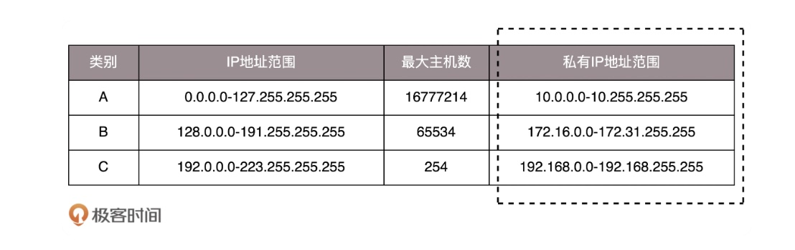

# 前言

## 命令

CNAME：记录就是把域名解析到另外一个域名

## KeyWord

1. ARP协议：ARP 协议的全称是 Address Resolution Protocol(地址解析协议)，它是一个通过用于实现从 IP 地址到 MAC 地址的映射，即询问目标 IP 对应的 MAC 地址 的一种协议。ARP 协议在 IPv4 中极其重要。注意：ARP 只用于 IPv4 协议中，IPv6 协议使用的是 Neighbor Discovery Protocol，译为邻居发现协议，它被纳入 ICMPv6 中。
2. CIS: Corporate Information Security 企业信息安全
2. WAF: Web Application Firewall
2. DNS：Domain Name System
3. CDN：content distribution net work
4. VPN，Virtual Private Network，虚拟专用网
4. CIDR，Classless Inter-Domain Routing，无分类域间路由选择
5. DHCP 协议。DHCP 全称叫动态主机配置协议（Dynamic Host Configuration Protocol）
6. ARP 协议ARP 全称叫地址解析协议（Address Resolution Protocol），它服务于现在局域网中最流行的以太网协议。在以太网中，ARP 协议负责解析远程主机 IP 地址对应的 MAC 地址。之所以需要 ARP 协议，是因为我们平常应用程序连接目标计算机进行网络通讯时，都是提供了域名或 IP 地址。但对以太网来说，要想发信件出去，它要的是对方的 MAC 地址。
7. ICMP 全称叫互联网控制报文协议（Internet Control Message Protocol），它能够检测网路的连线状况，以保证连线的有效性。基于这个协议实现的常见程序有两个：ping 和 traceroute，它们可以用来判断和定位网络问题。
8. NAT的全拼是“Network Address Translation”，中文意思是“网络地址转换”。它是一个IETF标准，允许一个整体机构以一个公用IP地址出现在Internet上。NAT 网关本质上是一个透明代理（中间人），工作在网络协议的第四层，即传输层，基于 TCP/UDP 协议。
9. Amazon 提供的 ELB(**Elastic Load Balance**) 服务包含三种类型：ALB, NLB, CLB。
10. ALB: Application Load Balancer 运行于请求级别（第 7 层），可根据请求的内容将流量路由至 EC2 实例、容器、IP 地址和 Lambda 函数等目标。Application Load Balancer 最适合 HTTP 和 HTTPS 流量的高级负载均衡，面向交付包括微服务和基于容器的应用程序在内的现代应用程序架构，提供高级请求路由功能。
11. NLB: Network Load Balancer 网络负载均衡器运行于连接级别（第 4 层），可根据 IP 协议数据将连接路由至 Amazon Virtual Private Cloud (Amazon VPC) 内的不同目标（Amazon EC2 实例、微服务和容器）。
12. Classic Load Balancer 同时运行于请求级别和连接级别，可在多个 Amazon EC2 实例之间提供基本的负载均衡。Classic Load Balancer 适用于在 EC2-Classic 网络内构建的应用程序。在使用 Virtual Private Cloud (VPC) 时，我们建议使用第 7 层 Application Load Balancer 和第 4 层网络负载均衡器。

# 第一讲 为什么要学习网络协议？

## 协议三要素

- 语法：一段内容符合一定的规则和格式。

- 语义：一段内容要代表某种意义。

- 顺序：一段内容要有顺序。

## 我们常用的网络协议有哪些？
### 应用层：
- 地址簿协议DNS：
- 地址簿查找协议HTTPDNS：
- HTTP
- HTTPS
- DHCP（UDP）
- RTMP
- P2P
- GTP
- RPC
### 传输层

传输层解决的是如何让互联网通讯可信赖的问题

- UDP
- TCP
### 网络层

IP 网络解决的是网如何通的问题，而传输层解决的是如何让互联网通讯可信赖的问题，从而大幅降低互联网应用程序开发的负担。

- IP协议
- ICMP
- OSPF
- BGP
- IPSec
- GRE
### 链路层

负责解决的是局部网络世界的数据传输能力。

- ARP
- VLAN
- STP
### 物理层
- 网络跳线


## Reference

*[DNS和HTTPDNS的区别](https://juejin.cn/post/6844903987796246542)*

# 第2讲 | 网络分层的真实含义是什么？

长时间从事计算机网络相关的工作，我发现，计算机网络有一个显著的特点，就是这是一个不仅需要背诵，而且特别需要将原理烂熟于胸的学科。很多问题看起来懂了，但是就怕往细里问，一问就发现你懂得没有那么透彻。

## 这四个问题你真的懂了吗？

1. TCP 在进行三次握手的时候，IP 层和 MAC 层对应都有什么操作呢？

   当然是 TCP 发送每一个消息，都会带着 IP 层和 MAC 层了。因为，TCP 每发送一个消息，IP 层和 MAC 层的所有机制都要运行一遍。只要是在网络上跑的包，都是完整的。可以有下层没上层，绝对不可能有上层没下层。

   所以，对 TCP 协议来说，三次握手也好，重试也好，只要想发出去包，就要有 IP 层和 MAC 层，不然是发不出去的。

2. 如果放在 IP 协议中的目标地址，那包到了中转站，怎么知道最终的目的地址是 D 呢？

3. 二层设备处理的包里，有没有 HTTP 层的内容呢？

4. 通过 SSH 登录到公有云主机里面，都需要经历哪些过程？或者说你打开一个电商网站，都需要经历哪些过程？

## 网络为什么要分层？

复杂的程序都要分层，这是程序设计的要求。比如，复杂的电商还会分数据库层、缓存层、Compose 层、Controller 层和接入层，每一层专注做本层的事情。

## 程序是如何工作的？

当一个网络包从一个网口经过的时候，你看到了，首先先看看要不要请进来，处理一把。有的网口配置了混杂模式，凡是经过的，全部拿进来。

拿进来以后，就要交给一段程序来处理。于是，你调用 process_layer2(buffer)。当然，这是一个假的函数。但是你明白其中的意思，知道肯定是有这么个函数的。那这个函数是干什么的呢？从 Buffer 中，摘掉二层的头，看一看，应该根据头里面的内容做什么操作。

假设你发现这个包的 MAC 地址和你的相符，那说明就是发给你的，于是需要调用 process_layer3(buffer)。这个时候，Buffer 里面往往就没有二层的头了，因为已经在上一个函数的处理过程中拿掉了，或者将开始的偏移量移动了一下。在这个函数里面，摘掉三层的头，看看到底是发送给自己的，还是希望自己转发出去的。

如何判断呢？如果 IP 地址不是自己的，那就应该转发出去；如果 IP 地址是自己的，那就是发给自己的。根据 IP 头里面的标示，拿掉三层的头，进行下一层的处理，到底是调用 process_tcp(buffer) 呢，还是调用 process_udp(buffer) 呢？

假设这个地址是 TCP 的，则会调用 process_tcp(buffer)。这时候，Buffer 里面没有三层的头，就需要查看四层的头，看这是一个发起，还是一个应答，又或者是一个正常的数据包，然后分别由不同的逻辑进行处理。如果是发起或者应答，接下来可能要发送一个回复包；如果是一个正常的数据包，就需要交给上层了。交给谁呢？是不是有 process_http(buffer) 函数呢？

没有的，如果你是一个网络包处理程序，你不需要有 process_http(buffer)，而是应该交给应用去处理。交给哪个应用呢？在四层的头里面有端口号，不同的应用监听不同的端口号。如果发现浏览器应用在监听这个端口，那你发给浏览器就行了。至于浏览器怎么处理，和你没有关系。

浏览器自然是解析 HTML，显示出页面来。电脑的主人看到页面很开心，就点了鼠标。点击鼠标的动作被浏览器捕获。浏览器知道，又要发起另一个 HTTP 请求了，于是使用端口号，将请求发给了你。

你应该调用 send_tcp(buffer)。不用说，Buffer 里面就是 HTTP 请求的内容。这个函数里面加一个 TCP 的头，记录下源端口号。浏览器会给你目的端口号，一般为 80 端口。

然后调用 send_layer3(buffer)。Buffer 里面已经有了 HTTP 的头和内容，以及 TCP 的头。在这个函数里面加一个 IP 的头，记录下源 IP 的地址和目标 IP 的地址。

然后调用 send_layer2(buffer)。Buffer 里面已经有了 HTTP 的头和内容、TCP 的头，以及 IP 的头。这个函数里面要加一下 MAC 的头，记录下源 MAC 地址，得到的就是本机器的 MAC 地址和目标的 MAC 地址。不过，这个还要看当前知道不知道，知道就直接加上；不知道的话，就要通过一定的协议处理过程，找到 MAC 地址。反正要填一个，不能空着。

万事俱备，只要 Buffer 里面的内容完整，就可以从网口发出去了，你作为一个程序的任务就算告一段落了。

## 揭秘层与层之间的关系


# 第3讲 | ifconfig：最熟悉又陌生的命令行

即便没有专业学过计算机的人，只要倒腾过电脑，重装过系统，大多也会知道这个问题的答案：在 Windows 上是 ipconfig，在 Linux 上是 ifconfig。那你知道在 Linux 上还有什么其他命令可以查看 IP 地址吗？答案是 ip addr。如果回答不上来这个问题，那你可能没怎么用过 Linux。

你可以自行安装 net-tools 和 iproute2 这两个工具。当然，大多数时候这两个命令是系统自带的。

安装好后，我们来运行一下 ip addr。不出意外，应该会输出下面的内容。

```java
root@test:~# ip addr
1: lo: <LOOPBACK,UP,LOWER_UP> mtu 65536 qdisc noqueue state UNKNOWN group default 
    link/loopback 00:00:00:00:00:00 brd 00:00:00:00:00:00
    inet 127.0.0.1/8 scope host lo
       valid_lft forever preferred_lft forever
    inet6 ::1/128 scope host 
       valid_lft forever preferred_lft forever
2: eth0: <BROADCAST,MULTICAST,UP,LOWER_UP> mtu 1500 qdisc pfifo_fast state UP group default qlen 1000
    link/ether fa:16:3e:c7:79:75 brd ff:ff:ff:ff:ff:ff
    inet 10.100.122.2/24 brd 10.100.122.255 scope global eth0
       valid_lft forever preferred_lft forever
    inet6 fe80::f816:3eff:fec7:7975/64 scope link 
       valid_lft forever preferred_lft forever
```

这个命令显示了这台机器上所有的网卡。大部分的网卡都会有一个 IP 地址，当然，这不是必须的。在后面的分享中，我们会遇到没有 IP 地址的情况。

IP 地址是一个网卡在网络世界的通讯地址，相当于我们现实世界的门牌号码。

如上输出的结果，10.100.122.2 就是一个 IP 地址。这个地址被点分隔为四个部分，每个部分 8 个 bit，所以 IP 地址总共是 32 位。这样产生的 IP 地址的数量很快就不够用了。因为当时设计 IP 地址的时候，哪知道今天会有这么多的计算机啊！因为不够用，于是就有了 IPv6，也就是上面输出结果里面 inet6 fe80::f816:3eff:fec7:7975/64。这个有 128 位，现在看来是够了，但是未来的事情谁知道呢？

下面这个表格，详细地展示了 A、B、C 三类地址所能包含的主机的数量。在后文中，我也会多次借助这个表格来讲解。

这里面有个尴尬的事情，就是 C 类地址能包含的最大主机数量实在太少了，只有 254 个。当时设计的时候恐怕没想到，现在估计一个网吧都不够用吧。而 B 类地址能包含的最大主机数量又太多了。6 万多台机器放在一个网络下面，一般的企业基本达不到这个规模，闲着的地址就是浪费。

## 无类型域间选路（CIDR）

于是有了一个折中的方式叫作无类型域间选路，简称 CIDR。这种方式打破了原来设计的几类地址的做法，将 32 位的 IP 地址一分为二，前面是网络号，后面是主机号。从哪里分呢？你如果注意观察的话可以看到，10.100.122.2/24，这个 IP 地址中有一个斜杠，斜杠后面有个数字 24。这种地址表示形式，就是 CIDR。后面 24 的意思是，32 位中，前 24 位是网络号，后 8 位是主机号。

伴随着 CIDR 存在的，一个是广播地址，10.100.122.255。如果发送这个地址，所有 10.100.122 网络里面的机器都可以收到。另一个是子网掩码，255.255.255.0。

将子网掩码和 IP 地址进行 AND 计算。前面三个 255，转成二进制都是 1。1 和任何数值取 AND，都是原来数值，因而前三个数不变，为 10.100.122。后面一个 0，转换成二进制是 0，0 和任何数值取 AND，都是 0，因而最后一个数变为 0，合起来就是 10.100.122.0。这就是网络号。将子网掩码和 IP 地址按位计算 AND，就可得到网络号。

## 公有 IP 地址和私有 IP 地址

在日常的工作中，几乎不用划分 A 类、B 类或者 C 类，所以时间长了，很多人就忘记了这个分类，而只记得 CIDR。但是有一点还是要注意的，就是公有 IP 地址和私有 IP 地址。

我们继续看上面的表格。表格最右列是私有 IP 地址段。平时我们看到的数据中心里，办公室、家里或学校的 IP 地址，一般都是私有 IP 地址段。因为这些地址允许组织内部的 IT 人员自己管理、自己分配，而且可以重复。因此，你学校的某个私有 IP 地址段和我学校的可以是一样的。

不需要将十进制转换为二进制 32 位，就能明显看出 192.168.0 是网络号，后面是主机号。而整个网络里面的第一个地址 192.168.0.1，往往就是你这个私有网络的出口地址。例如，你家里的电脑连接 Wi-Fi，Wi-Fi 路由器的地址就是 192.168.0.1，而 192.168.0.255 就是广播地址。一旦发送这个地址，整个 192.168.0 网络里面的所有机器都能收到。

但是也不总都是这样的情况。因此，其他情况往往就会很难理解，还容易出错。

## 举例：一个容易“犯错”的 CIDR

我们来看 16.158.165.91/22 这个 CIDR。求一下这个网络的第一个地址、子网掩码和广播地址。

你要是上来就写 16.158.165.1，那就大错特错了。

/22 不是 8 的整数倍，不好办，只能先变成二进制来看。16.158 的部分不会动，它占了前 16 位。中间的 165，变为二进制为‭10100101‬。除了前面的 16 位，还剩 6 位。所以，这 8 位中前 6 位是网络号，16.158.<101001>，而 <01>.91 是机器号。

第一个地址是 16.158.<101001><00>.1，即 16.158.164.1。子网掩码是 255.255.<111111><00>.0，即 255.255.252.0。广播地址为 16.158.<101001><11>.255，即 16.158.167.255。

这五类地址中，还有一类 D 类是组播地址。使用这一类地址，属于某个组的机器都能收到。这有点类似在公司里面大家都加入了一个邮件组。发送邮件，加入这个组的都能收到。组播地址在后面讲述 VXLAN 协议的时候会提到。

讲了这么多，才讲了上面的输出结果中很小的一部分，是不是觉得原来并没有真的理解 ip addr 呢？我们接着来分析。

在 IP 地址的后面有个 scope，对于 eth0 这张网卡来讲，是 global，说明这张网卡是可以对外的，可以接收来自各个地方的包。对于 lo 来讲，是 host，说明这张网卡仅仅可以供本机相互通信。

lo 全称是 loopback，又称环回接口，往往会被分配到 127.0.0.1 这个地址。这个地址用于本机通信，经过内核处理后直接返回，不会在任何网络中出现。

## MAC 地址

在 IP 地址的上一行是 link/ether fa:16:3e:c7:79:75 brd ff:ff:ff:ff:ff:ff，这个被称为 MAC 地址，是一个网卡的物理地址，用十六进制，6 个 byte 表示。

MAC 地址是一个很容易让人“误解”的地址。因为 MAC 地址号称全局唯一，不会有两个网卡有相同的 MAC 地址，而且网卡自生产出来，就带着这个地址。很多人看到这里就会想，既然这样，整个互联网的通信，全部用 MAC 地址好了，只要知道了对方的 MAC 地址，就可以把信息传过去。

这样当然是不行的。 一个网络包要从一个地方传到另一个地方，除了要有确定的地址，还需要有定位功能。 而有门牌号码属性的 IP 地址，才是有远程定位功能的。

MAC 地址更像是身份证，是一个唯一的标识。它的唯一性设计是为了组网的时候，不同的网卡放在一个网络里面的时候，可以不用担心冲突。从硬件角度，保证不同的网卡有不同的标识。

MAC 地址是有一定定位功能的，只不过范围非常有限。你可以根据 IP 地址，找到杭州市网商路 599 号 B 楼 6 层，但是依然找不到我，你就可以靠吼了，大声喊身份证 XXXX 的是哪位？我听到了，我就会站起来说，是我啊。但是如果你在上海，到处喊身份证 XXXX 的是哪位，我不在现场，当然不会回答，因为我在杭州不在上海。

所以，MAC 地址的通信范围比较小，局限在一个子网里面。例如，从 192.168.0.2/24 访问 192.168.0.3/24 是可以用 MAC 地址的。一旦跨子网，即从 192.168.0.2/24 到 192.168.1.2/24，MAC 地址就不行了，需要 IP 地址起作用了。

## 网络设备的状态标识

解析完了 MAC 地址，我们再来看 是干什么的？这个叫做 net_device flags，网络设备的状态标识。

UP 表示网卡处于启动的状态；BROADCAST 表示这个网卡有广播地址，可以发送广播包；MULTICAST 表示网卡可以发送多播包；LOWER_UP 表示 L1 是启动的，也即网线插着呢。MTU1500 是指什么意思呢？是哪一层的概念呢？最大传输单元 MTU 为 1500，这是以太网的默认值。

上一节，我们讲过网络包是层层封装的。MTU 是二层 MAC 层的概念。MAC 层有 MAC 的头，以太网规定正文部分不允许超过 1500 个字节。正文里面有 IP 的头、TCP 的头、HTTP 的头。如果放不下，就需要分片来传输。

qdisc pfifo_fast 是什么意思呢？qdisc 全称是 queueing discipline，中文叫排队规则。内核如果需要通过某个网络接口发送数据包，它都需要按照为这个接口配置的 qdisc（排队规则）把数据包加入队列。

最简单的 qdisc 是 pfifo，它不对进入的数据包做任何的处理，数据包采用先入先出的方式通过队列。pfifo_fast 稍微复杂一些，它的队列包括三个波段（band）。在每个波段里面，使用先进先出规则。

三个波段（band）的优先级也不相同。band 0 的优先级最高，band 2 的最低。如果 band 0 里面有数据包，系统就不会处理 band 1 里面的数据包，band 1 和 band 2 之间也是一样。

数据包是按照服务类型（Type of Service，TOS）被分配到三个波段（band）里面的。TOS 是 IP 头里面的一个字段，代表了当前的包是高优先级的，还是低优先级的。

队列是个好东西，后面我们讲云计算中的网络的时候，会有很多用户共享一个网络出口的情况，这个时候如何排队，每个队列有多粗，队列处理速度应该怎么提升，我都会详细为你讲解。


# 第4讲 | DHCP与PXE：IP是怎么来的，又是怎么没的？

## 如何配置 IP 地址？

那如何配置呢？如果有相关的知识和积累，你可以用命令行自己配置一个地址。可以使用 ifconfig，也可以使用 ip addr。设置好了以后，用这两个命令，将网卡 up 一下，就可以开始工作了。

使用 net-tools：

```java
$ sudo ifconfig eth1 10.0.0.1/24
$ sudo ifconfig eth1 up
```

使用 iproute2：

```java
$ sudo ip addr add 10.0.0.1/24 dev eth1
$ sudo ip link set up eth1
```

你看着它有自己的源 IP 地址 16.158.23.6，也有目标 IP 地址 192.168.1.6，但是包发不出去，这是因为 MAC 层还没填。Linux 首先会判断，要去的这个地址和我是一个网段的吗，或者和我的一个网卡是同一网段的吗？只有是一个网段的，它才会发送 ARP 请求，获取 MAC 地址。如果发现不是呢？

Linux 默认的逻辑是，如果这是一个跨网段的调用，它便不会直接将包发送到网络上，而是企图将包发送到网关。

如果你配置了网关的话，Linux 会获取网关的 MAC 地址，然后将包发出去。对于 192.168.1.6 这台机器来讲，虽然路过它家门的这个包，目标 IP 是它，但是无奈 MAC 地址不是它的，所以它的网卡是不会把包收进去的。

如果没有配置网关呢？那包压根就发不出去。

如果将网关配置为 192.168.1.6 呢？不可能，Linux 不会让你配置成功的，因为网关要和当前的网络至少一个网卡是同一个网段的，怎么可能 16.158.23.6 的网关是 192.168.1.6 呢？

所以，当你需要手动配置一台机器的网络 IP 时，一定要好好问问你的网络管理员。如果在机房里面，要去网络管理员那里申请，让他给你分配一段正确的 IP 地址。当然，真正配置的时候，一定不是直接用命令配置的，而是放在一个配置文件里面。不同系统的配置文件格式不同，但是无非就是 CIDR、子网掩码、广播地址和网关地址。

## 动态主机配置协议（DHCP）

动态主机配置协议（Dynamic Host Configuration Protocol），简称 DHCP，一个自动配置的协议。

所以说，如果是数据中心里面的服务器，IP 一旦配置好，基本不会变，这就相当于买房自己装修。DHCP 的方式就相当于租房。你不用装修，都是帮你配置好的。你暂时用一下，用完退租就可以了。

## 解析 DHCP 的工作方式

当一台机器新加入一个网络的时候，肯定一脸懵，啥情况都不知道，只知道自己的 MAC 地址。怎么办？先吼一句，我来啦，有人吗？这时候的沟通基本靠“吼”。这一步，我们称为 DHCP Discover。

新来的机器使用 IP 地址 0.0.0.0 发送了一个广播包，目的 IP 地址为 255.255.255.255。广播包封装了 UDP，UDP 封装了 BOOTP。其实 DHCP 是 BOOTP 的增强版，但是如果你去抓包的话，很可能看到的名称还是 BOOTP 协议。

在这个广播包里面，新人大声喊：我是新来的（Boot request），我的 MAC 地址是这个，我还没有 IP，谁能给租给我个 IP 地址！

如果一个网络管理员在网络里面配置了 DHCP Server 的话，他就相当于这些 IP 的管理员。他立刻能知道来了一个“新人”。这个时候，我们可以体会 MAC 地址唯一的重要性了。当一台机器带着自己的 MAC 地址加入一个网络的时候，MAC 是它唯一的身份，如果连这个都重复了，就没办法配置了。

只有 MAC 唯一，IP 管理员才能知道这是一个新人，需要租给它一个 IP 地址，这个过程我们称为 DHCP Offer。同时，DHCP Server 为此客户保留为它提供的 IP 地址，从而不会为其他 DHCP 客户分配此 IP 地址。

DHCP Server 仍然使用广播地址作为目的地址，因为，此时请求分配 IP 的新人还没有自己的 IP。DHCP Server 回复说，我分配了一个可用的 IP 给你，你看如何？除此之外，服务器还发送了子网掩码、网关和 IP 地址租用期等信息。

新来的机器很开心，它的“吼”得到了回复，并且有人愿意租给它一个 IP 地址了，这意味着它可以在网络上立足了。当然更令人开心的是，如果有多个 DHCP Server，这台新机器会收到多个 IP 地址，简直受宠若惊。

它会选择其中一个 DHCP Offer，一般是最先到达的那个，并且会向网络发送一个 DHCP Request 广播数据包，包中包含客户端的 MAC 地址、接受的租约中的 IP 地址、提供此租约的 DHCP 服务器地址等，并告诉所有 DHCP Server 它将接受哪一台服务器提供的 IP 地址，告诉其他 DHCP 服务器，谢谢你们的接纳，并请求撤销它们提供的 IP 地址，以便提供给下一个 IP 租用请求者。

此时，由于还没有得到 DHCP Server 的最后确认，客户端仍然使用 0.0.0.0 为源 IP 地址、255.255.255.255 为目标地址进行广播。在 BOOTP 里面，接受某个 DHCP Server 的分配的 IP。

当 DHCP Server 接收到客户机的 DHCP request 之后，会广播返回给客户机一个 DHCP ACK 消息包，表明已经接受客户机的选择，并将这一 IP 地址的合法租用信息和其他的配置信息都放入该广播包，发给客户机，欢迎它加入网络大家庭。

## IP 地址的收回和续租

客户机会在租期过去 50% 的时候，直接向为其提供 IP 地址的 DHCP Server 发送 DHCP request 消息包。客户机接收到该服务器回应的 DHCP ACK 消息包，会根据包中所提供的新的租期以及其他已经更新的 TCP/IP 参数，更新自己的配置。这样，IP 租用更新就完成了。

好了，一切看起来完美。DHCP 协议大部分人都知道，但是其实里面隐藏着一个细节，很多人可能不会去注意。接下来，我就讲一个有意思的事情：网络管理员不仅能自动分配 IP 地址，还能帮你自动安装操作系统！

## 预启动执行环境（PXE）

普通的笔记本电脑，一般不会有这种需求。因为你拿到电脑时，就已经有操作系统了，即便你自己重装操作系统，也不是很麻烦的事情。但是，在数据中心里就不一样了。数据中心里面的管理员可能一下子就拿到几百台空的机器，一个个安装操作系统，会累死的。

所以管理员希望的不仅仅是自动分配 IP 地址，还要自动安装系统。装好系统之后自动分配 IP 地址，直接启动就能用了，这样当然最好了！

其实，这个过程和操作系统启动的过程有点儿像。首先，启动 BIOS。这是一个特别小的小系统，只能干特别小的一件事情。其实就是读取硬盘的 MBR 启动扇区，将 GRUB 启动起来；然后将权力交给 GRUB，GRUB 加载内核、加载作为根文件系统的 initramfs 文件；然后将权力交给内核；最后内核启动，初始化整个操作系统。

那我们安装操作系统的过程，只能插在 BIOS 启动之后了。因为没安装系统之前，连启动扇区都没有。因而这个过程叫做预启动执行环境（Pre-boot Execution Environment），简称 PXE。

PXE 协议分为客户端和服务器端，由于还没有操作系统，只能先把客户端放在 BIOS 里面。当计算机启动时，BIOS 把 PXE 客户端调入内存里面，就可以连接到服务端做一些操作了。

首先，PXE 客户端自己也需要有个 IP 地址。因为 PXE 的客户端启动起来，就可以发送一个 DHCP 的请求，让 DHCP Server 给它分配一个地址。PXE 客户端有了自己的地址，那它怎么知道 PXE 服务器在哪里呢？对于其他的协议，都好办，要有人告诉他。例如，告诉浏览器要访问的 IP 地址，或者在配置中告诉它；例如，微服务之间的相互调用。

但是 PXE 客户端启动的时候，啥都没有。好在 DHCP Server 除了分配 IP 地址以外，还可以做一些其他的事情。这里有一个 DHCP Server 的一个样例配置：

```java
ddns-update-style interim;
ignore client-updates;
allow booting;
allow bootp;
subnet 192.168.1.0 netmask 255.255.255.0
{
option routers 192.168.1.1;
option subnet-mask 255.255.255.0;
option time-offset -18000;
default-lease-time 21600;
max-lease-time 43200;
range dynamic-bootp 192.168.1.240 192.168.1.250;
filename "pxelinux.0";
next-server 192.168.1.180;
}
```

按照上面的原理，默认的 DHCP Server 是需要配置的，无非是我们配置 IP 的时候所需要的 IP 地址段、子网掩码、网关地址、租期等。如果想使用 PXE，则需要配置 next-server，指向 PXE 服务器的地址，另外要配置初始启动文件 filename。

这样 PXE 客户端启动之后，发送 DHCP 请求之后，除了能得到一个 IP 地址，还可以知道 PXE 服务器在哪里，也可以知道如何从 PXE 服务器上下载某个文件，去初始化操作系统。

## 解析 PXE 的工作过程

首先，启动 PXE 客户端。第一步是通过 DHCP 协议告诉 DHCP Server，我刚来，一穷二白，啥都没有。DHCP Server 便租给它一个 IP 地址，同时也给它 PXE 服务器的地址、启动文件 pxelinux.0。

其次，PXE 客户端知道要去 PXE 服务器下载这个文件后，就可以初始化机器。于是便开始下载，下载的时候使用的是 TFTP 协议。所以 PXE 服务器上，往往还需要有一个 TFTP 服务器。PXE 客户端向 TFTP 服务器请求下载这个文件，TFTP 服务器说好啊，于是就将这个文件传给它。

然后，PXE 客户端收到这个文件后，就开始执行这个文件。这个文件会指示 PXE 客户端，向 TFTP 服务器请求计算机的配置信息 pxelinux.cfg。TFTP 服务器会给 PXE 客户端一个配置文件，里面会说内核在哪里、initramfs 在哪里。PXE 客户端会请求这些文件。

最后，启动 Linux 内核。一旦启动了操作系统，以后就啥都好办了。

# 第5讲 | 从物理层到MAC层：如何在宿舍里自己组网玩联机游戏？

## 第一层（物理层）
- 两台电脑联网：一根网线使用1－3、2－6 交叉接法就可以。前提需要配置一下这两台电脑的IP地址、子网掩码和默认网关。这样就构成了一个最小的局域网，也即LAN。
- 三台电脑联网：交换机（贵）或者Hub（集线器）。
## 第二层（数据链路层）
1. 这个包是发给谁的？谁应该接收？ 
解决这个问题牵扯到了第二层的网络包格式。对于以太网，第二层的最开始就是目标的MAC地址和源的MAC地址。接下来是类型，大部分的类型是IP数据包，然后IP里面包含TCP、UDP以及HTTP等。有了这个目标MAC地址，数据包在链路上广播，MAC的网卡才能发现这个包是给它的。MAC的网卡把包收进来打开IP包，发现IP地址也是自己的，再打开TCP包，发现端口也是自己的，于是将请求提交给nginx，nginx返回一个网页。
2. 大家都在发，会不会产生混乱？有没有谁先发、谁后发的规则？
MAC的全称是Medium Access Control，即媒体访问控制。控制在向媒体发送数据的顺序，防止发生混乱（例如信道划分，轮流协议，随即接入协议）。
3. 如果发送的时候出现了错误，怎么办？
对于以太网，第二层的最后面是 CRC，也就是循环冗余检测。通过 XOR 异或的算法，来计算整个包是否在发送的过程中出现了错误。
4. 如果一个广播的网络中接入了N台机器，源机器不知道每个MAC地址是谁？
这里就引入了ARP协议，也就是已知IP地址，求MAC地址的协议。广而告之，会向N台机器都发送一个广播包，N台主机都会检查ARP请求包中的信息，如果ARP请求包中的目标IP地址和自己的相同，就会将自己的MAC地址写入响应返回主机。为了避免每次都用 ARP 请求，机器本地也会进行 ARP 缓存。当然机器会不断地上线下线，IP 也可能会变，所以 ARP 的 MAC 地址缓存过一段时间就会过期。

## 局域网
使用Hub一个宿舍没问题但是人数增多问题就出现了，因为 Hub 是广播的，不管某个接口是否需要，所有的 Bit 都会被发送出去，然后让主机来判断是不是需要。这种方式人少没关系，人多产生冲突的概率就提高了。而且把不需要的包转发过去，纯属浪费。这个使用就引入了交换机。

交换机一开始也不知道一个MAC地址的电脑在哪个口，它只能将包转发给除了来的那个口之外的其他所有口，然后做记录，多试几下交换机就记住了所有的MAC地址和口之间的关系，这个时候，基本上不用广播了，全部可以准确转发。当然，每个机器的IP地址会变，所在的口也会变，因而交换机上的学习的结果我们称为转发表，是有一个过期周期的。
## KeyWord
ARP协议：ARP 协议的全称是 Address Resolution Protocol(地址解析协议)，它是一个通过用于实现从 IP 地址到 MAC 地址的映射，即询问目标 IP 对应的 MAC 地址 的一种协议。ARP 协议在 IPv4 中极其重要。注意：ARP 只用于 IPv4 协议中，IPv6 协议使用的是 Neighbor Discovery Protocol，译为邻居发现协议，它被纳入 ICMPv6 中。

## Reference
[一文详解 ARP 协议](https://www.cnblogs.com/cxuanBlog/p/14265315.html)

# 第6讲 | 交换机与VLAN：办公室太复杂，我要回学校
## 拓扑结构是怎么形成的？
当一个交换机肯定不够用时，就需要多台交换机，交换机之间连接起来，就形成一个稍微复杂的拓扑结构。
## 环路问题
我们来想象一下机器 1 访问机器 2 的过程。一开始，机器 1 并不知道机器 2 的 MAC 地址，所以它需要发起一个 ARP 的广播。广播到达机器 2，机器 2 会把 MAC 地址返回来，看起来没有这两个交换机什么事情。

但是问题来了，这两个交换机还是都能够收到广播包的。交换机 A 一开始是不知道机器 2 在哪个局域网的，所以它会把广播消息放到局域网二，在局域网二广播的时候，交换机 B 右边这个网口也是能够收到广播消息的。交换机 B 会将这个广播信息发送到局域网一。局域网一的这个广播消息，又会到达交换机 A 左边的这个接口。交换机 A 这个时候还是不知道机器 2 在哪个局域网，于是将广播包又转发到局域网二。形成了一个圈。

## 如何解决常见的环路问题？

在数据结构中，有一个方法叫做最小生成树。有环的我们常称为图。将图中的环破了，就生成了树。在计算机网络中，生成树的算法叫作 STP，全称 Spanning Tree Protocol。下面是STP协议里面的一些概念。
- Root Bridge：根交换机。
- Designated Bridge：指定交换机。
- Bridge Protocol Data Units（BPDU）：网桥协议数据单元。
- Priority Vector：优先级向量。
## 如何解决广播问题和安全问题？
- 物理隔离：每个部门有单独的交换机，配置单独的子网，各部门之间通过路由器沟通。缺点是口多了浪费，少了不够用。
- 虚拟隔离：VLAN（虚拟局域网），使用VLAN，一个交换机上会连属于多个局域网的机器，可以灵活的修改每个VLSN的口

## Reference
极客时间版权所有: https://time.geekbang.org/column/article/8386


# 第7讲 | ICMP与ping：投石问路的侦察兵
## ICMP 协议的格式
ping 是ICMP协议工作的，ICMP全称是Internet Control Message Protocol，就是互联网控制报文协议。ICMP报文是封装在IP包里面的，里面包括类型字段，顺序号，源地址和目标地址，另外还会存放发送请求的时间值来计算往返时间等。本身很简单，因为作为侦察兵要轻装上阵。
## ICMP报文类型
- 查找报文类型：由源站主动发起的请求，类型字段为8，主动请求的应答为0。例如ping就是查询报文。
- 差错报文类型：
  - 终点不可达为3：
    - 网络不可达
    - 主机不可达
    - 协议不可达
    - 端口不可达
    - 需要进行分片但设置了不分片位
  - 源抑制为4: 让源站放慢发送速度。
  - 超时为11: 超过网络包的生存时间还是没有到。
  - 重定向为5: 让下次发送给另一个路由器。
## ping：查询报文类型的使用
假定主机A的IP地址是192.168.1.1，主机B的IP地址是192.168.1.2，主机A ping命令执行的时候，源主机首先会构建一个ICMP请求数据包，ICMP数据包内包含类型字段，顺序号等，其中顺序号用于区分连续ping发出的多个数据包，每发出一个请求数据包，顺序号会自动加1，为了能够计算往返时间RTT，会在报文的数据部分插入发送时间。

然后由ICMP协议将这个数据包连同地址一起交给IP层。IP层将192.168.1.2作为目的地址，本机地址作为源地址，加上一些其他控制信息构成一个IP数据包。

接下来，需要加入MAC头，如果在本节ARP映射表中查找出IP地址 192.168.1.2 所对应的MAC地址，则直接使用；如果没有，则需要发送ARP协议查询MAC地址，获取MAC地址后，由数据链路层构建一个数据帧，目的地址是IP层传过来的MAC地址，源地址是本机的MAC地址；还要附加上一些控制信息，一句以太网的介质访问规则，将它们传送出去。

主机B收到这个数据帧后，先检查它的目的MAC地址与本季MAC地址比对，如符合，则接收，否则就丢弃。接受后检查该数据帧，将IP数据包从帧中提取出来，交给本机的IP层。同样，IP层检查后将有用的信息提取后交给ICMP协议。

主机B会构建一个ICMP应答包，应答数据包的类型字段为0，顺序号为接收到的请求数据包中的顺序号，然后再发送给主机A。

在规定时间内，源主机如果没有接到ICMP的应答包，则说明目标主机不可达；如果接收到了ICMP应答包，则说明目标主机可达。此时，源主机会检查，用当前时刻减去该数据包最初从源主机上发出的时刻，就是ICMP数据的时间延迟。

当然这是同一个局域网里面的情况。如果跨网段的话，还会涉及网关的转发、路由器的转发等等。但是对于ICMP的头来讲，是没有什么影响的。会影响的是根据目标IP地址，选择路由的下一跳，还有每经过一个路由器到达一个新的局域网，需要换MAC头里面的MAC地址。

当遇到网络不通的问题的时候，除了直接 ping 目标的 IP 地址之外，还应该有一个清晰的网络拓扑图。并且从理论上来讲，应该要清楚地知道一个网络包从源地址到目标地址都需要经过哪些设备，然后逐个 ping 中间的这些设备或者机器。如果可能的话，在这些关键点，通过 tcpdump -i eth0 icmp，查看包有没有到达某个点，回复的包到达了哪个点，可以更加容易推断出错的位置。

经常会遇到一个问题，如果不在我们的控制范围内，很多中间设备都是禁止 ping 的，但是 ping 不通不代表网络不通。这个时候就要使用 telnet，通过其他协议来测试网络是否通。


## Traceroute：差错报文类型的使用
说了这么多，你应该可以看出 ping 这个程序是使用了 ICMP 里面的 ECHO REQUEST 和 ECHO REPLY 类型的。

Traceroute 的第一个作用就是故意设置特殊的 TTL，来追踪去往目的地时沿途经过的路由器。Traceroute 的参数指向某个目的 IP 地址，它会发送一个 UDP 的数据包。将 TTL 设置成 1，也就是说一旦遇到一个路由器或者一个关卡，就表示它“牺牲”了。如果中间的路由器不止一个，当然碰到第一个就“牺牲”。于是，返回一个 ICMP 包，也就是网络差错包，类型是时间超时。那大军前行就带一顿饭，试一试走多远会被饿死，然后找个哨探回来报告，那我就知道大军只带一顿饭能走多远了。

接下来，将 TTL 设置为 2。第一关过了，第二关就“牺牲”了，那我就知道第二关有多远。如此反复，直到到达目的主机。这样，Traceroute 就拿到了所有的路由器 IP。当然，有的路由器压根不会回这个 ICMP。这也是 Traceroute 一个公网的地址，看不到中间路由的原因。

怎么知道 UDP 有没有到达目的主机呢？Traceroute 程序会发送一份 UDP 数据报给目的主机，但它会选择一个不可能的值作为 UDP 端口号（大于 30000）。当该数据报到达时，将使目的主机的 UDP 模块产生一份“端口不可达”错误 ICMP 报文。如果数据报没有到达，则可能是超时。因为 UDP 是无连接的，如果是正确也得不到响应。无法区别到底是半路走丢了，还是正确到达，只有发送错误信息，才会收到消息。

Traceroute 还有一个作用是故意设置不分片，从而确定路径的 MTU。要做的工作首先是发送分组，并设置“不分片”标志。发送的第一个分组的长度正好与出口 MTU 相等。如果中间遇到窄的关口会被卡住，会发送 ICMP 网络差错包，类型为“需要进行分片但设置了不分片位”。其实，这是故意的，每次收到 ICMP“不能分片”差错时就减小分组的长度，直到到达目标主机。

## 命令

```
traceroute -I ：使用ICMP回应取代UDP资料信息。
```

## Reference

[网络ping不通是什么原因？看过就明白](https://cloud.tencent.com/developer/article/1878288)


# 第8讲 | 世界这么大，我想出网关：欧洲十国游与玄奘西行

在进行网卡配置的时候，除了 IP 地址，还需要配置一个Gateway 的东西，这个就是网关。
## 你了解 MAC 头和 IP 头的细节吗？
一旦配置了 IP 地址和网关，往往就能够指定目标地址进行访问了。由于在跨网关访问的时候，牵扯到 MAC 地址和 IP 地址的变化，这里有必要详细描述一下 MAC 头和 IP 头的细节。

在 MAC 头里面，先是目标 MAC 地址、源 MAC 地址、协议类型（用来说明里面是 IP 协议）、IP 头里面的版本号（目前主流的还是 IPv4）、服务类型 TOS、还有 8 位标识协议、下一层的协议（ TCP 还是 UDP）、源 IP 和目标 IP。

在任何一台机器上，当访问另一个IP地址的时候，都会先判断，源IP和目标IP是否在一个网段（使用CIDR和子网掩码）。

如果是同一个网段，直接将源地址和目标地址放在IP头中，然后通过ARP获取MAC地址，将源MAC和目标MAC放入MAC头中，发出去就可以了。

如果不是同一个网段，就需要发送默认的Gateway，Gateway的地址一定和源IP地址在一个网段的。往往不是第一个就是第二个。例如 192.168.1.0/24 这个网段，Gateway 往往会是 192.168.1.1/24 或者 192.168.1.2/24。

发送默认网关和发送同一网段的机器一样：将源地址和目标 IP 地址放入 IP 头中，通过 ARP 获得网关的 MAC 地址，将源 MAC 和网关的 MAC 放入 MAC 头中，发送出去。网关所在的端口，例如 192.168.1.1/24 将网络包收进来。

很多情况下，人们把网关就叫做路由器。其实不完全准确，而另一种比喻更加恰当：路由器是一台设备，它有五个网口或者网卡，相当于有五只手，分别连着五个局域网。每只手的 IP 地址都和局域网的 IP 地址相同的网段，每只手都是它握住的那个局域网的网关。

网关是一个三层转发的设备，三层设备就是把 MAC 头和 IP 头都取下来，然后根据里面的内容，看看接下来把包往哪里转发的设备。 若发现MAC地址是自己，IP地址不是自己，就会装入下一个目的地的MAC地址，继续发出去。

## 静态路由和动态路由
静态路由：其实就是在路由器上，配置一条一条规则。这些规则包括：想访问 BBS 站（它肯定有个网段），从 2 号口出去，下一跳是 IP2；想访问教学视频站（它也有个自己的网段），从 3 号口出去，下一跳是 IP3，然后保存在路由器里。

## IP 头和 MAC 头哪些变、哪些不变？
MAC 地址是一个局域网内才有效的地址。因而，MAC 地址只要过网关，就必定会改变，因为已经换了局域网。根据 IP 地址是否改变可以分为两种：
- 不改变 IP 地址的网关，我们称为转发网关。
- 改变 IP 地址的网关，我们称为NAT 网关。（经常）

其实这第二种方式我们经常见，现在大家每家都有家用路由器，家里的网段都是 192.168.1.x，所以你肯定访问不了你邻居家的这个私网的 IP 地址的。所以，当我们家里的包发出去的时候，都被家用路由器 NAT 成为了运营商的地址了，家里的网段是私有网段，出去的包需要 NAT 成公网的 IP 地址，因而路由器是一个 NAT 路由器。

很多办公室访问外网的时候，也是被 NAT 过的，因为不可能办公室里面的 IP 也是公网可见的，公网地址实在是太贵了，所以一般就是整个办公室共用一个到两个出口 IP 地址。你可以通过 https://www.whatismyip.com/ 查看自己的出口 IP 地址。


## Keyword

NAT：Network Address Translation

## Reference
极客时间版权所有: https://time.geekbang.org/column/article/8386


# 第9讲 | 路由协议：西出网关无故人，敢问路在何方

## 如何配置路由？

路由器就是一台网络设备，它有多张网卡。当一个入口的网络包送到路由器时，它会根据一个本地的转发信息库，来决定如何正确地转发流量。这个转发信息库通常被称为路由表。一张路由表中会有多条路由规则，每一条规则至少包含这三项信息。

- 目的网络：这个包想去哪儿？
- 出口设备：将包从哪个口扔出去？
- 下一跳网关：下一个路由器的地址。

## 如何配置策略路由？

通过 route 命令和 ip route 命令都可以进行查询或者配置。

例如，我们设置 ip route add 10.176.48.0/20 via 10.173.32.1 dev eth0，就说明要去 10.176.48.0/20 这个目标网络，要从 eth0 端口出去，经过 10.173.32.1。

上一节的例子中，网关上的路由策略就是按照这三项配置信息进行配置的。这种配置方式的一个核心思想是：根据目的 IP 地址来配置路由。

当然，在真实的复杂的网络环境中，除了可以根据目的 ip 地址配置路由外，还可以根据多个参数来配置路由，这就称为策略路由。

可以配置多个路由表，可以根据源 IP 地址、入口设备、TOS 等选择路由表，然后在路由表中查找路由。这样可以使得来自不同来源的包走不同的路由。

```javascript
ip rule add from 192.168.1.0/24 table 10 
ip rule add from 192.168.2.0/24 table 20
```

表示从 192.168.1.10/24 这个网段来的，使用 table 10 中的路由表，而从 192.168.2.0/24 网段来的，使用 table20 的路由表。

在一条路由规则中，也可以走多条路径。例如，在下面的路由规则下一跳有两个地方，分别是 100.100.100.1 和 200.200.200.1，权重分别为 1 比 2：

```javascript
ip route add default scope global nexthop via 100.100.100.1 weight 1 nexthop via 200.200.200.1 weight 2
```


## 动态路由算法

使用动态路由路由器，可以根据路由协议算法生成动态路由表，随网络运行状况的变化而变化。

### 距离矢量路由算法

第一大类的算法称为距离矢量路由（distance vector routing）。它是基于 Bellman-Ford 算法的。

这种算法的基本思路是，每个路由器都保存一个路由表，包含多行，每行对应网络中的一个路由器，每一行包含两部分信息，一个是要到目标路由器，从那条线出去，另一个是到目标路由器的距离。

#### 缺点

- 第一个问题就是好消息传得快，坏消息传得慢。

  一个网络存在A、B、C，当C挂了，A会到B，B尝试找C，发现C挂了，就会形成B<->A循环，知道超过阈值。

- 这种算法的第二个问题是，每次发送的时候，要发送整个全局路由表。
  网络大了，谁也受不了，所以最早的路由协议 RIP 就是这个算法。它适用于小型网络（小于 15 跳）。当网络规模都小的时候，没有问题。现在一个数据中心内部路由器数目就很多，因而不适用了。

## 链路状态路由算法

第二大类算法是链路状态路由（link state routing），基于 Dijkstra 算法。

这种算法的基本思路是：当一个路由器启动的时候，首先是发现邻居，向邻居 say hello，邻居都回复。然后计算和邻居的距离，发送一个 echo，要求马上返回，除以二就是距离。然后将自己和邻居之间的链路状态包广播出去，发送到整个网络的每个路由器。这样每个路由器都能够收到它和邻居之间的关系的信息。因而，每个路由器都能在自己本地构建一个完整的图，然后针对这个图使用 Dijkstra 算法，找到两点之间的最短路径。

不像距离距离矢量路由协议那样，更新时发送整个路由表。链路状态路由协议只广播更新的或改变的网络拓扑，这使得更新信息更小，节省了带宽和 CPU 利用率。而且一旦一个路由器挂了，它的邻居都会广播这个消息，可以使得坏消息迅速收敛。


## 动态路由协议

### 1. 基于链路状态路由算法的 OSPF

OSPF（Open Shortest Path First，开放式最短路径优先）就是这样一个基于链路状态路由协议，广泛应用在数据中心中的协议。由于主要用在数据中心内部，用于路由决策，因而称为内部网关协议（Interior Gateway Protocol，简称 IGP）。

内部网关协议的重点就是找到最短的路径。在一个组织内部，路径最短往往最优。当然有时候 OSPF 可以发现多个最短的路径，可以在这多个路径中进行负载均衡，这常常被称为等价路由。

### 2. 基于距离矢量路由算法的 BGP

但是外网的路由协议，也即国家之间的，又有所不同。我们称为外网路由协议（Border Gateway Protocol，简称 BGP）。

对于网络包同样，每个数据中心都设置自己的 Policy。例如，哪些外部的 IP 可以让内部知晓，哪些内部的 IP 可以让外部知晓，哪些可以通过，哪些不能通过。

在网络世界，这一个个国家成为自治系统 AS（Autonomous System）。自治系统分几种类型。

- Stub AS：对外只有一个连接。这类 AS 不会传输其他 AS 的包。例如，个人或者小公司的网络。
- Multihomed AS：可能有多个连接连到其他的 AS，但是大多拒绝帮其他的 AS 传输包。例如一些大公司的网络。
- Transit AS：有多个连接连到其他的 AS，并且可以帮助其他的 AS 传输包。例如主干网。

每个自治系统都有边界路由器，通过它和外面的世界建立联系。

BGP 又分为两类，eBGP 和 iBGP。自治系统间，边界路由器之间使用 eBGP 广播路由。内部网络也需要访问其他的自治系统。边界路由器如何将 BGP 学习到的路由导入到内部网络呢？就是通过运行 iBGP，使得内部的路由器能够找到到达外网目的地的最好的边界路由器。

BGP 协议使用的算法是路径矢量路由协议（path-vector protocol）。它是距离矢量路由协议的升级版。

前面说了距离矢量路由协议的缺点。其中一个是收敛慢。在 BGP 里面，除了下一跳 hop 之外，还包括了自治系统 AS 的路径，从而可以避免坏消息传得慢的问题，也即上面所描述的，B 知道 C 原来能够到达 A，是因为通过自己，一旦自己都到达不了 A 了，就不用假设 C 还能到达 A 了。

另外，在路径中将一个自治系统看成一个整体，不区分自治系统内部的路由器，这样自治系统的数目是非常有限的。就像大家都能记住出去玩，从中国出发先到韩国然后到日本，只要不计算细到具体哪一站，就算是发送全局信息，也是没有问题的。


# 第二模块

# 第10讲 | UDP协议：因性善而简单，难免碰到“城会玩”

## TCP 和 UDP 有哪些区别？

1. TCP面向连接，UDP面向无连接
   面向连接：在互通之前建立连接，所谓建立连接是为了在客户端和服务端维护连接，而建立一定的数据结构来双方交互的状态，用这样的数据结构来保证所谓的面向连接的特性。

2. TCP提供可靠交付。
   通过连接传输的数据，无差错、不丢失、不重复，并且按序到达。我们都知道IP包是没有任何可靠性保证的，一旦发出去都只能随他去。而UDP继承了IP包的特性，不保证不丢失，不保证按顺序到达。

3. TCP是面向字节流的。

   发送的时候是一个流，没头没尾。IP包可不是一个流，而是一个个的IP包。之所以变成了流，这也是TCP自己的状态维护做的事情。而UDP继承了IP的特性，基于数据包的，一个一个地发，一个一个地收。

4. TCP是可以有拥塞控制的。

   它意识到包丢弃了或者网络的环境不好了，就会根据情况调整自己的行为，看看是不是发快了。UDP就不会，应用让我发，我就发。

5. TCP其实是一个有状态服务。
   TCP里面精确的记着发送和接收的位置和状态。而UDP是无状态的服务，发出去就是发出去了。

   如果 MAC 层定义了本地局域网的传输行为，IP 层定义了整个网络端到端的传输行为，这两层基本定义了这样的基因：网络传输是以包为单位的，二层叫帧，网络层叫包，传输层叫段。我们笼统地称为包。

## UDP 包头是什么样的？

- IP头里面一个8位协议，用来代表是TCP还是UDP

- 源端口号

- 目的端口号

## UDP的特点

- 沟通简单：不需要大量的数据结构、处理逻辑、包头字段。

- 轻信他人：它不会建立连接，虽然有端口，但是监听在这个地方，谁都可以传给他数据，他也可以传给任何人数据，甚至可以同时传给多人数据。

- 愣头青，做事不懂变通：不会根据网络情况进行发包的拥塞控制。

## UDP 的三大使用场景

1. 需要资源少，在网络情况比较好的内网，或者对于丢包不敏感的应用。例如TFTP。

2. 不需要一对一沟通，建立连接，而是可以广播的应用。DHCP就是广播形式基于UDP协议，VXLAN也是需要用到组播，也是基于UDP协议的。

3. 需要处理速度快，时延低，可以容忍少数丢包，无论网络拥塞。

## 基于 UDP 的应用

1. 网页或者 APP 的访问

   原来访问网页和手机 APP 都是基于 HTTP 协议的，但是TCP时延大，连接时间长，而 QUIC（全称 Quick UDP Internet Connections，快速 UDP 互联网连接）是 Google 提出的一种基于 UDP 改进的通信协议，其目的是降低网络通信的延迟，提供更好的用户互动体验。QUIC 在应用层上，会自己实现快速连接建立、减少重传时延，自适应拥塞控制。

2. 流媒体的协议
   现在直播比较火，直播协议多使用 RTMP，这个协议我们后面的章节也会讲，而这个 RTMP 协议也是基于 TCP 的。

   1. TCP 的严格顺序传输要保证前一个收到了，下一个才能确认，如果前一个收不到，下一个就算包已经收到了，在缓存里面，也需要等着。对于直播来讲，老的视频帧丢了无所谓，他们要看新的了，如果老是没来就等着，卡顿了，新的也看不了，所以直播，实时性比较比较重要，宁可丢包，也不要卡顿的。
   2. 另外，对于丢包，其实对于视频播放来讲，有的包可以丢，有的包不能丢，因为视频的连续帧里面，有的帧重要，有的不重要，如果必须要丢包，隔几个帧丢一个，其实看视频的人不会感知，但是如果连续丢帧，就会感知了，因而在网络不好的情况下，应用希望选择性的丢帧。
   3. 还有就是当网络不好的时候，TCP 协议会主动降低发送速度，这对本来当时就卡的看视频来讲是要命的，应该应用层马上重传，而不是主动让步。因而，很多直播应用，都基于 UDP 实现了自己的视频传输协议。

3. 实时游戏

   1. 实时性比较高。实时游戏中客户端和服务端要建立长连接，来保证实时传输。但是游戏玩家很多，服务器却不多。由于维护 TCP 连接需要在内核维护一些数据结构，因而一台机器能够支撑的 TCP 连接数目是有限的，然后 UDP 由于是没有连接的，在异步 IO 机制引入之前，常常是应对海量客户端连接的策略。
   2. 另外还是 TCP 的强顺序问题，对战的游戏，对网络的要求很简单，玩家通过客户端发送给服务器鼠标和键盘行走的位置，服务器会处理每个用户发送过来的所有场景，处理完再返回给客户端，客户端解析响应，渲染最新的场景展示给玩家。
   3. 如果出现一个数据包丢失，所有事情都需要停下来等待这个数据包重发。客户端会出现等待接收数据，然而玩家并不关心过期的数据，激战中卡 1 秒，等能动了都已经死了。
   4. 游戏对实时要求较为严格的情况下，采用自定义的可靠 UDP 协议，自定义重传策略，能够把丢包产生的延迟降到最低，尽量减少网络问题对游戏性造成的影响。

4. IoT 物联网

   - 一方面，物联网领域终端资源少，很可能只是个内存非常小的嵌入式系统，而维护 TCP 协议代价太大；

   - 另一方面，物联网对实时性要求也很高，而 TCP 还是因为上面的那些原因导致时延大。Google 旗下的 Nest 建立 Thread Group，推出了物联网通信协议 Thread，就是基于 UDP 协议的。

5. 移动通信领域

   在 4G 网络里，移动流量上网的数据面对的协议 GTP-U 是基于 UDP 的。因为移动网络协议比较复杂，而 GTP 协议本身就包含复杂的手机上线下线的通信协议。如果基于 TCP，TCP 的机制就显得非常多余。

# 第11讲 | TCP协议（上）：因性恶而复杂，先恶后善反轻松

## TCP 包头格式

- IP头里面一个8位协议，用来代表是TCP还是UDP

- 源端口号

- 目的端口号

- 包的序号：解决乱序的问题。

- 确认序号：发出去的包应该有确认，如果没有收到就应该重新发送，直到送达，可以解决不丢包的问题。

- 一些状态位：例如 SYN 是发起一个连接，ACK 是回复，RST 是重新连接，FIN 是结束连接等。TCP 是面向连接的，因而双方要维护连接的状态，这些带状态位的包的发送，会引起双方的状态变更。

- 窗口大小：TCP 要做流量控制，通信双方各声明一个窗口，标识自己当前能够的处理能力，别发送的太快，撑死我，也别发的太慢，饿死我。

## TCP 的三次握手

TCP 的连接建立，我们常常称为三次握手，我们也常称为“请求 -> 应答 -> 应答之应答”的三个回合。这个看起来简单，其实里面还是有很多的学问，很多的细节。

### 两次握手为什么不行？

因为当B回复A的时候，不确定A有没有收到消息。


当然A发给B的应该也会丢失，甚至B挂了，按理说，还应该有个应答之应答之应答，但是这样就死循环了，好在大部分情况下，A和B建立连接之后，A会马上会发送数据的，一旦A发送数据，则很多问题都得到了解决。

### TCP包的序号问题

三次握手除了双方建立连接外，主要还是为了沟通一件事情，就是 TCP 包的序号的问题。那为什么序号起始不能都从1开始呢？因为这样往往会出现冲突。

例如，A 连上 B 之后，发送了 1、2、3 三个包，但是发送 3 的时候，中间丢了，或者绕路了，于是重新发送，后来 A 掉线了，重新连上 B 后，序号又从 1 开始，然后发送 2，但是压根没想发送 3，但是上次绕路的那个 3 又回来了，发给了 B，B 自然认为，这就是下一个包，于是发生了错误。

因而，每个连接都要有不同的序号。这个序号的起始序号是随着时间变化的，可以看成一个 32 位的计数器，每 4 微秒加一，如果计算一下，如果到重复，需要 4 个多小时，那个绕路的包早就死翘翘了，因为我们都知道 IP 包头里面有个 TTL，也即生存时间。

好了，双方终于建立了信任，建立了连接。前面也说过，为了维护这个连接，双方都要维护一个状态机，在连接建立的过程中，双方的状态变化时序图就像这样。

一开始，客户端和服务端都处于 CLOSED 状态。先是服务端主动监听某个端口，处于 LISTEN 状态。然后客户端主动发起连接 SYN，之后处于 SYN-SENT 状态。服务端收到发起的连接，返回 SYN，并且 ACK 客户端的 SYN，之后处于 SYN-RCVD 状态。客户端收到服务端发送的 SYN 和 ACK 之后，发送 ACK 的 ACK，之后处于 ESTABLISHED 状态，因为它一发一收成功了。服务端收到 ACK 的 ACK 之后，处于 ESTABLISHED 状态，因为它也一发一收了。

## TCP 四次挥手

A：B 啊，我不想玩了。

B：哦，你不想玩了啊，我知道了。

这个时候，还只是 A 不想玩了，也即 A 不会再发送数据，但是 B 能不能在 ACK 的时候，直接关闭呢？当然不可以了，很有可能 A 是发完了最后的数据就准备不玩了，但是 B 还没做完自己的事情，还是可以发送数据的，所以称为半关闭的状态。这个时候 A 可以选择不再接收数据了，也可以选择最后再接收一段数据，等待 B 也主动关闭。

B：A 啊，好吧，我也不玩了，拜拜。

A：好的，拜拜。

A请求->B请求应答->B请求->A请求应答

这样整个连接就关闭了。但是这个过程有没有异常情况呢？当然有，上面是和平分手的场面。A 开始说“不玩了”，B 说“知道了”，这个回合，是没什么问题的，因为在此之前，双方还处于合作的状态，如果 A 说“不玩了”，没有收到回复，则 A 会重新发送“不玩了”。但是这个回合结束之后，就有可能出现异常情况了，因为已经有一方率先撕破脸。

一种情况是，A 说完“不玩了”之后，直接跑路，是会有问题的，因为 B 还没有发起结束，而如果 A 跑路，B 就算发起结束，也得不到回答，B 就不知道该怎么办了。另一种情况是，A 说完“不玩了”，B 直接跑路，也是有问题的，因为 A 不知道 B 是还有事情要处理，还是过一会儿会发送结束。

断开的时候，我们可以看到，当 A 说“不玩了”，就进入 FIN_WAIT_1 的状态，B 收到“A 不玩”的消息后，发送知道了，就进入 CLOSE_WAIT 的状态。

A 收到“B 说知道了”，就进入 FIN_WAIT_2 的状态，如果这个时候 B 直接跑路，则 A 将永远在这个状态。TCP 协议里面并没有对这个状态的处理，但是 Linux 有，可以调整 tcp_fin_timeout 这个参数，设置一个超时时间。

如果 B 没有跑路，发送了“B 也不玩了”的请求到达 A 时，A 发送“知道 B 也不玩了”的 ACK 后，从 FIN_WAIT_2 状态结束，按说 A 可以跑路了，但是最后的这个 ACK 万一 B 收不到呢？则 B 会重新发一个“B 不玩了”，这个时候 A 已经跑路了的话，B 就再也收不到 ACK 了，因而 TCP 协议要求 A 最后等待一段时间 TIME_WAIT，这个时间要足够长，长到如果 B 没收到 ACK 的话，“B 说不玩了”会重发的，A 会重新发一个 ACK 并且足够时间到达 B。

A 直接跑路还有一个问题是，A 的端口就直接空出来了，但是 B 不知道，B 原来发过的很多包很可能还在路上，如果 A 的端口被一个新的应用占用了，这个新的应用会收到上个连接中 B 发过来的包，虽然序列号是重新生成的，但是这里要上一个双保险，防止产生混乱，因而也需要等足够长的时间，等到原来 B 发送的所有的包都死翘翘，再空出端口来。

等待的时间设为 2MSL，MSL 是 Maximum Segment Lifetime，报文最大生存时间，它是任何报文在网络上存在的最长时间，超过这个时间报文将被丢弃。因为 TCP 报文基于是 IP 协议的，而 IP 头中有一个 TTL 域，是 IP 数据报可以经过的最大路由数，每经过一个处理他的路由器此值就减 1，当此值为 0 则数据报将被丢弃，同时发送 ICMP 报文通知源主机。协议规定 MSL 为 2 分钟，实际应用中常用的是 30 秒，1 分钟和 2 分钟等。

还有一个异常情况就是，B 超过了 2MSL 的时间，A依然没有收到B发的 FIN 的 ACK，怎么办呢？按照 TCP 的原理，B 当然还会重发 FIN，这个时候 A 再收到这个包之后，A 就表示，我已经在这里等了这么长时间了，已经仁至义尽了，之后的我就都不认了，于是就直接发送 RST，B 就知道 A 早就跑了。

# 第12讲 | TCP协议（下）：西行必定多妖孽，恒心智慧消磨难

## 如何实现一个靠谱的协议？

为了保证顺序性，每一个包都有一个 ID。在建立连接的时候，会商定起始的 ID 是什么，然后按照 ID 一个个发送。为了保证不丢包，对于发送的包都要进行应答，但是这个应答也不是一个一个来的，而是会应答某个之前的 ID，表示都收到了，这种模式称为累计确认或者累计应答（cumulative acknowledgment）。

为了记录所有发送的包和接收的包，TCP 也需要发送端和接收端分别都有缓存来保存这些记录。发送端的缓存里是按照包的 ID 一个个排列，根据处理的情况分成四个部分。

- 第一部分：发送了并且已经确认的。
- 第二部分：发送了并且尚未确认的。
- 第三部分：没有发送，但是已经等待发送的。
- 第四部分：没有发送，并且暂时还不会发送的。

这里面为什么要区分第三部分和第四部分呢？没交代的，一下子全交代了不就完了吗？

这就是我们上一节提到的十个词口诀里的“流量控制，把握分寸”。作为项目管理人员，你应该根据以往的工作情况和这个员工反馈的能力、抗压力等，先在心中估测一下，这个人一天能做多少工作。如果工作布置少了，就会不饱和；如果工作布置多了，他就会做不完；如果你使劲逼迫，人家可能就要辞职了。

到底一个员工能够同时处理多少事情呢？在 TCP 里，接收端会给发送端报一个窗口的大小，叫 Advertised window。这个窗口的大小应该等于上面的第二部分加上第三部分，就是已经交代了没做完的加上马上要交代的。超过这个窗口的，接收端做不过来，就不能发送了。

## 顺序问题与丢包问题

- 确认与重发的机制。估计往返时间，需要 TCP 通过采样 RTT 的时间，然后进行加权平均，算出一个值，而且这个值还是要不断变化的，因为网络状况不断地变化。除了采样 RTT，还要采样 RTT 的波动范围，计算出一个估计的超时时间。由于重传时间是不断变化的，我们称为自适应重传算法（Adaptive Retransmission Algorithm）。

- 快速重传的机制：当接收方收到一个序号大于下一个所期望的报文段时，就会检测到数据流中的一个间隔，于是它就会发送冗余的 ACK，仍然 ACK 的是期望接收的报文段。而当客户端收到三个冗余的 ACK 后，就会在定时器过期之前，重传丢失的报文段。

- Selective Acknowledgment （SACK）：这种方式需要在 TCP 头里加一个 SACK 的东西，可以将缓存的地图发送给发送方。例如可以发送 ACK6、SACK8、SACK9，有了地图，发送方一下子就能看出来是 7 丢了。

## 流量控制问题

发送方会定时发送窗口探测数据包，看是否有机会调整窗口的大小。当接收方比较慢的时候，要防止低能窗口综合征，别空出一个字节来就赶快告诉发送方，然后马上又填满了，可以当窗口太小的时候，不更新窗口，直到达到一定大小，或者缓冲区一半为空，才更新窗口。

## 拥塞控制问题

最后，我们看一下拥塞控制的问题，也是通过窗口的大小来控制的，前面的滑动窗口 rwnd 是怕发送方把接收方缓存塞满，而拥塞窗口 cwnd，是怕把网络塞满。这里有一个公式 LastByteSent - LastByteAcked <= min {cwnd, rwnd} ，是拥塞窗口和滑动窗口共同控制发送的速度。

TCP 的拥塞控制主要来避免两种现象，包丢失和超时重传。一旦出现了这些现象就说明，发送速度太快了，要慢一点。为了优化这两个问题，后来有了 TCP BBR 拥塞算法。它企图找到一个平衡点，就是通过不断地加快发送速度，将管道填满，但是不要填满中间设备的缓存，因为这样时延会增加，在这个平衡点可以很好的达到高带宽和低时延的平衡。

# 第13讲 | 套接字Socket：Talk is cheap, show me the code

Socket 这个名字很有意思，可以作插口或者插槽讲。虽然我们是写软件程序，但是你可以想象为弄一根网线，一头插在客户端，一头插在服务端，然后进行通信。所以在通信之前，双方都要建立一个 Socket。

## 基于 TCP 协议的 Socket 程序函数调用过程

TCP 的服务端要先监听一个端口，一般是先调用 bind 函数，给这个 Socket 赋予一个 IP 地址和端口。为什么需要端口呢？要知道，你写的是一个应用程序，当一个网络包来的时候，内核要通过 TCP 头里面的这个端口，来找到你这个应用程序，把包给你。为什么要 IP 地址呢？有时候，一台机器会有多个网卡，也就会有多个 IP 地址，你可以选择监听所有的网卡，也可以选择监听一个网卡，这样，只有发给这个网卡的包，才会给你。

当服务端有了 IP 和端口号，就可以调用 listen 函数进行监听。在 TCP 的状态图里面，有一个 listen 状态，当调用这个函数之后，服务端就进入了这个状态，这个时候客户端就可以发起连接了。

在内核中，为每个 Socket 维护两个队列。一个是已经建立了连接的队列，这时候连接三次握手已经完毕，处于 established 状态；一个是还没有完全建立连接的队列，这个时候三次握手还没完成，处于 syn_rcvd 的状态。

接下来，服务端调用 accept 函数，拿出一个已经完成的连接进行处理。如果还没有完成，就要等着。

在服务端等待的时候，客户端可以通过 connect 函数发起连接。先在参数中指明要连接的 IP 地址和端口号，然后开始发起三次握手。内核会给客户端分配一个临时的端口。一旦握手成功，服务端的 accept 就会返回另一个 Socket。

说 TCP 的 Socket 就是一个文件流，是非常准确的。因为，Socket 在 Linux 中就是以文件的形式存在的。除此之外，还存在文件描述符。写入和读出，也是通过文件描述符。

在内核中，Socket 是一个文件，那对应就有文件描述符。每一个进程都有一个数据结构 task_struct，里面指向一个文件描述符数组，来列出这个进程打开的所有文件的文件描述符。文件描述符是一个整数，是这个数组的下标。

这个数组中的内容是一个指针，指向内核中所有打开的文件的列表。既然是一个文件，就会有一个 inode，只不过 Socket 对应的 inode 不像真正的文件系统一样，保存在硬盘上的，而是在内存中的。在这个 inode 中，指向了 Socket 在内核中的 Socket 结构。

## 基于 UDP 协议的 Socket 程序函数调用过程

对于 UDP 来讲，过程有些不一样。UDP 是没有连接的，所以不需要三次握手，也就不需要调用 listen 和 connect，但是，UDP 的交互仍然需要 IP 和端口号，因而也需要 bind。UDP 是没有维护连接状态的，因而不需要每对连接建立一组 Socket，而是只要有一个 Socket，就能够和多个客户端通信。也正是因为没有连接状态，每次通信的时候，都调用 sendto 和 recvfrom，都可以传入 IP 地址和端口。


## 服务器如何接更多的项目？

理论上，对 IPv4，客户端的 IP 数最多为 2 的 32 次方，客户端的端口数最多为 2 的 16 次方，也就是服务端单机最大 TCP 连接数，约为 2 的 48 次方。

当然，服务端最大并发 TCP 连接数远不能达到理论上限。首先主要是文件描述符限制，按照上面的原理，Socket 都是文件，所以首先要通过 ulimit 配置文件描述符的数目；另一个限制是内存，按上面的数据结构，每个 TCP 连接都要占用一定内存，操作系统是有限的。

### 方式一：将项目外包给其他公司（多进程方式）

这就相当于你是一个代理，在那里监听来的请求。一旦建立了一个连接，就会有一个已连接 Socket，这时候你可以创建一个子进程，然后将基于已连接 Socket 的交互交给这个新的子进程来做。

### 方式二：将项目转包给独立的项目组（多线程方式）

在 Linux 下，通过 pthread_create 创建一个线程，也是调用 do_fork。不同的是，虽然新的线程在 task 列表会新创建一项，但是很多资源，例如文件描述符列表、进程空间，还是共享的，只不过多了一个引用而已。

### 方式三：一个项目组支撑多个项目（IO 多路复用，一个线程维护多个 Socket）

上面基于进程或者线程模型的，其实还是有问题的。新到来一个 TCP 连接，就需要分配一个进程或者线程。一台机器无法创建很多进程或者线程。有个 C10K，它的意思是一台机器要维护 1 万个连接，就要创建 1 万个进程或者线程，那么操作系统是无法承受的。如果维持 1 亿用户在线需要 10 万台服务器，成本也太高了。

由于 Socket 是文件描述符，因而某个线程盯的所有的 Socket，都放在一个文件描述符集合 fd_set 中，这就是项目进度墙，然后调用 select 函数来监听文件描述符集合是否有变化。一旦有变化，就会依次查看每个文件描述符。那些发生变化的文件描述符在 fd_set 对应的位都设为 1，表示 Socket 可读或者可写，从而可以进行读写操作，然后再调用 select，接着盯着下一轮的变化。

### 方式四：一个项目组支撑多个项目（IO 多路复用，从“派人盯着”到“有事通知”）

上面 select 函数还是有问题的，因为每次 Socket 所在的文件描述符集合中有 Socket 发生变化的时候，都需要通过轮询的方式，也就是需要将全部项目都过一遍的方式来查看进度，这大大影响了一个项目组能够支撑的最大的项目数量。因而使用 select，能够同时盯的项目数量由 FD_SETSIZE 限制。

如果改成事件通知的方式，情况就会好很多，项目组不需要通过轮询挨个盯着这些项目，而是当项目进度发生变化的时候，主动通知项目组，然后项目组再根据项目进展情况做相应的操作。

能完成这件事情的函数叫 epoll，它在内核中的实现不是通过轮询的方式，而是通过注册 callback 函数的方式，当某个文件描述符发送变化的时候，就会主动通知。

## 推荐阅读

- Unix 网络编程

## Reference

极客时间版权所有: https://time.geekbang.org/column/article/9293

# 第14讲 | HTTP协议：看个新闻原来这么麻烦

URL，叫作统一资源定位符。之所以叫统一，是因为它是有格式的。

## HTTP 请求的准备

浏览器会将 www.163.com 这个域名发送给 DNS 服务器，让它解析为 IP 地址。

## HTTP 请求的构建

建立了连接以后，浏览器就要发送 HTTP 的请求。

HTTP 的报文大概分为三大部分。第一部分是请求行，第二部分是请求的首部，第三部分才是请求的正文实体。

### 第一部分：请求行

在请求行中，URL 就是 http://www.163.com ，版本为 HTTP 1.1。这里要说一下的，就是方法。方法有GET，POST，PUT，DELETE 4种类型。

### 第二部分：首部字段

请求行下面就是我们的首部字段。首部是 key value，通过冒号分隔。这里面，往往保存了一些非常重要的字段。

- Accept-Charset：表示客户端可以接受的字符集。
- Content-Type：指正文的格式
- Cache-control：对于静态资源，有 Vanish 缓存层。当缓存过期的时候，才会访问真正的 Tomcat 应用集群，用来控制缓存的。
- If-Modified-Since：如果服务器的资源在某个时间之后更新了，那么客户端就应该下载最新的资源；如果没有更新，服务端会返回“304 Not Modified”的响应，那客户端就不用下载了，也会节省带宽。

## HTTP 请求的发送

HTTP 协议是基于 TCP 协议的，所以它使用面向连接的方式发送请求，通过 stream 二进制流的方式传给对方。当然，到了 TCP 层，它会把二进制流变成一个个报文段发送给服务器。

在发送给每个报文段的时候，都需要对方有一个回应 ACK，来保证报文可靠地到达了对方。如果没有回应，那么 TCP 这一层会进行重新传输，直到可以到达。同一个包有可能被传了好多次，但是 HTTP 这一层不需要知道这一点，因为是 TCP 这一层在埋头苦干。

TCP 层发送每一个报文的时候，都需要加上自己的地址（即源地址）和它想要去的地方（即目标地址），将这两个信息放到 IP 头里面，交给 IP 层进行传输。

IP 层需要查看目标地址和自己是否是在同一个局域网。如果是，就发送 ARP 协议来请求这个目标地址对应的 MAC 地址，然后将源 MAC 和目标 MAC 放入 MAC 头，发送出去即可；如果不在同一个局域网，就需要发送到网关，还要需要发送 ARP 协议，来获取网关的 MAC 地址，然后将源 MAC 和网关 MAC 放入 MAC 头，发送出去。

网关收到包发现 MAC 符合，取出目标 IP 地址，根据路由协议找到下一跳的路由器，获取下一跳路由器的 MAC 地址，将包发给下一跳路由器。

这样路由器一跳一跳终于到达目标的局域网。这个时候，最后一跳的路由器能够发现，目标地址就在自己的某一个出口的局域网上。于是，在这个局域网上发送 ARP，获得这个目标地址的 MAC 地址，将包发出去。

目标的机器发现 MAC 地址符合，就将包收起来；发现 IP 地址符合，根据 IP 头中协议项，知道自己上一层是 TCP 协议，于是解析 TCP 的头，里面有序列号，需要看一看这个序列包是不是我要的，如果是就放入缓存中然后返回一个 ACK，如果不是就丢弃。

TCP 头里面还有端口号，HTTP 的服务器正在监听这个端口号。于是，目标机器自然知道是 HTTP 服务器这个进程想要这个包，于是将包发给 HTTP 服务器。HTTP 服务器的进程看到，原来这个请求是要访问一个网页，于是就把这个网页发给客户端。

## HTTP 返回的构建

HTTP 的返回报文也是有一定格式的。这也是基于 HTTP 1.1 的。

- 状态码：反应HTTP请求的结果。
- Retry-After：告诉客户端应该在多长时间以后再次尝试一下。503错误是说服务暂时不再和这个值配合使用。

构造好了返回的 HTTP 报文，接下来就是把这个报文发送出去。还是交给 Socket 去发送，还是交给 TCP 层，让 TCP 层将返回的 HTML，也分成一个个小的段，并且保证每个段都可靠到达。

这些段加上 TCP 头后会交给 IP 层，然后把刚才的发送过程反向走一遍。虽然两次不一定走相同的路径，但是逻辑过程是一样的，一直到达客户端。

客户端发现 MAC 地址符合、IP 地址符合，于是就会交给 TCP 层。根据序列号看是不是自己要的报文段，如果是，则会根据 TCP 头中的端口号，发给相应的进程。这个进程就是浏览器，浏览器作为客户端也在监听某个端口。

## HTTP 2.0

HTTP 1.1 在应用层以纯文本的形式进行通信。每次通信都要带完整的 HTTP 的头，而且不考虑 pipeline 模式的话，每次的过程总是像上面描述的那样一去一回。这样在实时性、并发性上都存在问题。

为了解决这些问题，HTTP 2.0 会对 HTTP 的头进行一定的压缩，将原来每次都要携带的大量 key value 在两端建立一个索引表，对相同的头只发送索引表中的索引。

另外，HTTP 2.0 协议将一个 TCP 的连接中，切分成多个流，每个流都有自己的 ID，而且流可以是客户端发往服务端，也可以是服务端发往客户端。它其实只是一个虚拟的通道。流是有优先级的。

HTTP 2.0 还将所有的传输信息分割为更小的消息和帧，并对它们采用二进制格式编码。常见的帧有 Header 帧，用于传输 Header 内容，并且会开启一个新的流。再就是 Data 帧，用来传输正文实体。多个 Data 帧属于同一个流。

通过这两种机制，HTTP 2.0 的客户端可以将多个请求分到不同的流中，然后将请求内容拆成帧，进行二进制传输。这些帧可以打散乱序发送， 然后根据每个帧首部的流标识符重新组装，并且可以根据优先级，决定优先处理哪个流的数据。

假设我们的一个页面要发送三个独立的请求，一个获取 css，一个获取 js，一个获取图片 jpg。如果使用 HTTP 1.1 就是串行的，但是如果使用 HTTP 2.0，就可以在一个连接里，客户端和服务端都可以同时发送多个请求或回应，而且不用按照顺序一对一对应。

HTTP 2.0 成功解决了 HTTP 1.1 的队首阻塞问题，同时，也不需要通过 HTTP 1.x 的 pipeline 机制用多条 TCP 连接来实现并行请求与响应；减少了 TCP 连接数对服务器性能的影响，同时将页面的多个数据 css、js、 jpg 等通过一个数据链接进行传输，能够加快页面组件的传输速度。

## QUIC 协议

HTTP 2.0 虽然大大增加了并发性，但还是有问题的。因为 HTTP 2.0 也是基于 TCP 协议的，TCP 协议在处理包时是有严格顺序的。

当其中一个数据包遇到问题，TCP 连接需要等待这个包完成重传之后才能继续进行。虽然 HTTP 2.0 通过多个 stream，使得逻辑上一个 TCP 连接上的并行内容，进行多路数据的传输，然而这中间并没有关联的数据。一前一后，前面 stream 2 的帧没有收到，后面 stream 1 的帧也会因此阻塞。

- 机制一：自定义连接机制

  一条 TCP 连接是由四元组标识的，分别是源 IP、源端口、目的 IP、目的端口。一旦一个元素发生变化时，就需要断开重连，重新连接。在移动互联情况下，当手机信号不稳定或者在 WIFI 和 移动网络切换时，都会导致重连，从而进行再次的三次握手，导致一定的时延。但是基于 UDP，就可以在 QUIC 自己的逻辑里面维护连接的机制，不再以四元组标识，而是以一个 64 位的随机数作为 ID 来标识，而且 UDP 是无连接的，所以当 IP 或者端口变化的时候，只要 ID 不变，就不需要重新建立连接。

- 机制二：自定义重传机制

  TCP 为了保证可靠性，通过使用序号和应答机制，来解决顺序问题和丢包问题。但是在 TCP 里面超时的采样存在不准确的问题。QUIC 也有个序列号，是递增的。任何一个序列号的包只发送一次，下次就要加一了。例如，发送一个包，序号是 100，发现没有返回；再次发送的时候，序号就是 101 了；如果返回的 ACK 100，就是对第一个包的响应。如果返回 ACK 101 就是对第二个包的响应，RTT 计算相对准确。

  但是这里有一个问题，就是怎么知道包 100 和包 101 发送的是同样的内容呢？QUIC 定义了一个 offset 概念。QUIC 既然是面向连接的，也就像 TCP 一样，是一个数据流，发送的数据在这个数据流里面有个偏移量 offset，可以通过 offset 查看数据发送到了哪里，这样只要这个 offset 的包没有来，就要重发；如果来了，按照 offset 拼接，还是能够拼成一个流。

- 机制三：无阻塞的多路复用

  同 HTTP 2.0 一样，同一条 QUIC 连接上可以创建多个 stream，来发送多个 HTTP 请求。但是，QUIC 是基于 UDP 的，一个连接上的多个 stream 之间没有依赖。这样，假如 stream2 丢了一个 UDP 包，后面跟着 stream3 的一个 UDP 包，虽然 stream2 的那个包需要重传，但是 stream3 的包无需等待，就可以发给用户。

- 机制四：自定义流量控制

  TCP 的流量控制是通过滑动窗口协议。QUIC 的流量控制也是通过 window_update，来告诉对端它可以接受的字节数。但是 QUIC 的窗口是适应自己的多路复用机制的，不但在一个连接上控制窗口，还在一个连接中的每个 stream 控制窗口。在 TCP 协议中，接收端的窗口的起始点是下一个要接收并且 ACK 的包，即便后来的包都到了，放在缓存里面，窗口也不能右移，因为 TCP 的 ACK 机制是基于序列号的累计应答，一旦 ACK 了一个序列号，就说明前面的都到了，所以只要前面的没到，后面的到了也不能 ACK，就会导致后面的到了，也有可能超时重传，浪费带宽。

  QUIC 的 ACK 是基于 offset 的，每个 offset 的包来了，进了缓存，就可以应答，应答后就不会重发，中间的空档会等待到来或者重发即可，而窗口的起始位置为当前收到的最大 offset，从这个 offset 到当前的 stream 所能容纳的最大缓存，是真正的窗口大小。显然，这样更加准确。
## Reference

极客时间版权所有: https://time.geekbang.org/column/article/9293

# 第15讲 | HTTPS协议：点外卖的过程原来这么复杂

## 对称加密

因为对称加密算法相比非对称加密算法来说，效率要高得多，性能也好，所以交互的场景下多用对称加密。

假设你和外卖网站约定了一个密钥，你发送请求的时候用这个密钥进行加密，外卖网站用同样的密钥进行解密。这样就算中间的黑客截获了你的请求，但是它没有密钥，还是破解不了。但是在互联网应用中，客户太多，线下传输密钥是不行的。

## 非对称加密

外卖网站有私钥，用户有公钥，公钥用来加密，私钥用来解密可以解决用户到外卖网站的安全性。但是也带来了2个问题。

1. 外卖网站传输给用户的信息如果使用公钥加密，用户怎么解开？

2. 黑客也可以模拟用户

这种情况就要使用2对密钥，商家和用户都有。

## 数字证书

不对称加密也会有同样的问题，如何将不对称加密的公钥给对方呢？一种是放在一个公网的地址上，让对方下载；另一种就是在建立连接的时候，传给对方。但是有个问题，怎么鉴别别人给你的公钥是正常的？这个时候就要引入权威部门CA（Certificate Authority），CA会下发证书给到用户，里面包含公钥，证书所有者，发布机构和证书的有效期。

要想知道某个 CA 的证书是否可靠，要看 CA 的上级证书的公钥，能不能解开这个 CA 的签名。就像你不相信区公安局，可以打电话问市公安局，让市公安局确认区公安局的合法性。这样层层上去，直到全球皆知的几个著名大 CA，称为 root CA，做最后的背书。通过这种层层授信背书的方式，从而保证了非对称加密模式的正常运转。

除此之外，还有一种证书，称为 Self-Signed Certificate，就是自己给自己签名。这个给人一种“我就是我，你爱信不信”的感觉。

## HTTPS 的工作模式

HTTPS 协议的总体思路是：公钥私钥主要用于传输对称加密的秘钥，而真正的双方大数据量的通信都是通过对称加密进行的。

## 重放与篡改

其实，这里还有一些没有解决的问题，例如重放和篡改的问题。

- 重放：有了加密和解密，黑客截获了包也打不开了，但是它可以发送 N 次。
  通过 Timestamp 和 Nonce 随机数联合起来，然后做一个不可逆的签名来保证。

- 如果改了用签名算法解出来，就对不上了，可以丢弃了。


## Reference
[数字证书、签名到底是什么？这篇文章讲得太好了](https://mp.weixin.qq.com/s/rLw4EERlX4RxrkJ9cFRRgQ)


# 第16讲 | 流媒体协议：如何在直播里看到美女帅哥？

如果传输原视频数据量就太大了，根本没办法传输，这个时候就可以使用压缩。

## 视频和图片的压缩过程有什么特点？

- 空间冗余：图像的相邻像素之间有较强的相关性，一张图片相邻像素往往是渐变的，不是突变的，没必要每个像素都完整地保存，可以隔几个保存一个，中间的用算法计算出来。
- 时间冗余：视频序列的相邻图像之间内容相似。一个视频中连续出现的图片也不是突变的，可以根据已有的图片进行预测和推断。
- 视觉冗余：人的视觉系统对某些细节不敏感，因此不会每一个细节都注意到，可以允许丢失一些数据。
- 编码冗余：不同像素值出现的概率不同，概率高的用的字节少，概率低的用的字节多，类似霍夫曼编码（Huffman Coding）的思路。

## 视频编码的两大流派

- 流派一：ITU（International Telecommunications Union）的 VCEG（Video Coding Experts Group），这个称为国际电联下的 VCEG。既然是电信，可想而知，他们最初做视频编码，主要侧重传输。名词系列二，就是这个组织制定的标准。

- 流派二：ISO（International Standards Organization）的 MPEG（Moving Picture Experts Group），这个是 ISO 旗下的 MPEG，本来是做视频存储的。例如，编码后保存在 VCD 和 DVD 中。当然后来也慢慢侧重视频传输了。名词系列三，就是这个组织制定的标准。

后来，ITU-T（国际电信联盟电信标准化部门，ITU Telecommunication Standardization Sector）与 MPEG 联合制定了 H.264/MPEG-4 AVC

## 如何在直播里看到帅哥美女？

当然，这个二进制也可以通过某种网络协议进行封装，放在互联网上传输，这个时候就可以进行网络直播了。

网络协议将编码好的视频流，从主播端推送到服务器，在服务器上有个运行了同样协议的服务端来接收这些网络包，从而得到里面的视频流，这个过程称为接流。

服务端接到视频流之后，可以对视频流进行一定的处理，例如转码，也即从一个编码格式，转成另一种格式。因为观众使用的客户端千差万别，要保证他们都能看到直播。

流处理完毕之后，就可以等待观众的客户端来请求这些视频流。观众的客户端请求的过程称为拉流。

如果有非常多的观众，同时看一个视频直播，那都从一个服务器上拉流，压力太大了，因而需要一个视频的分发网络，将视频预先加载到就近的边缘节点，这样大部分观众看的视频，是从边缘节点拉取的，就能降低服务器的压力。

当观众的客户端将视频流拉下来之后，就需要进行解码，也即通过上述过程的逆过程，将一串串看不懂的二进制，再转变成一帧帧生动的图片，在客户端播放出来，这样你就能看到美女帅哥啦。

## 编码：如何将丰富多彩的图片变成二进制流？

虽然我们说视频是一张张图片的序列，但是如果每张图片都完整，就太大了，因而会将视频序列分成三种帧。

- I 帧，也称关键帧。里面是完整的图片，只需要本帧数据，就可以完成解码。

- P 帧，前向预测编码帧。P 帧表示的是这一帧跟之前的一个关键帧（或 P 帧）的差别，解码时需要用之前缓存的画面，叠加上和本帧定义的差别，生成最终画面。B 帧，双向预测内插编码帧。

- B 帧记录的是本帧与前后帧的差别。要解码 B 帧，不仅要取得之前的缓存画面，还要解码之后的画面，通过前后画面的数据与本帧数据的叠加，取得最终的画面。
  

可以看出，I 帧最完整，B 帧压缩率最高，而压缩后帧的序列，应该是在 IBBP 的间隔出现的。这就是通过时序进行编码。

在一帧中，分成多个片，每个片中分成多个宏块，每个宏块分成多个子块，这样将一张大的图分解成一个个小块，可以方便进行空间上的编码。

尽管时空非常立体地组成了一个序列，但是总归还是要压缩成一个二进制流。这个流是有结构的，是一个个的网络提取层单元（NALU，Network Abstraction Layer Unit）。变成这种格式就是为了传输，因为网络上的传输，默认的是一个个的包，因而这里也就分成了一个个的单元。

每一个 NALU 首先是一个起始标识符，用于标识 NALU 之间的间隔；然后是 NALU 的头，里面主要配置了 NALU 的类型；最终 Payload 里面是 NALU 承载的数据。

在 NALU 头里面，主要的内容是类型 NAL Type。

- 0x07 表示 SPS，是序列参数集， 包括一个图像序列的所有信息，如图像尺寸、视频格式等。

- 0x08 表示 PPS，是图像参数集，包括一个图像的所有分片的所有相关信息，包括图像类型、序列号等。

在传输视频流之前，必须要传输这两类参数，不然无法解码。为了保证容错性，每一个 I 帧前面，都会传一遍这两个参数集合。

如果 NALU Header 里面的表示类型是 SPS 或者 PPS，则 Payload 中就是真正的参数集的内容。

如果类型是帧，则 Payload 中才是正的视频数据，当然也是一帧一帧存放的，前面说了，一帧的内容还是挺多的，因而每一个 NALU 里面保存的是一片。对于每一片，到底是 I 帧，还是 P 帧，还是 B 帧，在片结构里面也有个 Header，这里面有个类型，然后是片的内容。

这样，整个格式就出来了，一个视频，可以拆分成一系列的帧，每一帧拆分成一系列的片，每一片都放在一个 NALU 里面，NALU 之间都是通过特殊的起始标识符分隔，在每一个 I 帧的第一片前面，要插入单独保存 SPS 和 PPS 的 NALU，最终形成一个长长的 NALU 序列。

## 推流：如何把数据流打包传输到对端？

那这个格式是不是就能够直接在网上传输到对端，开始直播了呢？其实还不是，还需要将这个二进制的流打包成网络包进行发送，这里我们使用 RTMP 协议。这就进入了第二个过程，推流。

RTMP 是基于 TCP 的，因而肯定需要双方建立一个 TCP 的连接。在有 TCP 的连接的基础上，还需要建立一个 RTMP 的连接，也即在程序里面，你需要调用 RTMP 类库的 Connect 函数，显示创建一个连接。

## 拉流：观众的客户端如何看到视频？

这个时候，大量观看直播的观众就可以通过 RTMP 协议从流媒体服务器上拉取，但是这么多的用户量，都去同一个地方拉取，服务器压力会很大，而且用户分布在全国甚至全球，如果都去统一的一个地方下载，也会时延比较长，需要有分发网络。

分发网络分为中心和边缘两层。边缘层服务器部署在全国各地及横跨各大运营商里，和用户距离很近。中心层是流媒体服务集群，负责内容的转发。智能负载均衡系统，根据用户的地理位置信息，就近选择边缘服务器，为用户提供推 / 拉流服务。中心层也负责转码服务，例如，把 RTMP 协议的码流转换为 HLS 码流。

先读到的是 H.264 的解码参数，例如 SPS 和 PPS，然后对收到的 NALU 组成的一个个帧，进行解码，交给播发器播放，一个绚丽多彩的视频画面就出来了。

## Reference

极客时间版权所有: https://time.geekbang.org/column/article/9293

# 第17讲 | P2P协议：我下小电影，99%急死你

如果你想下载一个电影，一般会通过什么方式呢？

当然，最简单的方式就是通过 HTTP 进行下载。但是相信你有过这样的体验，通过浏览器下载的时候，只要文件稍微大点，下载的速度就奇慢无比。

还有种下载文件的方式，就是通过 FTP，也即文件传输协议。FTP 采用两个 TCP 连接来传输一个文件。

- 控制连接：服务器以被动的方式，打开众所周知用于 FTP 的端口 21，客户端则主动发起连接。该连接将命令从客户端传给服务器，并传回服务器的应答。常用的命令有：list——获取文件目录；reter——取一个文件；store——存一个文件。

- 数据连接：每当一个文件在客户端与服务器之间传输时，就创建一个数据连接。

## FTP 的两种工作模式

每传输一个文件，都要建立一个全新的数据连接。FTP 有两种工作模式，分别是主动模式（PORT）和被动模式（PASV），这些都是站在 FTP 服务器的角度来说的。

主动模式下，客户端随机打开一个大于 1024 的端口 N，向服务器的命令端口 21 发起连接，同时开放 N+1 端口监听，并向服务器发出 “port N+1” 命令，由服务器从自己的数据端口 20，主动连接到客户端指定的数据端口 N+1。

被动模式下，当开启一个 FTP 连接时，客户端打开两个任意的本地端口 N（大于 1024）和 N+1。第一个端口连接服务器的 21 端口，提交 PASV 命令。然后，服务器会开启一个任意的端口 P（大于 1024），返回“227 entering passive mode”消息，里面有 FTP 服务器开放的用来进行数据传输的端口。客户端收到消息取得端口号之后，会通过 N+1 号端口连接服务器的端口 P，然后在两个端口之间进行数据传输。

## P2P 是什么？

但是无论是 HTTP 的方式，还是 FTP 的方式，都有一个比较大的缺点，就是难以解决单一服务器的带宽压力， 因为它们使用的都是传统的客户端服务器的方式。

后来，一种创新的、称为 P2P 的方式流行起来。P2P 就是 peer-to-peer。资源开始并不集中地存储在某些设备上，而是分散地存储在多台设备上。这些设备我们姑且称为 peer。

想要下载一个文件的时候，你只要得到那些已经存在了文件的 peer，并和这些 peer 之间，建立点对点的连接，而不需要到中心服务器上，就可以就近下载文件。一旦下载了文件，你也就成为 peer 中的一员，你旁边的那些机器，也可能会选择从你这里下载文件，所以当你使用 P2P 软件的时候，例如 BitTorrent，往往能够看到，既有下载流量，也有上传的流量，也即你自己也加入了这个 P2P 的网络，自己从别人那里下载，同时也提供给其他人下载。
我们不少 P2P 软件就利用了这个技术实现 NAT 穿透，让两台不同内网的计算机相互能够直接通讯。

## 种子（.torrent）文件

但是有一个问题，当你想下载一个文件的时候，怎么知道哪些 peer 有这个文件呢？

这就用到种子啦，也即咱们比较熟悉的.torrent 文件。.torrent 文件由两部分组成，分别是：announce（tracker URL）和文件信息。文件信息里面有这些内容。

- info 区：这里指定的是该种子有几个文件、文件有多长、目录结构，以及目录和文件的名字。
- Name 字段：指定顶层目录名字。
- 每个段的大小：BitTorrent（简称 BT）协议把一个文件分成很多个小段，然后分段下载。
- 段哈希值：将整个种子中，每个段的 SHA-1 哈希值拼在一起。

下载时，BT 客户端首先解析.torrent 文件，得到 tracker 地址，然后连接 tracker 服务器。tracker 服务器回应下载者的请求，将其他下载者（包括发布者）的 IP 提供给下载者。下载者再连接其他下载者，根据.torrent 文件，两者分别对方告知自己已经有的块，然后交换对方没有的数据。

从这个过程也可以看出，这种方式特别依赖 tracker。tracker 需要收集下载者信息的服务器，并将此信息提供给其他下载者，使下载者们相互连接起来，传输数据。虽然下载的过程是非中心化的，但是加入这个 P2P 网络的时候，都需要借助 tracker 中心服务器，这个服务器是用来登记有哪些用户在请求哪些资源。

所以，这种工作方式有一个弊端，一旦 tracker 服务器出现故障或者线路遭到屏蔽，BT 工具就无法正常工作了。

## 去中心化网络（DHT）

那能不能彻底非中心化呢？

于是，后来就有了一种叫作 DHT（Distributed Hash Table）的去中心化网络。每个加入这个 DHT 网络的人，都要负责存储这个网络里的资源信息和其他成员的联系信息，相当于所有人一起构成了一个庞大的分布式存储数据库。

有一种著名的 DHT 协议，叫 Kademlia 协议。这个和区块链的概念一样，很抽象，我来详细讲一下这个协议。

任何一个 BitTorrent 启动之后，它都有两个角色。一个是 peer，监听一个 TCP 端口，用来上传和下载文件，这个角色表明，我这里有某个文件。另一个角色 DHT node，监听一个 UDP 的端口，通过这个角色，这个节点加入了一个 DHT 的网络。

在 DHT 网络里面，每一个 DHT node 都有一个 ID。这个 ID 是一个很长的串。每个 DHT node 都有责任掌握一些知识，也就是文件索引，也即它应该知道某些文件是保存在哪些节点上。它只需要有这些知识就可以了，而它自己本身不一定就是保存这个文件的节点。

## 哈希值

每个文件可以计算出一个哈希值，而 DHT node 的 ID 是和哈希值相同长度的串。

DHT 算法是这样规定的：如果一个文件计算出一个哈希值，则和这个哈希值一样的那个 DHT node，就有责任知道从哪里下载这个文件，即便它自己没保存这个文件。

当然不一定这么巧，总能找到和哈希值一模一样的，有可能一模一样的 DHT node 也下线了，所以 DHT 算法还规定：除了一模一样的那个 DHT node 应该知道，ID 和这个哈希值非常接近的 N 个 DHT node 也应该知道。

在 DHT 网络中，每个 node 都保存了一定的联系方式，但是肯定没有 node 的所有联系方式。DHT 网络中，节点之间通过互相通信，也会交流联系方式，也会删除联系方式。和人们的方式一样，你有你的朋友圈，你的朋友有它的朋友圈，你们互相加微信，就互相认识了，过一段时间不联系，就删除朋友关系。

## DHT 网络中的朋友圈是怎么维护的？

就像人一样，虽然我们常联系人的只有少数，但是朋友圈里肯定是远近都有。DHT 网络的朋友圈也是一样，远近都有，并且按距离分层。

最终到从倒数 160 位就开始都不同。你会发现，差距越大，陌生人越多，但是朋友圈不能都放下，所以每一层都只放 K 个，这是参数可以配置。

## DHT 网络是如何查找朋友的？

Kademlia 的这种查询机制，是通过折半查找的方式来收缩范围，对于总的节点数目为 N，最多只需要查询 log2(N) 次，就能够找到。

## 在 DHT 网络中，朋友之间怎么沟通呢？

Kademlia 算法中，每个节点只有 4 个指令。

- PING：测试一个节点是否在线，还活着没，相当于打个电话，看还能打通不。
- STORE：要求一个节点存储一份数据，既然加入了组织，有义务保存一份数据。
- FIND_NODE：根据节点 ID 查找一个节点，就是给一个 160 位的 ID，通过上面朋友圈的方式找到那个节点。
- FIND_VALUE：根据 KEY 查找一个数据，实则上跟 FIND_NODE 非常类似。KEY 就是文件对应的 160 位的 ID，就是要找到保存了文件的节点。

## DHT 网络中，朋友圈如何更新呢？

- 每个 bucket 里的节点，都按最后一次接触的时间倒序排列，这就相当于，朋友圈里面最近联系过的人往往是最熟的。

- 每次执行四个指令中的任意一个都会触发更新。

- 当一个节点与自己接触时，检查它是否已经在 k-bucket 中，也就是说是否已经在朋友圈。如果在，那么将它挪到 k-bucket 列表的最底，也就是最新的位置，刚联系过，就置顶一下，方便以后多联系；如果不在，新的联系人要不要加到通讯录里面呢？假设通讯录已满的情况，PING 一下列表最上面，也即最旧的一个节点。如果 PING 通了，将旧节点挪到列表最底，并丢弃新节点，老朋友还是留一下；如果 PING 不通，删除旧节点，并将新节点加入列表，这人联系不上了，删了吧。

这个机制保证了任意节点加入和离开都不影响整体网络。

# 第18讲 | DNS协议：网络世界的地址簿

## DNS 服务器

DNS服务器是通过域名绑定IP的一个地址簿。由于频繁的解析，所以DNS 服务器，一定要设置成高可用、高并发和分布式的。于是，就有了这样树状的层次结构。

- 根 DNS 服务器 ：返回顶级域 DNS 服务器的 IP 地址。
- 顶级域 DNS 服务器：返回权威 DNS 服务器的 IP 地址。例如.com，.cn，.net。
- 权威 DNS 服务器 ：返回相应主机的 IP 地址。163.com，google.cn，csdn.net。

## DNS 解析流程

为了提高 DNS 的解析性能，很多网络都会就近部署 DNS 缓存服务器。于是，就有了以下的 DNS 解析流程。

1. 本地 DNS 解析器先查看看本地的缓存是否有这个记录。如果有则直接使用，如果没有就发送给本地域名服务器。
2. 电脑客户端会发出一个 DNS 请求，并发给本地域名服务器 (本地 DNS)。那本地域名服务器 (本地 DNS) 是什么呢？如果是通过 DHCP 配置，本地 DNS 由你的网络服务商（ISP），如电信、移动等自动分配，它通常就在你网络服务商的某个机房。
3. 本地 DNS 收到来自客户端的请求。如果能找到 www.163.com，它就直接返回 IP 地址。如果没有，本地 DNS 会去问它的根域名服务器，根域名服务器是最高层次的，全球共有 13 套。它不直接用于域名解析，但能指明一条道路。
4. 根 DNS 收到来自本地 DNS 的请求，发现后缀是 .com，指向.com 顶级域名服务器。
5. 本地 DNS 转向问顶级域名服务器，顶级域名服务器就是大名鼎鼎的比如 .com、.net、 .org 这些一级域名，它负责管理二级域名，比如 163.com，所以它能提供一条更清晰的方向。
6. 顶级域名服务器说：“我给你负责 www.163.com 区域的权威 DNS 服务器的地址，你去问它应该能问到。
7. 本地 DNS 转向问权威 DNS 服务器：“您好，www.163.com 对应的 IP 是啥呀？”163.com 的权威 DNS 服务器，它是域名解析结果的原出处。为啥叫权威呢？就是我的域名我做主。
8. 权威 DNS 服务器查询后将对应的 IP 地址 X.X.X.X 告诉本地 DNS。
9. 本地 DNS 再将 IP 地址返回客户端，客户端和目标建立连接。

## 负载均衡

站在客户端角度，这是一次 DNS 递归查询过程。因为本地 DNS 全权为它效劳，它只要坐等结果即可。在这个过程中，DNS 除了可以通过名称映射为 IP 地址，它还可以做另外一件事，就是负载均衡。

- 内部负载均衡。

  在域名解析的时候，我们只要配置策略，这次返回第一个 IP，下次返回第二个 IP，就可以实现负载均衡了。

- 全局负载均衡

  我们肯定希望北京的用户访问北京的数据中心，上海的用户访问上海的数据中心，这样，客户体验就会非常好，访问速度就会超快。这就是全局负载均衡的概念。

# 第19讲 | HttpDNS：网络世界的地址簿也会指错路

## 传统 DNS 存在哪些问题？

1. 域名缓存问题

由于本地缓存缓存信息没有及时同步，就会导致绕远路。
2. 域名转发问题

有的时候请求过来，直接转发给其他运营商去做解析，这样就导致DNS权威服务器在负载的时候会根据转发的运营商适配最优的返回。
3. 出口 NAT 问题

很多机房都会给出口请求配置 NAT，也即网络地址转换，使得从这个网关出去的包，都换成新的 IP 地址，但是一旦做了网络地址的转换，权威的 DNS 服务器，就没办法通过这个地址，来判断客户到底是来自哪个运营商，而且极有可能因为转换过后的地址，误判运营商，导致跨运营商的访问。

4. 域名更新问题

本地 DNS 服务器是由不同地区、不同运营商独立部署的。对域名解析缓存的处理上，实现策略也有区别，有的会偷懒，忽略域名解析结果的 TTL 时间限制，在权威 DNS 服务器解析变更的时候，解析结果在全网生效的周期非常漫长。但是有的时候，在 DNS 的切换中，场景对生效时间要求比较高。

5. 解析延迟问题

从 DNS 查询过程来看，DNS 的查询过程需要递归遍历多个 DNS 服务器，才能获得最终的解析结果，这会带来一定的时延，甚至会解析超时。

## HttpDNS 的工作模式

HttpDNS 其实就是，不走传统的 DNS 解析，而是自己搭建基于 HTTP 协议的 DNS 服务器集群，分布在多个地点和多个运营商。当客户端需要 DNS 解析的时候，直接通过 HTTP 协议进行请求这个服务器集群，得到就近的地址。

在客户端的 SDK 里动态请求服务端，获取 HttpDNS 服务器的 IP 列表，缓存到本地。随着不断地解析域名，SDK 也会在本地缓存 DNS 域名解析的结果。

当手机应用要访问一个地址的时候，首先看是否有本地的缓存，如果有就直接返回。这个缓存和本地 DNS 的缓存不一样的是，这个是手机应用自己做的，而非整个运营商统一做的。如何更新、何时更新，手机应用的客户端可以和服务器协调来做这件事情。

如果本地没有，就需要请求 HttpDNS 的服务器，在本地 HttpDNS 服务器的 IP 列表中，选择一个发出 HTTP 的请求，会返回一个要访问的网站的 IP 列表。

## HttpDNS 的缓存设计

解析 DNS 过程复杂，通信次数多，对解析速度造成很大影响。为了加快解析，因而有了缓存，但是这又会产生缓存更新速度不及时的问题。最要命的是，这两个方面都掌握在别人手中，也即本地 DNS 服务器手中，它不会为你定制，你作为客户端干着急没办法。

而 HttpDNS 就是将解析速度和更新速度全部掌控在自己手中。一方面，解析的过程，不需要本地 DNS 服务递归的调用一大圈，一个 HTTP 的请求直接搞定，要实时更新的时候，马上就能起作用；另一方面为了提高解析速度，本地也有缓存，缓存是在客户端 SDK 维护的，过期时间、更新时间，都可以自己控制。

HttpDNS 的缓存设计策略也是咱们做应用架构中常用的缓存设计模式，也即分为客户端、缓存、数据源三层。

- 对于应用架构来讲，就是应用、缓存、数据库。常见的是 Tomcat、Redis、MySQL。

- 对于 HttpDNS 来讲，就是手机客户端、DNS 缓存、HttpDNS 服务器。

SDK 中的缓存会严格按照缓存过期时间，如果缓存没有命中，或者已经过期，而且客户端不允许使用过期的记录，则会发起一次解析，保障记录是更新的。
解析可以同步进行，也就是直接调用 HttpDNS 的接口，返回最新的记录，更新缓存；也可以异步进行，添加一个解析任务到后台，由后台任务调用 HttpDNS 的接口。

- 同步更新
  优点：实时性好
  缺点：如果有多个请求都发现过期的时候，同时会请求 HttpDNS 多次，其实是一种浪费。同步更新的方式对应到应用架构中缓存的 Cache-Aside 机制，也即先读缓存，不命中读数据库，同时将结果写入缓存。

- 异步更新
  优点：可以将多个请求都发现过期的情况，合并为一个对于 HttpDNS 的请求任务，只执行一次，减少 HttpDNS 的压力。同时可以在即将过期的时候，就创建一个任务进行预加载，防止过期之后再刷新，称为预加载。
  缺点：当前请求拿到过期数据的时候，如果客户端允许使用过期数据，需要冒一次风险。如果过期的数据还能请求，就没问题；如果不能请求，则失败一次，等下次缓存更新后，再请求方能成功。

## HttpDNS 的调度设计

在客户端，可以知道手机是哪个国家、哪个运营商、哪个省，甚至哪个市，HttpDNS 服务端可以根据这些信息，选择最佳的服务节点访问。

在服务端，应用可以通过调用 HttpDNS 的管理接口，配置不同服务质量的优先级、权重。HttpDNS 会根据这些策略综合地理位置和线路状况算出一个排序，优先访问当前那些优质的、时延低的 IP 地址。


# 第20讲 | CDN：你去小卖部取过快递么？

这就是 CDN 分发系统的架构。CDN 系统的缓存，也是一层一层的，能不访问后端真正的源，就不打扰它。这也是电商网站物流系统的思路，北京局找不到，找华北局，华北局找不到，再找北方局。

## 客户端如何找到相应的边缘节点进行访问呢？

然而有了 CDN 之后，情况发生了变化。在 web.com 这个权威 DNS 服务器上，会设置一个 CNAME 别名，指向另外一个域名 www.web.cdn.com，返回给本地 DNS 服务器。

当本地 DNS 服务器拿到这个新的域名时，需要继续解析这个新的域名。这个时候，再访问的就不是 web.com 的权威 DNS 服务器了，而是 web.cdn.com 的权威 DNS 服务器，这是 CDN 自己的权威 DNS 服务器。在这个服务器上，还是会设置一个 CNAME，指向另外一个域名，也即 CDN 网络的全局负载均衡器。

接下来，本地 DNS 服务器去请求 CDN 的全局负载均衡器解析域名，全局负载均衡器会为用户选择一台合适的缓存服务器提供服务，选择的依据包括：

- 根据用户 IP 地址，判断哪一台服务器距用户最近；

- 用户所处的运营商；

- 根据用户所请求的 URL 中携带的内容名称，判断哪一台服务器上有用户所需的内容；

- 查询各个服务器当前的负载情况，判断哪一台服务器尚有服务能力。


基于以上这些条件，进行综合分析之后，全局负载均衡器会返回一台缓存服务器的 IP 地址。

本地 DNS 服务器缓存这个 IP 地址，然后将 IP 返回给客户端，客户端去访问这个边缘节点，下载资源。缓存服务器响应用户请求，将用户所需内容传送到用户终端。如果这台缓存服务器上并没有用户想要的内容，那么这台服务器就要向它的上一级缓存服务器请求内容，直至追溯到网站的源服务器将内容拉到本地。

## CDN 可以进行缓存的内容有很多种。

1. 静态页面、图片等，因为这些东西也不怎么变，所以适合缓存。内容的分发往往采取拉取的方式。

2. 流媒体，例如前面讲过的 RTMP 协议。在很多情况下，这相当于一个代理，从上一级缓存读取内容，转发给用户。由于流媒体往往是连续的，因而可以进行预先缓存的策略，也可以预先推送到用户的客户端。但是，流媒体数据量大，如果出现回源，压力会比较大，所以往往采取主动推送的模式，将热点数据主动推送到边缘节点。

## 流媒体防盗链问题

1. 最常用也最简单的方法就是 HTTP 头的 referer 字段， 当浏览器发送请求的时候，一般会带上 referer，告诉服务器是从哪个页面链接过来的，服务器基于此可以获得一些信息用于处理。如果 refer 信息不是来自本站，就阻止访问或者跳到其它链接。
2. referer 的机制相对比较容易破解，所以还需要配合其他的机制。一种常用的机制是时间戳防盗链。使用 CDN 的管理员可以在配置界面上，和 CDN 厂商约定一个加密字符串。客户端取出当前的时间戳，要访问的资源及其路径，连同加密字符串进行签名算法得到一个字符串，然后生成一个下载链接，带上这个签名字符串和截止时间戳去访问 CDN。在 CDN 服务端，根据取出过期时间，和当前 CDN 节点时间进行比较，确认请求是否过期。然后 CDN 服务端有了资源及路径，时间戳，以及约定的加密字符串，根据相同的签名算法计算签名，如果匹配则一致，访问合法，才会将资源返回给客户。

## 动态 CDN

1. 一种为生鲜超市模式，也即边缘计算的模式。既然数据是动态生成的，所以数据的逻辑计算和存储，也相应的放在边缘的节点。其中定时从源数据那里同步存储的数据，然后在边缘进行计算得到结果。
2. 一种是冷链运输模式，也即路径优化的模式。数据不是在边缘计算生成的，而是在源站生成的，但是数据的下发则可以通过 CDN 的网络，对路径进行优化。因为 CDN 节点较多，能够找到离源站很近的边缘节点，也能找到离用户很近的边缘节点。

对于常用的 TCP 连接，在公网上传输的时候经常会丢数据，导致 TCP 的窗口始终很小，发送速度上不去。根据前面的 TCP 流量控制和拥塞控制的原理，在 CDN 加速网络中可以调整 TCP 的参数，使得 TCP 可以更加激进地传输数据。

可以通过多个请求复用一个连接，保证每次动态请求到达时。连接都已经建立了，不必临时三次握手或者建立过多的连接，增加服务器的压力。另外，可以通过对传输数据进行压缩，增加传输效率。


# 第21讲 | 数据中心：我是开发商，自己拿地盖别墅

- 数据中心分为三层。服务器连接到接入层，然后是汇聚层，再然后是核心层，最外面是边界路由器和安全设备。
- 数据中心的所有链路都需要高可用性。服务器需要绑定网卡，交换机需要堆叠，三层设备可以通过等价路由，二层设备可以通过 TRILL 协议。

- 随着云和大数据的发展，东西流量相对于南北流量越来越重要，因而演化为叶脊网络结构。

# 第22讲 | VPN：朝中有人好做官

有的公司有多个数据中心，需要将多个数据中心连接起来，或者需要办公室和数据中心连接起来。这该怎么办呢？

- 第一种方式是走公网，但是公网太不安全，你的隐私可能会被别人偷窥。

- 第二种方式是租用专线的方式把它们连起来，这是土豪的做法，需要花很多钱。

- 第三种方式是用 VPN 来连接，这种方法比较折中，安全又不贵。

VPN，全名 Virtual Private Network，虚拟专用网，就是利用开放的公众网络，建立专用数据传输通道，将远程的分支机构、移动办公人员等连接起来。

## VPN 是如何工作的？

VPN 通过隧道技术在公众网络上仿真一条点到点的专线，是通过利用一种协议来传输另外一种协议的技术，这里面涉及三种协议：乘客协议、隧道协议和承载协议。

我们以 IPsec 协议为例来说明。

你知道如何通过自驾进行海南游吗？这其中，你的车怎么通过琼州海峡呢？这里用到轮渡，其实这就用到隧道协议。

在广州这边开车是有“协议”的，例如靠右行驶、红灯停、绿灯行，这个就相当于“被封装”的乘客协议。当然在海南那面，开车也是同样的协议。这就相当于需要连接在一起的一个公司的两个分部。

但是在海上坐船航行，也有它的协议，例如要看灯塔、要按航道航行等。这就是外层的承载协议。

那我的车如何从广州到海南呢？这就需要你遵循开车的协议，将车开上轮渡，所有通过轮渡的车都关在船舱里面，按照既定的规则排列好，这就是隧道协议。

在大海上，你的车是关在船舱里面的，就像在隧道里面一样，这个时候内部的乘客协议，也即驾驶协议没啥用处，只需要船遵从外层的承载协议，到达海南就可以了。

到达之后，外部承载协议的任务就结束了，打开船舱，将车开出来，就相当于取下承载协议和隧道协议的头。接下来，在海南该怎么开车，就怎么开车，还是内部的乘客协议起作用。

## IPsec VPN

在最前面的时候说了，直接使用公网太不安全，所以接下来我们来看一种十分安全的 VPN，IPsec VPN。这是基于 IP 协议的安全隧道协议，为了保证在公网上面信息的安全，因而采取了一定的机制保证安全性。

- 机制一：私密性，防止信息泄露给未经授权的个人，通过加密把数据从明文变成无法读懂的密文，从而确保数据的私密性。前面讲 HTTPS 的时候，说过加密可以分为对称加密和非对称加密。对称加密速度快一些。而 VPN 一旦建立，需要传输大量数据，因而我们采取对称加密。但是同样，对称加密还是存在加密密钥如何传输的问题，这里需要用到因特网密钥交换（IKE，Internet Key Exchange）协议。

- 机制二：完整性，数据没有被非法篡改，通过对数据进行 hash 运算，产生类似于指纹的数据摘要，以保证数据的完整性。
- 机制三：真实性，数据确实是由特定的对端发出，通过身份认证可以保证数据的真实性。

那如何保证对方就是真正的那个人呢？

- 第一种方法就是预共享密钥。
- 另外一种方法就是用数字签名来验证。

基于以上三个特性，组成了 IPsec VPN 的协议簇。这个协议簇内容比较丰富。在这个协议簇里面，有两种协议，这两种协议的区别在于封装网络包的格式不一样。

- 一种协议称为 AH（Authentication Header），只能进行数据摘要 ，不能实现数据加密。

- 还有一种 ESP（Encapsulating Security Payload），能够进行数据加密和数据摘要。


在这个协议簇里面，还有两类算法，分别是加密算法和摘要算法。

这个协议簇还包含两大组件，一个用于 VPN 的双方要进行对称密钥的交换的 IKE 组件，另一个是 VPN 的双方要对连接进行维护的 SA（Security Association）组件。

## IPsec VPN 的建立过程

下面来看 IPsec VPN 的建立过程，这个过程分两个阶段。

- 第一个阶段，建立 IKE 自己的 SA。这个 SA 用来维护一个通过身份认证和安全保护的通道，为第二个阶段提供服务。在这个阶段，通过 DH（Diffie-Hellman）算法计算出一个对称密钥 K。到此客户端和服务端可以根据已有的信息，各自独立算出相同的结果 K，就是对称密钥。但是这个过程，对称密钥从来没有在通道上传输过，只传输了生成密钥的材料，通过这些材料，截获的人是无法算出的。

- 第二个阶段，建立 IPsec SA,在这个 SA 里面，双方会生成一个随机的对称密钥 M，由 K 加密传给对方，然后使用 M 进行双方接下来通信的数据。对称密钥 M 是有过期时间的，会过一段时间，重新生成一次，从而防止被破解。

IPsec SA 里面有以下内容：
- SPI（Security Parameter Index），用于标识不同的连接；
- 双方商量好的加密算法、哈希算法和封装模式；
- 生存周期，超过这个周期，就需要重新生成一个 IPsec SA，重新生成对称密钥。

当 IPsec 建立好，接下来就可以开始打包封装传输了。

左面是原始的 IP 包，在 IP 头里面，会指定上一层的协议为 TCP。ESP 要对 IP 包进行封装，因而 IP 头里面的上一层协议为 ESP。在 ESP 的正文里面，ESP 的头部有双方商讨好的 SPI，以及这次传输的序列号。

接下来全部是加密的内容。可以通过对称密钥进行解密，解密后在正文的最后，指明了里面的协议是什么。如果是 IP，则需要先解析 IP 头，然后解析 TCP 头，这是从隧道出来后解封装的过程。

有了 IPsec VPN 之后，客户端发送的明文的 IP 包，都会被加上 ESP 头和 IP 头，在公网上传输，由于加密，可以保证不被窃取，到了对端后，去掉 ESP 的头，进行解密。

这种点对点的基于 IP 的 VPN，能满足互通的要求，但是速度往往比较慢，这是由底层 IP 协议的特性决定的。IP 不是面向连接的，是尽力而为的协议，每个 IP 包自由选择路径，到每一个路由器，都自己去找下一跳，丢了就丢了，是靠上一层 TCP 的重发来保证可靠性。

因为 IP 网络从设计的时候，就认为是不可靠的，所以即使同一个连接，也可能选择不同的道路，这样的好处是，一条道路崩溃的时候，总有其他的路可以走。当然，带来的代价就是，不断的路由查找，效率比较差。

## ATM

和 IP 对应的另一种技术称为 ATM。这种协议和 IP 协议的不同在于，它是面向连接的。你可以说 TCP 也是面向连接的啊。这两个不同，ATM 和 IP 是一个层次的，和 TCP 不是一个层次的。

另外，TCP 所谓的面向连接，是不停地重试来保证成功，其实下层的 IP 还是不面向连接的，丢了就丢了。ATM 是传输之前先建立一个连接，形成一个虚拟的通路，一旦连接建立了，所有的包都按照相同的路径走，不会分头行事。

好处是不需要每次都查路由表的，虚拟路径已经建立，打上了标签，后续的包傻傻的跟着走就是了，不用像 IP 包一样，每个包都思考下一步怎么走，都按相同的路径走，这样效率会高很多。

但是一旦虚拟路径上的某个路由器坏了，则这个连接就断了，什么也发不过去了，因为其他的包还会按照原来的路径走，都掉坑里了，它们不会选择其他的路径走。

ATM 技术虽然没有成功，但其摒弃了繁琐的路由查找，改为简单快速的标签交换，将具有全局意义的路由表改为只有本地意义的标签表，这些都可以大大提高一台路由器的转发功力。

## 多协议标签交换（MPLS，Multi-Protocol Label Switching）

在 MPLS 头里面，首先是标签值占 20 位，接着是 3 位实验位，再接下来是 1 位栈底标志位，表示当前标签是否位于栈底了。这样就允许多个标签被编码到同一个数据包中，形成标签栈。最后是 8 位 TTL 存活时间字段，如果标签数据包的出发 TTL 值为 0，那么该数据包在网络中的生命期被认为已经过期了。

MPLS 在原始的 IP 头之外，多了 MPLS 的头，里面可以打标签。

在二层头里面，有类型字段，0x0800 表示 IP，0x8847 表示 MPLS Label。

在 MPLS 头里面，首先是标签值占 20 位，接着是 3 位实验位，再接下来是 1 位栈底标志位，表示当前标签是否位于栈底了。这样就允许多个标签被编码到同一个数据包中，形成标签栈。最后是 8 位 TTL 存活时间字段，如果标签数据包的出发 TTL 值为 0，那么该数据包在网络中的生命期被认为已经过期了。

有了标签，还需要设备认这个标签，并且能够根据这个标签转发，这种能够转发标签的路由器称为标签交换路由器（LSR，Label Switching Router）。


## Reference

极客时间版权所有: https://time.geekbang.org/column/article/10386


# 第23讲 | 移动网络：去巴塞罗那，手机也上不了脸书

## 2G 网络

手机本来是用来打电话的，不是用来上网的，所以原来在 2G 时代，上网使用的不是 IP 网络，而是电话网络，走模拟信号，专业名称为公共交换电话网（PSTN，Public Switched Telephone Network）。手机是通过收发无线信号来通信的，专业名称是 Mobile Station，简称 MS，需要嵌入 SIM。手机是客户端，而无线信号的服务端，就是基站子系统（BSS，Base Station SubsystemBSS）。通过无线信号，让你的手机可以进行通信。

但是你要知道一点，无论无线通信如何无线，最终还是要连接到有线的网络里。

- 手机通过无线信号连接基站；
- 基站一面朝前接无线，一面朝后接核心网；
- 核心网一面朝前接到基站请求，一是判断你是否合法，二是判断你是不是本地号，还有没有钱，一面通过网关连接电话网络。

## 2.5G 网络

后来从 2G 到了 2.5G，也即在原来电路交换的基础上，加入了分组交换业务，支持 Packet 的转发，从而支持 IP 网络。
在上述网络的基础上，基站一面朝前接无线，一面朝后接核心网。在朝后的组件中，多了一个分组控制单元（PCU，Packet Control Unit），用以提供分组交换通道。

在核心网里面，有个朝前的接待员（SGSN，Service GPRS Supported Node）和朝后连接 IP 网络的网关型 GPRS 支持节点（GGSN，Gateway GPRS Supported Node）。

## 3G 网络

到了 3G 时代，主要是无线通信技术有了改进，大大增加了无线的带宽。以 W-CDMA 为例，理论最高 2M 的下行速度，因而基站改变了，一面朝外的是 Node B，一面朝内连接核心网的是无线网络控制器（RNC，Radio Network Controller）。核心网以及连接的 IP 网络没有什么变化。

## 4G 网络

然后就到了今天的 4G 网络，基站为 eNodeB，包含了原来 Node B 和 RNC 的功能，下行速度向百兆级别迈进。另外，核心网实现了控制面和数据面的分离，这个怎么理解呢？

在前面的核心网里面，有接待员 MSC 或者 SGSN，你会发现检查是否合法是它负责，转发数据也是它负责，也即控制面和数据面是合二为一的，这样灵活性比较差，因为控制面主要是指令，多是小包，往往需要高的及时性；数据面主要是流量，多是大包，往往需要吞吐量。

HSS 用于存储用户签约信息的数据库，其实就是你这个号码归属地是哪里的，以及一些认证信息。

MME 是核心控制网元，是控制面的核心，当手机通过 eNodeB 连上的时候，MME 会根据 HSS 的信息，判断你是否合法。如果允许连上来，MME 不负责具体的数据的流量，而是 MME 会选择数据面的 SGW 和 PGW，然后告诉 eNodeB，我允许你连上来了，你连接它们吧。

于是手机直接通过 eNodeB 连接 SGW，连上核心网，SGW 相当于数据面的接待员，并通过 PGW 连到 IP 网络。PGW 就是出口网关。在出口网关，有一个组件 PCRF，称为策略和计费控制单元，用来控制上网策略和流量的计费。

## 4G 网络协议解析

其中虚线部分是控制面的协议。当一个手机想上网的时候，先要连接 eNodeB，并通过 S1-MME 接口，请求 MME 对这个手机进行认证和鉴权。


### 控制面协议

控制面的协议是eNodeB 和 MME 之间的IP网络连接，但是这里面在 IP 层之上，却既不是 TCP，也不是 UDP，而是 SCTP。这也是传输层的协议，也是面向连接的，但是更加适合移动网络。 它继承了 TCP 较为完善的拥塞控制并改进 TCP 的一些不足之处。

- SCTP 的第一个特点是多宿主。一台机器可以有多个网卡，而对于 TCP 连接来讲，虽然服务端可以监听 0.0.0.0，也就是从哪个网卡来的连接都能接受，但是一旦建立了连接，就建立了四元组，也就选定了某个网卡。

  SCTP 引入了联合（association）的概念，将多个接口、多条路径放到一个联合中来。当检测到一条路径失效时，协议就会通过另外一条路径来发送通信数据。应用程序甚至都不必知道发生了故障、恢复，从而提供更高的可用性和可靠性。

- SCTP 的第二个特点是将一个联合分成多个流。一个联合中的所有流都是独立的，但均与该联合相关。每个流都给定了一个流编号，它被编码到 SCTP 报文中，通过联合在网络上传送。在 TCP 的机制中，由于强制顺序，导致前一个不到达，后一个就得等待，SCTP 的多个流不会相互阻塞。

- SCTP 的第三个特点是四次握手，防止 SYN 攻击。在 TCP 中是三次握手，当服务端收到客户的 SYN 之后，返回一个 SYN-ACK 之前，就建立数据结构，并记录下状态，等待客户端发送 ACK 的 ACK。当恶意客户端使用虚假的源地址来伪造大量 SYN 报文时，服务端需要分配大量的资源，最终耗尽资源，无法处理新的请求。

  SCTP 可以通过四次握手引入 Cookie 的概念，来有效地防止这种攻击的产生。在 SCTP 中，客户机使用一个 INIT 报文发起一个连接。服务器使用一个 INIT-ACK 报文进行响应，其中就包括了 Cookie。然后客户端就使用一个 COOKIE-ECHO 报文进行响应，其中包含了服务器所发送的 Cookie。这个时候，服务器为这个连接分配资源，并通过向客户机发送一个 COOKIE-ACK 报文对其进行响应。

- SCTP 的第四个特点是将消息分帧。TCP 是面向流的，也即发送的数据没头没尾，没有明显的界限。这对于发送数据没有问题，但是对于发送一个个消息类型的数据，就不太方便。有可能客户端写入 10 个字节，然后再写入 20 个字节。服务端不是读出 10 个字节的一个消息，再读出 20 个字节的一个消息，而有可能读入 25 个字节，再读入 5 个字节，需要业务层去组合成消息。
  SCTP 借鉴了 UDP 的机制，在数据传输中提供了消息分帧功能。当一端对一个套接字执行写操作时，可确保对等端读出的数据大小与此相同。

- SCTP 的第五个特点是断开连接是三次挥手。在 TCP 里面，断开连接是四次挥手，允许另一端处于半关闭的状态。SCTP 选择放弃这种状态，当一端关闭自己的套接字时，对等的两端全部需要关闭，将来任何一端都不允许再进行数据的移动了。

## 数据面的数据通路

建设的数据通路分两段路，其实是两个隧道。一段是从 eNodeB 到 SGW，这个数据通路由 MME 通过 S1-MME 协议告诉 eNodeB，它是隧道的一端，通过 S11 告诉 SGW，它是隧道的另一端。第二端是从 SGW 到 PGW，SGW 通过 S11 协议知道自己是其中一端，并主动通过 S5 协议，告诉 PGW 它是隧道的另一端。

GTP-C 协议是基于 UDP 的，通过序列号，不用 TCP，GTP-C 自己就可以实现可靠性，为每个输出信令消息分配一个依次递增的序列号，以确保信令消息的按序传递，并便于检测重复包。对于每个输出信令消息启动定时器，在定时器超时前未接收到响应消息则进行重发。

## 数据面协议

当两个隧道都打通，接在一起的时候，PGW 会给手机分配一个 IP 地址，这个 IP 地址是隧道内部的 IP 地址，可以类比为 IPsec 协议里面的 IP 地址。这个 IP 地址是归手机运营商管理的。然后，手机可以使用这个 IP 地址，连接 eNodeB，从 eNodeB 经过 S1-U 协议，通过第一段隧道到达 SGW，再从 SGW 经过 S8 协议，通过第二段隧道到达 PGW，然后通过 PGW 连接到互联网。
数据面的协议都是通过 GTP-U，手机每发出的一个包，都由 GTP-U 隧道协议封装起来，格式如下。

和 IPsec 协议很类似，分为乘客协议、隧道协议、承载协议。其中乘客协议是手机发出来的包，IP 是手机的 IP，隧道协议里面有隧道 ID，不同的手机上线会建立不同的隧道，因而需要隧道 ID 来标识。承载协议的 IP 地址是 SGW 和 PGW 的 IP 地址。

## 手机上网流程

1. 手机开机以后，在附近寻找基站 eNodeB，找到后给 eNodeB 发送 Attach Request，说“我来啦，我要上网”。
2. eNodeB 将请求发给 MME，说“有个手机要上网”。
3. MME 去请求手机，一是认证，二是鉴权，还会请求 HSS 看看有没有钱，看看是在哪里上网。
4. 当 MME 通过了手机的认证之后，开始分配隧道，先告诉 SGW，说要创建一个会话（Create Session）。在这里面，会给 SGW 分配一个隧道 ID t1，并且请求 SGW 给自己也分配一个隧道 ID。
5. SGW 转头向 PGW 请求建立一个会话，为 PGW 的控制面分配一个隧道 ID t2，也给 PGW 的数据面分配一个隧道 ID t3，并且请求 PGW 给自己的控制面和数据面分配隧道 ID。
6. PGW 回复 SGW 说“创建会话成功”，使用自己的控制面隧道 ID t2，回复里面携带着给 SGW 控制面分配的隧道 ID t4 和控制面的隧道 ID t5，至此 SGW 和 PGW 直接的隧道建设完成。双方请求对方，都要带着对方给自己分配的隧道 ID，从而标志是这个手机的请求。
7. 接下来 SGW 回复 MME 说“创建会话成功”，使用自己的隧道 ID t1 访问 MME，回复里面有给 MME 分配隧道 ID t6，也有 SGW 给 eNodeB 分配的隧道 ID t7。
8. 当 MME 发现后面的隧道都建设成功之后，就告诉 eNodeB，“后面的隧道已经建设完毕，SGW 给你分配的隧道 ID 是 t7，你可以开始连上来了，但是你也要给 SGW 分配一个隧道 ID”。
9. eNodeB 告诉 MME 自己给 SGW 分配一个隧道，ID 为 t8。
10. MME 将 eNodeB 给 SGW 分配的隧道 ID t8 告知 SGW，从而前面的隧道也建设完毕。这样，手机就可以通过建立的隧道成功上网了。

## 异地上网问题

为什么要分 SGW （Serving Gateway）和 PGW （Packet data network Gateway）呢，一个 GW 不可以吗？SGW 是你本地的运营商的设备，而 PGW 是你所属的运营商的设备。

如果你在巴塞罗那，一下飞机，手机开机，周围搜寻到的肯定是巴塞罗那的 eNodeB。通过 MME 去查询国内运营商的 HSS，看你是否合法，是否还有钱。如果允许上网，你的手机和巴塞罗那的 SGW 会建立一个隧道，然后巴塞罗那的 SGW 和国内运营商的 PGW 建立一个隧道，然后通过国内运营商的 PGW 上网。

因此，判断你是否能上网的是国内运营商的 HSS，控制你上网策略的是国内运营商的 PCRF，给手机分配的 IP 地址也是国内运营商的 PGW 负责的，给手机分配的 IP 地址也是国内运营商里统计的。运营商由于是在 PGW 里面统计的，这样你的上网流量全部通过国内运营商即可，只不过巴塞罗那运营商也要和国内运营商进行流量结算。

由于你的上网策略是由国内运营商在 PCRF 中控制的，因而你还是上不了脸书。

## Reference

极客时间版权所有: https://time.geekbang.org/column/article/10534


# 第24讲 | 云中网络：自己拿地成本高，购买公寓更灵活

## 从物理机到虚拟机

为了解决这些问题，人们发明了一种叫虚拟机的东西，并基于它产生了云计算技术。

其实在你的个人电脑上，就可以使用虚拟机。如果你对虚拟机没有什么概念，你可以下载一个桌面虚拟化的软件，自己动手尝试一下。它可以让你灵活地指定 CPU 的数目、内存的大小、硬盘的大小，可以有多个网卡，然后在一台笔记本电脑里面创建一台或者多台虚拟电脑。不用的时候，一点删除就没有了。

在数据中心里面，也有一种类似的开源技术 qemu-kvm，能让你在一台巨大的物理机里面，掏出一台台小的机器。这套软件就能解决上面的问题：一点就能创建，一点就能销毁。你想要多大就有多大，每次创建的系统还都是新的。

它用的是软件模拟硬件的方式。刚才说了，数据中心里面用的 qemu-kvm。从名字上来讲，emu 就是 Emulator（模拟器）的意思，主要会模拟 CPU、内存、网络、硬盘，使得虚拟机感觉自己在使用独立的设备，但是真正使用的时候，当然还是使用物理的设备。

例如，多个虚拟机轮流使用物理 CPU，内存也是使用虚拟内存映射的方式，最终映射到物理内存上。硬盘在一块大的文件系统上创建一个 N 个 G 的文件，作为虚拟机的硬盘。


## 虚拟网卡的原理

首先，虚拟机要有一张网卡。对于 qemu-kvm 来说，这是通过 Linux 上的一种 TUN/TAP 技术来实现的。

虚拟机是物理机上跑着的一个软件。这个软件可以像其他应用打开文件一样，打开一个称为 TUN/TAP 的 Char Dev（字符设备文件）。打开了这个字符设备文件之后，在物理机上就能看到一张虚拟 TAP 网卡。

虚拟化软件作为“骗子”，会将打开的这个文件，在虚拟机里面虚拟出一张网卡，让虚拟机里面的应用觉得它们真有一张网卡。于是，所有的网络包都往这里发。

当然，网络包会到虚拟化软件这里。它会将网络包转换成为文件流，写入字符设备，就像写一个文件一样。内核中 TUN/TAP 字符设备驱动会收到这个写入的文件流，交给 TUN/TAP 的虚拟网卡驱动。这个驱动将文件流再次转成网络包，交给 TCP/IP 协议栈，最终从虚拟 TAP 网卡发出来，成为标准的网络包。

就这样，几经转手，数据终于从虚拟机里面，发到了虚拟机外面。

## 虚拟网卡连接到云中

我们就这样有了虚拟 TAP 网卡。接下来就要看，这个卡怎么接入庞大的数据中心网络中。

在接入之前，我们先来看，云计算中的网络都需要注意哪些点。

- 共享：尽管每个虚拟机都会有一个或者多个虚拟网卡，但是物理机上可能只有有限的网卡。那这么多虚拟网卡如何共享同一个出口？
- 隔离：分两个方面，一个是安全隔离，两个虚拟机可能属于两个用户，那怎么保证一个用户的数据不被另一个用户窃听？一个是流量隔离，两个虚拟机，如果有一个疯狂下片，会不会导致另外一个上不了网？
- 互通：分两个方面，一个是如果同一台机器上的两个虚拟机，属于同一个用户的话，这两个如何相互通信？另一个是如果不同物理机上的两个虚拟机，属于同一个用户的话，这两个如何相互通信？
- 灵活：虚拟机和物理不同，会经常创建、删除，从一个机器漂移到另一台机器，有的互通、有的不通等等，灵活性比物理网络要好得多，需要能够灵活配置。

## 共享与互通问题

首先，一台物理机上有多个虚拟机，有多个虚拟网卡，这些虚拟网卡如何连在一起，进行相互访问，并且可以访问外网呢？

还记得我们在大学宿舍里做的事情吗？你可以想象你的物理机就是你们宿舍，虚拟机就是你的个人电脑，这些电脑应该怎么连接起来呢？当然应该买一个交换机。

在物理机上，应该有一个虚拟的交换机，在 Linux 上有一个命令叫作 brctl，可以创建虚拟的网桥 brctl addbr br0。创建出来以后，将两个虚拟机的虚拟网卡，都连接到虚拟网桥 brctl addif br0 tap0 上，这样将两个虚拟机配置相同的子网网段，两台虚拟机就能够相互通信了。

那这些虚拟机如何连接外网呢？在桌面虚拟化软件上面，我们能看到以下选项。

这里面，host-only 的网络对应的，其实就是上面两个虚拟机连到一个 br0 虚拟网桥上，而且不考虑访问外部的场景，只要虚拟机之间能够相互访问就可以了。

如果要访问外部，往往有两种方式。

1. 一种方式称为桥接。如果在桌面虚拟化软件上选择桥接网络，则在你的笔记本电脑上，就会形成下面的结构。

每个虚拟机都会有虚拟网卡，在你的笔记本电脑上，会发现多了几个网卡，其实是虚拟交换机。这个虚拟交换机将虚拟机连接在一起。在桥接模式下，物理网卡也连接到这个虚拟交换机上，物理网卡在桌面虚拟化软件上，在“界面名称”那里选定。

如果使用桥接网络，当你登录虚拟机里看 IP 地址的时候会发现，你的虚拟机的地址和你的笔记本电脑的，以及你旁边的同事的电脑的网段是一个网段。这是为什么呢？这其实相当于将物理机和虚拟机放在同一个网桥上，相当于这个网桥上有三台机器，是一个网段的，全部打平了。我将图画成下面的样子你就好理解了。

在数据中心里面，采取的也是类似的技术，只不过都是 Linux，在每台机器上都创建网桥 br0，虚拟机的网卡都连到 br0 上，物理网卡也连到 br0 上，所有的 br0 都通过物理网卡出来连接到物理交换机上。

同样我们换一个角度看待这个拓扑图。同样是将网络打平，虚拟机会和你的物理网络具有相同的网段。

在这种方式下，不但解决了同一台机器的互通问题，也解决了跨物理机的互通问题，因为都在一个二层网络里面，彼此用相同的网段访问就可以了。但是当规模很大的时候，会存在问题。

2. 另外一种方式称为 NAT。如果在桌面虚拟化软件中使用 NAT 模式，在你的笔记本电脑上会出现如下的网络结构。

在这种方式下，你登录到虚拟机里面查看 IP 地址，会发现虚拟机的网络是虚拟机的，物理机的网络是物理机的，两个不相同。虚拟机要想访问物理机的时候，需要将地址 NAT 成为物理机的地址。

除此之外，它还会在你的笔记本电脑里内置一个 DHCP 服务器，为笔记本电脑上的虚拟机动态分配 IP 地址。因为虚拟机的网络自成体系，需要进行 IP 管理。为什么桥接方式不需要呢？因为桥接将网络打平了，虚拟机的 IP 地址应该由物理网络的 DHCP 服务器分配。

## 隔离问题

如果一台机器上的两个虚拟机不属于同一个用户，怎么办呢？好在 brctl 创建的网桥也是支持 VLAN 功能的，可以设置两个虚拟机的 tag，这样在这个虚拟网桥上，两个虚拟机是不互通的。

但是如何跨物理机互通，并且实现 VLAN 的隔离呢？由于 brctl 创建的网桥上面的 tag 是没办法在网桥之外的范围内起作用的，因此我们需要寻找其他的方式。

有一个命令 vconfig，可以基于物理网卡 eth0 创建带 VLAN 的虚拟网卡，所有从这个虚拟网卡出去的包，都带这个 VLAN，如果这样，跨物理机的互通和隔离就可以通过这个网卡来实现。

首先为每个用户分配不同的 VLAN，例如有一个用户 VLAN 10，一个用户 VLAN 20。在一台物理机上，基于物理网卡，为每个用户用 vconfig 创建一个带 VLAN 的网卡。不同的用户使用不同的虚拟网桥，带 VLAN 的虚拟网卡也连接到虚拟网桥上。

这样是否能保证两个用户的隔离性呢？不同的用户由于网桥不通，不能相互通信，一旦出了网桥，由于 VLAN 不同，也不会将包转发到另一个网桥上。另外，出了物理机，也是带着 VLAN ID 的。只要物理交换机也是支持 VLAN 的，到达另一台物理机的时候，VLAN ID 依然在，它只会将包转发给相同 VLAN 的网卡和网桥，所以跨物理机，不同的 VLAN 也不会相互通信。

使用 brctl 创建出来的网桥功能是简单的，基于 VLAN 的虚拟网卡也能实现简单的隔离。但是这都不是大规模云平台能够满足的，一个是 VLAN 的隔离，数目太少。前面我们学过，VLAN ID 只有 4096 个，明显不够用。另外一点是这个配置不够灵活。谁和谁通，谁和谁不通，流量的隔离也没有实现，还有大量改进的空间。

## Reference

https://time.geekbang.org/column/article/10742


# 第25讲 | 软件定义网络：共享基础设施的小区物业管理办法

上一节我们说到，使用原生的 VLAN 和 Linux 网桥的方式来进行云平台的管理，但是这样在灵活性、隔离性方面都显得不足，而且整个网络缺少统一的视图、统一的管理。

## 软件定义网络（SDN）

这种模式就像传统的网络设备和普通的 Linux 网桥的模式，配置整个云平台的网络通路，你需要登录到这台机器上配置这个，再登录到另外一个设备配置那个，才能成功。

这就是软件定义网络（SDN）。它主要有以下三个特点。

1. 控制与转发分离：转发平面就是一个个虚拟或者物理的网络设备，就像小区里面的一条条路。控制平面就是统一的控制中心，就像小区物业的监控室。它们原来是一起的，物业管理员要从监控室出来，到路上去管理设备，现在是分离的，路就是走人的，控制都在监控室。

2. 控制平面与转发平面之间的开放接口：控制器向上提供接口，被应用层调用，就像总控室提供按钮，让物业管理员使用。控制器向下调用接口，来控制网络设备，就像总控室会远程控制电梯的速度。这里经常使用两个名词，前面这个接口称为北向接口，后面这个接口称为南向接口，上北下南嘛。

3. 逻辑上的集中控制：逻辑上集中的控制平面可以控制多个转发面设备，也就是控制整个物理网络，因而可以获得全局的网络状态视图，并根据该全局网络状态视图实现对网络的优化控制，就像物业管理员在监控室能够看到整个小区的情况，并根据情况优化出入方案。

## OpenFlow 和 OpenvSwitch

OpenFlow 是 SDN 控制器和网络设备之间互通的南向接口协议，OpenvSwitch 用于创建软件的虚拟交换机。OpenvSwitch 是支持 OpenFlow 协议的，当然也有一些硬件交换机也支持 OpenFlow 协议。它们都可以被统一的 SDN 控制器管理，从而实现物理机和虚拟机的网络连通。

SDN 控制器是如何通过 OpenFlow 协议控制网络的呢？

在 OpenvSwitch 里面，有一个流表规则，任何通过这个交换机的包，都会经过这些规则进行处理，从而接收、转发、放弃。

那流表长啥样呢？其实就是一个个表格，每个表格好多行，每行都是一条规则。每条规则都有优先级，先看高优先级的规则，再看低优先级的规则。

对于每一条规则，要看是否满足匹配条件。这些条件包括，从哪个端口进来的，网络包头里面有什么等等。满足了条件的网络包，就要执行一个动作，对这个网络包进行处理。可以修改包头里的内容，可以跳到任何一个表格，可以转发到某个网口出去，也可以丢弃。

通过这些表格，可以对收到的网络包随意处理。总而言之，对于 OpenvSwitch 来讲，网络包到了我手里，就是一个 Buffer，我想怎么改怎么改，想发到哪个端口就发送到哪个端口。

OpenvSwitch 有本地的命令行可以进行配置，能够实验咱们前面讲过的一些功能。我们可以通过 OpenvSwitch 的命令创建一个虚拟交换机。然后可以将多个虚拟端口 port 添加到这个虚拟交换机上。比如说下面这个 add-br 命令，就是创建虚拟交换机的。

## 如何在云计算中使用 OpenvSwitch？

在没有 OpenvSwitch 的时候，如果一个新的用户要使用一个新的 VLAN，就需要创建一个属于新的 VLAN 的虚拟网卡，并且为这个租户创建一个单独的虚拟网桥，这样用户越来越多的时候，虚拟网卡和虚拟网桥会越来越多，管理就越来越复杂。

另一个问题是虚拟机的 VLAN 和物理环境的 VLAN 是透传的，也即从一开始规划的时候，这两个就需要匹配起来，将物理环境和虚拟环境强绑定，这样本来就不灵活。

而引入了 OpenvSwitch，状态就得到了改观。

首先，由于 OpenvSwitch 本身就是支持 VLAN 的，这样所有的虚拟机都可以放在一个网桥 br0 上，通过不同的用户配置不同的 tag，就能够实现隔离。例如上面的图左面的部分，用户 A 的虚拟机都在 br0 上，用户 B 的虚拟机都在 br1 上，有了 OpenvSwitch，就可以都放在 br0 上，只是设置了不同的 tag 就可以了。

另外，还可以创建一个虚拟交换机 br1，将物理网络和虚拟网络进行隔离。物理网络有物理网络的 VLAN 规划，虚拟机在一台物理机上，所有的 VLAN 都可以从 1 开始。由于一台物理机上的虚拟机肯定不会超过 4096 个，所以 VLAN 在一台物理机上如果从 1 开始，肯定够用了。例如在图中右面部分的上面的那台物理机里面，用户 A 被分配的 tag 是 1，用户 B 被分配的 tag 是 2，而在下面的物理机里面，用户 A 被分配的 tag 是 7，用户 B 被分配的 tag 是 6。

如果物理机之间的通信和隔离还是通过 VLAN 的话，需要将虚拟机的 VLAN 和物理环境的 VLAN 对应起来，但为了灵活性，不一定一致，这样可以实现分别管理物理机的网络和虚拟机的网络。好在 OpenvSwitch 可以对包的内容进行修改。例如通过匹配 dl_vlan，然后执行 mod_vlan_vid 来改变进进出出物理机的网络包。

尽管租户多了，物理环境的 VLAN 还是不够用，但是有了 OpenvSwitch 的映射，将物理和虚拟解耦，从而可以让物理环境使用其他技术，而不影响虚拟机环境，这个我们后面再讲。


## Reference

极客时间版权所有: https://time.geekbang.org/column/article/10755


# 第26讲 | 云中的网络安全：虽然不是土豪，也需要基本安全和保障

对于公有云上的虚拟机，我的建议是仅仅开放需要的端口，而将其他的端口一概关闭。这个时候，你只要通过安全措施守护好这个唯一的入口就可以了。采用的方式常常是用 ACL（Access Control List，访问控制列表）来控制 IP 和端口。

设置好了这些规则，只有指定的 IP 段能够访问指定的开放接口，就算有个有漏洞的后台进程在那里，也会被屏蔽，黑客进不来。在云平台上，这些规则的集合常称为安全组。那安全组怎么实现呢？

我们来复习一下，当一个网络包进入一台机器的时候，都会做什么事情。

首先拿下 MAC 头看看，是不是我的。如果是，则拿下 IP 头来。得到目标 IP 之后呢，就开始进行路由判断。在路由判断之前，这个节点我们称为 PREROUTING。如果发现 IP 是我的，包就应该是我的，就发给上面的传输层，这个节点叫作 INPUT。如果发现 IP 不是我的，就需要转发出去，这个节点称为 FORWARD。如果是我的，上层处理完毕后，一般会返回一个处理结果，这个处理结果会发出去，这个节点称为 OUTPUT，无论是 FORWARD 还是 OUTPUT，都是路由判断之后发生的，最后一个节点是 POSTROUTING。

是因为在 Linux 内核中，有一个框架叫 Netfilter。它可以在这些节点插入 hook 函数。这些函数可以截获数据包，对数据包进行干预。例如做一定的修改，然后决策是否接着交给 TCP/IP 协议栈处理；或者可以交回给协议栈，那就是 ACCEPT；或者过滤掉，不再传输，就是 DROP；还有就是 QUEUE，发送给某个用户态进程处理。

有了这个 Netfilter 框架就太好了，你可以在 IP 转发的过程中，随时干预这个过程，只要你能实现这些 hook 函数。

一个著名的实现，就是内核模块 ip_tables。它在这五个节点上埋下函数，从而可以根据规则进行包的处理。按功能可分为四大类：连接跟踪（conntrack）、数据包的过滤（filter）、网络地址转换（nat）和数据包的修改（mangle）。其中连接跟踪是基础功能，被其他功能所依赖。其他三个可以实现包的过滤、修改和网络地址转换。

在用户态，还有一个你肯定知道的客户端程序 iptables，用命令行来干预内核的规则。内核的功能对应 iptables 的命令行来讲，就是表和链的概念。

iptables 的表分为四种：raw-->mangle-->nat-->filter。这四个优先级依次降低，raw 不常用，所以主要功能都在其他三种表里实现。每个表可以设置多个链。

- filter 表处理过滤功能，主要包含三个链：

1. INPUT 链：过滤所有目标地址是本机的数据包；
2. FORWARD 链：过滤所有路过本机的数据包；
3. OUTPUT 链：过滤所有由本机产生的数据包。

- nat 表主要是处理网络地址转换，可以进行 Snat（改变数据包的源地址）、Dnat（改变数据包的目标地址），包含三个链：

1. PREROUTING 链：可以在数据包到达防火墙时改变目标地址；
2. OUTPUT 链：可以改变本地产生的数据包的目标地址；
3. POSTROUTING 链：在数据包离开防火墙时改变数据包的源地址。

- mangle 表主要是修改数据包，包含：

1. PREROUTING 链；
2. INPUT 链；
3. FORWARD 链；
4. OUTPUT 链；
5. POSTROUTING 链。

## Fileter的作用

将 iptables 的表和链加入到上面的过程图中，就形成了下面的图和过程。

1. 数据包进入的时候，先进 mangle 表的 PREROUTING 链。在这里可以根据需要，改变数据包头内容之后，进入 nat 表的 PREROUTING 链，在这里可以根据需要做 Dnat，也就是目标地址转换。
2. 进入路由判断，要判断是进入本地的还是转发的。
3. 如果是进入本地的，就进入 INPUT 链，之后按条件过滤限制进入。
4. 之后进入本机，再进入 OUTPUT 链，按条件过滤限制出去，离开本地。
5. 如果是转发就进入 FORWARD 链，根据条件过滤限制转发。
6. 之后进入 POSTROUTING 链，这里可以做 Snat，离开网络接口。有了 iptables 命令，我们就可以在云中实现一定的安全策略。例如我们可以处理前面的偷窥事件。首先我们将所有的门都关闭。

有了 iptables 命令，我们就可以在云中实现一定的安全策略。例如我们可以处理前面的偷窥事件。首先我们将所有的门都关闭。

## Nat的作用

我们学过，IP 头里面包含源 IP 地址和目标 IP 地址，这两种 IP 地址都可以转换成其他地址。转换源 IP 地址的，我们称为 Snat；转换目标 IP 地址的，我们称为 Dnat。

你有没有思考过这个问题，TCP 的访问都是一去一回的，而你在你家里连接 WiFi 的 IP 地址是一个私网 IP，192.168.1.x。当你通过你们家的路由器访问 163 网站之后，网站的返回结果如何能够到达你的笔记本电脑呢？肯定不能通过 192.168.1.x，这是个私网 IP，不具有公网上的定位能力，而且用这个网段的人很多，茫茫人海，怎么能够找到你呢？

所以当你从你家里访问 163 网站的时候，在你路由器的出口，会做 Snat 的，运营商的出口也可能做 Snat，将你的私网 IP 地址，最终转换为公网 IP 地址，然后 163 网站就可以通过这个公网 IP 地址返回结果，然后再 nat 回来，直到到达你的笔记本电脑。

云平台里面的虚拟机也是这样子的，它只有私网 IP 地址，到达外网网口要做一次 Snat，转换成为机房网 IP，然后出数据中心的时候，再转换为公网 IP。

这里有一个问题是，在外网网口上做 Snat 的时候，是全部转换成一个机房网 IP 呢，还是每个虚拟机都对应一个机房网 IP，最终对应一个公网 IP 呢？前面也说过了，公网 IP 非常贵，虚拟机也很多，当然不能每个都有单独的机房网和公网 IP 了，因此这种 Snat 是一种特殊的 Snat，MASQUERADE（地址伪装）。

这种方式下，所有的虚拟机共享一个机房网和公网的 IP 地址，所有从外网网口出去的，都转换成为这个 IP 地址。那又一个问题来了，都变成一个公网 IP 了，当 163 网站返回结果的时候，给谁呢，再 nat 成为哪个私网的 IP 呢？

这就是 Netfilter 的连接跟踪（conntrack）功能了。对于 TCP 协议来讲，肯定是上来先建立一个连接，可以用“源 / 目的 IP+ 源 / 目的端口”唯一标识一条连接，这个连接会放在 conntrack 表里面。当时是这台机器去请求 163 网站的，虽然源地址已经 Snat 成公网 IP 地址了，但是 conntrack 表里面还是有这个连接的记录的。当 163 网站返回数据的时候，会找到记录，从而找到正确的私网 IP 地址。

## Reference

极客时间版权所有: https://time.geekbang.org/column/article/10978

# 第27讲 | 云中的网络QoS：邻居疯狂下电影，我该怎么办？

在云平台上，也有这种现象，好在有一种流量控制的技术，可以实现 QoS（Quality of Service），从而保障大多数用户的服务质量。

对于控制一台机器的网络的 QoS，分两个方向，一个是入方向，一个是出方向。

其实我们能控制的只有出方向，通过 Shaping，将出的流量控制成自己想要的模样。而进入的方向是无法控制的，只能通过 Policy 将包丢弃。

## 控制网络的 QoS 有哪些方式？

在 Linux 下，可以通过 TC 控制网络的 QoS，主要就是通过队列的方式。

### 无类别排队规则

1. 第一大类称为无类别排队规则（Classless Queuing Disciplines）。还记得我们讲ip addr的时候讲过的 pfifo_fast，这是一种不把网络包分类的技术。在 0 到 2 之间，和 TOS 的十六种类型对应起来，表示不同的 TOS 对应的不同的队列。其中 Band 0 优先级最高，发送完毕后才轮到 Band 1 发送，最后才是 Band 2。

2. 另外一种无类别队列规则叫作随机公平队列（Stochastic Fair Queuing）。会建立很多的 FIFO 的队列，TCP Session 会计算 hash 值，通过 hash 值分配到某个队列。在队列的另一端，网络包会通过轮询策略从各个队列中取出发送。这样不会有一个 Session 占据所有的流量。

3. 还有一种无类别队列规则称为令牌桶规则（TBF，Token Bucket Filte）。所有的网络包排成队列进行发送，但不是到了队头就能发送，而是需要拿到令牌才能发送。令牌根据设定的速度生成，所以即便队列很长，也是按照一定的速度进行发送的。当没有包在队列中的时候，令牌还是以既定的速度生成，但是不是无限累积的，而是放满了桶为止。设置桶的大小为了避免下面的情况：当长时间没有网络包发送的时候，积累了大量的令牌，突然来了大量的网络包，每个都能得到令牌，造成瞬间流量大增。

### 基于类别的队列规则

另外一大类是基于类别的队列规则（Classful Queuing Disciplines），其中典型的为分层令牌桶规则（HTB， Hierarchical Token Bucket）。

HTB 有个很好的特性，同一个 root class 下的子类可以相互借流量，如果不直接在队列规则下面创建一个 root class，而是直接创建三个 class，它们之间是不能相互借流量的。借流量的策略，可以使得当前不使用这个分支的流量的时候，可以借给另一个分支，从而不浪费带宽，使带宽发挥最大的作用。

基于这个队列规则，我们还可以通过 TC 设定发送规则：从 1.2.3.4 来的，发送给 port 80 的包，从第一个分支 1:10 走；其他从 1.2.3.4 发送来的包从第二个分支 1:11 走；其他的走默认分支。

## 如何控制 QoS？

就像我们上面说的一样，OpenvSwitch 支持两种：

- 对于进入的流量，可以设置策略 Ingress policy；
- 对于发出的流量，可以设置 QoS 规则 Egress shaping，支持 HTB。

我们构建一个拓扑图，来看看 OpenvSwitch 的 QoS 是如何工作的。

1. 首先，在 port 上可以创建 QoS 规则，一个 QoS 规则可以有多个队列 Queue。

2. 上面的命令创建了一个 QoS 规则，对应三个 Queue。min-rate 就是上面的 rate，max-rate 就是上面的 ceil。通过交换机的网络包，要通过流表规则，匹配后进入不同的队列。然后我们就可以添加流表规则 Flow(first_br 是 br0 上的 port 5)。
3. 接下来，我们单独测试从 192.168.100.100，192.168.100.101，192.168.100.102 到 192.168.100.103 的带宽的时候，每个都是能够打满带宽的。
4. 如果三个一起测试，一起狂发网络包，会发现是按照 3:1:6 的比例进行的，正是根据配置的队列的带宽比例分配的。
5. 如果 192.168.100.100 和 192.168.100.101 一起测试，发现带宽占用比例为 3:1，但是占满了总的流量，也即没有发包的 192.168.100.102 有 60% 的带宽被借用了。
6. 如果 192.168.100.100 和 192.168.100.102 一起测试，发现带宽占用比例为 1:2。如果 192.168.100.101 和 192.168.100.102 一起测试，发现带宽占用比例为 1:6。

# 第28讲 | 云中网络的隔离GRE、VXLAN：虽然住一个小区，也要保护隐私

对于云平台中的隔离问题，前面咱们用的策略一直都是 VLAN，但是我们也说过这种策略的问题，VLAN 只有 12 位，共 4096 个。当时设计的时候，看起来是够了，但是现在绝对不够用，怎么办呢？

一种方式是修改这个协议。这种方法往往不可行，因为当这个协议形成一定标准后，千千万万设备上跑的程序都要按这个规则来。现在说改就放，谁去挨个儿告诉这些程序呢？很显然，这是一项不可能的工程。

另一种方式就是扩展，在原来包的格式的基础上扩展出一个头，里面包含足够用于区分租户的 ID，外层的包的格式尽量和传统的一样，依然兼容原来的格式。一旦遇到需要区分用户的地方，我们就用这个特殊的程序，来处理这个特殊的包的格式。

底层的物理网络设备组成的网络我们称为 Underlay 网络，而用于虚拟机和云中的这些技术组成的网络称为 Overlay 网络，这是一种基于物理网络的虚拟化网络实现。这一节我们重点讲两个 Overlay 的网络技术。

## GRE

第一个技术是 GRE，全称 Generic Routing Encapsulation，它是一种 IP-over-IP 的隧道技术。它将 IP 包封装在 GRE 包里，外面加上 IP 头，在隧道的一端封装数据包，并在通路上进行传输，到另外一端的时候解封装。你可以认为 Tunnel 是一个虚拟的、点对点的连接。

## VXLAN

第二种 Overlay 的技术称为 VXLAN。和三层外面再套三层的 GRE 不同，VXLAN 则是从二层外面就套了一个 VXLAN 的头，这里面包含的 VXLAN ID 为 24 位，也够用了。在 VXLAN 头外面还封装了 UDP、IP，以及外层的 MAC 头。

VXLAN 作为扩展性协议，也需要一个地方对 VXLAN 的包进行封装和解封装，实现这个功能的点称为 VTEP（VXLAN Tunnel Endpoint）。

# 第29讲 | 容器网络：来去自由的日子，不买公寓去合租

容器就是 Container，而 Container 的另一个意思是集装箱。其实容器的思想就是要变成软件交付的集装箱。集装箱的特点，一是打包，二是标准。

学习集装箱，首先要有个封闭的环境，将货物封装起来，让货物之间互不干扰，互相隔离，这样装货卸货才方便。

封闭的环境主要使用了两种技术，一种是看起来是隔离的技术，称为 namespace，也即每个 namespace 中的应用看到的是不同的 IP 地址、用户空间、程号等。另一种是用起来是隔离的技术，称为 cgroup，也即明明整台机器有很多的 CPU、内存，而一个应用只能用其中的一部分。

有了这两项技术，就相当于我们焊好了集装箱。接下来的问题就是如何“将这个集装箱标准化”，并在哪艘船上都能运输。这里的标准首先就是镜像。

所谓镜像，就是将你焊好集装箱的那一刻，将集装箱的状态保存下来，就像孙悟空说：“定！”，集装箱里的状态就被定在了那一刻，然后将这一刻的状态保存成一系列文件。无论从哪里运行这个镜像，都能完整地还原当时的情况。

## 命名空间（namespace）

在 Linux 下也是这样的，很多的资源都是全局的。比如进程有全局的进程 ID，网络也有全局的路由表。但是，当一台 Linux 上跑多个进程的时候，如果我们觉得使用不同的路由策略，这些进程可能会冲突，那就需要将这个进程放在一个独立的 namespace 里面，这样就可以独立配置网络了。

网络的 namespace 由 ip netns 命令操作。它可以创建、删除、查询 namespace。

我们在前面的章节讲过，如果要在虚拟机里面提供服务，提供给外网的客户端访问，客户端需要访问外网 IP3，会在外网网口 NAT 称为虚拟机私网 IP。这个 NAT 规则要在这个 namespace 里面配置。

这里面有两个规则，一个是 SNAT，将虚拟机的私网 IP 192.168.1.3 NAT 成物理外网 IP 16.158.1.103。一个是 DNAT，将物理外网 IP 16.158.1.103 NAT 成虚拟机私网 IP 192.168.1.3。

## 机制网络（cgroup）

cgroup 全称 control groups，是 Linux 内核提供的一种可以限制、隔离进程使用的资源机制。

cgroup 能控制哪些资源呢？它有很多子系统：

- CPU 子系统使用调度程序为进程控制 CPU 的访问；
- cpuset，如果是多核心的 CPU，这个子系统会为进程分配单独的 CPU 和内存；
- memory 子系统，设置进程的内存限制以及产生内存资源报告；
- blkio 子系统，设置限制每个块设备的输入输出控制；
- net_cls，这个子系统使用等级识别符（classid）标记网络数据包，可允许 Linux 流量控制程序（tc）识别从具体 cgroup 中生成的数据包。

我们这里最关心的是 net_cls，它可以和前面讲过的 TC 关联起来。

cgroup 提供了一个虚拟文件系统，作为进行分组管理和各子系统设置的用户接口。要使用 cgroup，必须挂载 cgroup 文件系统，一般情况下都是挂载到 /sys/fs/cgroup 目录下。

## 容器网络中如何融入物理网络？

### 容器互相访问

容器里面有张网卡，容器外有张网卡，容器外的网卡连到 docker0 网桥，通过这个网桥，容器直接实现相互访问。

如果你用 brctl 查看 docker0 网桥，你会发现它上面连着一些网卡。

### 容器访问外网

虚拟机里面的桥接模式和 NAT 模式。Docker 默认使用 NAT 模式。NAT 模式分为 SNAT 和 DNAT，如果是容器内部访问外部，就需要通过 SNAT。

所有从容器内部发出来的包，都要做地址伪装，将源 IP 地址，转换为物理网卡的 IP 地址。如果有多个容器，所有的容器共享一个外网的 IP 地址，但是在 conntrack 表中，记录下这个出去的连接。

当服务器返回结果的时候，到达物理机，会根据 conntrack 表中的规则，取出原来的私网 IP，通过 DNAT 将地址转换为私网 IP 地址，通过网桥 docker0 实现对内的访问。

如果在容器内部属于一个服务，例如部署一个网站，提供给外部进行访问，需要通过 Docker 的端口映射技术，将容器内部的端口映射到物理机上来。

例如容器内部监听 80 端口，可以通 Docker run 命令中的参数 -p 10080:80，将物理机上的 10080 端口和容器的 80 端口映射起来， 当外部的客户端访问这个网站的时候，通过访问物理机的 10080 端口，就能访问到容器内的 80 端口了。
Docker 有两种方式，

- 一种是通过一个进程 docker-proxy 的方式，监听 10080，转换为 80 端口。

- 另外一种方式是通过 DNAT 方式，在 -A PREROUTING 阶段加一个规则，将到端口 10080 的 DNAT 称为容器的私有网络。

# 第30讲 | 容器网络之Flannel：每人一亩三分地

容器作为集装箱，可以保证应用在不同的环境中快速迁移，提高迭代的效率。但是如果要形成容器集团军，还需要一个集团军作战的调度平台，这就是 Kubernetes。它可以灵活地将一个容器调度到任何一台机器上，并且当某个应用扛不住的时候，只要在 Kubernetes 上修改容器的副本数，一个应用马上就能变八个，而且都能提供服务。

然而集团军作战有个重要的问题，就是通信。这里面包含两个问题，第一个是集团军的 A 部队如何实时地知道 B 部队的位置变化，第二个是两个部队之间如何相互通信。

第一个问题位置变化，往往是通过一个称为注册中心的地方统一管理的，这个是应用自己做的。当一个应用启动的时候，将自己所在环境的 IP 地址和端口，注册到注册中心指挥部，这样其他的应用请求它的时候，到指挥部问一下它在哪里就好了。当某个应用发生了变化，例如一台机器挂了，容器要迁移到另一台机器，这个时候 IP 改变了，应用会重新注册，则其他的应用请求它的时候，还是能够从指挥部得到最新的位置。

接下来是如何相互通信的问题。NAT 这种模式，在多个主机的场景下，是存在很大问题的。在物理机 A 上的应用 A 看到的 IP 地址是容器 A 的，是 172.17.0.2，在物理机 B 上的应用 B 看到的 IP 地址是容器 B 的，不巧也是 172.17.0.2，当它们都注册到注册中心的时候，注册中心就是这个图里这样子。

Kubernetes 作为集团军作战管理平台，提出指导意见，说网络模型要变平，但是没说怎么实现。于是业界就涌现了大量的方案，Flannel 就是其中之一。

对于 IP 冲突的问题，如果每一个物理机都是网段 172.17.0.0/16，肯定会冲突啊，但是这个网段实在太大了，一台物理机上根本启动不了这么多的容器，所以能不能每台物理机在这个大网段里面，抠出一个小的网段，每个物理机网段都不同，自己看好自己的一亩三分地，谁也不和谁冲突。

接下来的问题，就是物理机 A 上的容器如何访问到物理机 B 上的容器呢？

这里我要说 Flannel 使用 UDP 实现 Overlay 网络的方案。

在物理机 A 上的容器 A 里面，能看到的容器的 IP 地址是 172.17.8.2/24，里面设置了默认的路由规则 default via 172.17.8.1 dev eth0。

如果容器 A 要访问 172.17.9.2，就会发往这个默认的网关 172.17.8.1。172.17.8.1 就是物理机上面 docker0 网桥的 IP 地址，这台物理机上的所有容器都是连接到这个网桥的。

在物理机上面，查看路由策略，会有这样一条 172.17.0.0/24 via 172.17.0.0 dev flannel.1，也就是说发往 172.17.9.2 的网络包会被转发到 flannel.1 这个网卡。

这个网卡是怎么出来的呢？在每台物理机上，都会跑一个 flanneld 进程，这个进程打开一个 /dev/net/tun 字符设备的时候，就出现了这个网卡。

你有没有想起 qemu-kvm，打开这个字符设备的时候，物理机上也会出现一个网卡，所有发到这个网卡上的网络包会被 qemu-kvm 接收进来，变成二进制串。只不过接下来 qemu-kvm 会模拟一个虚拟机里面的网卡，将二进制的串变成网络包，发给虚拟机里面的网卡。但是 flanneld 不用这样做，所有发到 flannel.1 这个网卡的包都会被 flanneld 进程读进去，接下来 flanneld 要对网络包进行处理。

物理机 A 上的 flanneld 会将网络包封装在 UDP 包里面，然后外层加上物理机 A 和物理机 B 的 IP 地址，发送给物理机 B 上的 flanneld。

为什么是 UDP 呢？因为不想在 flanneld 之间建立两两连接，而 UDP 没有连接的概念，任何一台机器都能发给另一台。

物理机 B 上的 flanneld 收到包之后，解开 UDP 的包，将里面的网络包拿出来，从物理机 B 的 flannel.1 网卡发出去。

在物理机 B 上，有路由规则 172.17.9.0/24 dev docker0 proto kernel scope link src 172.17.9.1。

将包发给 docker0，docker0 将包转给容器 B。通信成功。

上面的过程连通性没有问题，但是由于全部在用户态，所以性能差了一些。

跨物理机的连通性问题，在虚拟机那里有成熟的方案，就是 VXLAN，那能不能 Flannel 也用 VXLAN 呢？

当然可以了。如果使用 VXLAN，就不需要打开一个 TUN 设备了，而是要建立一个 VXLAN 的 VTEP。如何建立呢？可以通过 netlink 通知内核建立一个 VTEP 的网卡 flannel.1。在我们讲 OpenvSwitch 的时候提过，netlink 是一种用户态和内核态通信的机制。

当网络包从物理机 A 上的容器 A 发送给物理机 B 上的容器 B，在容器 A 里面通过默认路由到达物理机 A 上的 docker0 网卡，然后根据路由规则，在物理机 A 上，将包转发给 flannel.1。这个时候 flannel.1 就是一个 VXLAN 的 VTEP 了，它将网络包进行封装。

内部的 MAC 地址这样写：源为物理机 A 的 flannel.1 的 MAC 地址，目标为物理机 B 的 flannel.1 的 MAC 地址，在外面加上 VXLAN 的头。

外层的 IP 地址这样写：源为物理机 A 的 IP 地址，目标为物理机 B 的 IP 地址，外面加上物理机的 MAC 地址。

这样就能通过 VXLAN 将包转发到另一台机器，从物理机 B 的 flannel.1 上解包，变成内部的网络包，通过物理机 B 上的路由转发到 docker0，然后转发到容器 B 里面。通信成功。

## ReFerence

极客时间版权所有: https://time.geekbang.org/column/article/11643?cid=100007101


# 第31讲 | 容器网络之Calico：为高效说出善意的谎言

在虚拟机的场景下，整个网段在所有的物理机之间都是可以“飘来飘去”的。网段不同，就给了我们做路由策略的可能。

## Calico 网络模型的设计思路

我们看图中的两台物理机。它们的物理网卡是同一个二层网络里面的。由于两台物理机的容器网段不同，我们完全可以将两台物理机配置成为路由器，并按照容器的网段配置路由表。

例如，在物理机 A 中，我们可以这样配置：要想访问网段 172.17.9.0/24，下一跳是 192.168.100.101，也即到物理机 B 上去。

这样在容器 A 中访问容器 B，当包到达物理机 A 的时候，就能够匹配到这条路由规则，并将包发给下一跳的路由器，也即发给物理机 B。在物理机 B 上也有路由规则，要访问 172.17.9.0/24，从 docker0 的网卡进去即可。

当容器 B 返回结果的时候，在物理机 B 上，可以做类似的配置：要想访问网段 172.17.8.0/24，下一跳是 192.168.100.100，也即到物理机 A 上去。

当包到达物理机 B 的时候，能够匹配到这条路由规则，将包发给下一跳的路由器，也即发给物理机 A。在物理机 A 上也有路由规则，要访问 172.17.8.0/24，从 docker0 的网卡进去即可。

这就是 Calico 网络的大概思路，即不走 Overlay 网络，不引入另外的网络性能损耗，而是将转发全部用三层网络的路由转发来实现，只不过具体的实现和上面的过程稍有区别。

首先，如果全部走三层的路由规则，没必要每台机器都用一个 docker0，从而浪费了一个 IP 地址，而是可以直接用路由转发到 veth pair 在物理机这一端的网卡。同样，在容器内，路由规则也可以这样设定：把容器外面的 veth pair 网卡算作默认网关，下一跳就是外面的物理机。


## Calico 的架构

### 路由配置组件 Felix

如果只有两台机器，每台机器只有两个容器，而且保持不变。我手动配置一下，倒也没啥问题。但是如果容器不断地创建、删除，节点不断地加入、退出，情况就会变得非常复杂。

就像图中，有三台物理机，两两之间都需要配置路由，每台物理机上对外的路由就有两条。如果有六台物理机，则每台物理机上对外的路由就有五条。新加入一个节点，需要通知每一台物理机添加一条路由。

这还是在物理机之间，一台物理机上，每创建一个容器，也需要多配置一条指向这个容器的路由。如此复杂，肯定不能手动配置，需要每台物理机上有一个 agent，当创建和删除容器的时候，自动做这件事情。这个 agent 在 Calico 中称为 Felix。

### 路由广播组件 BGP Speaker

当 Felix 配置了路由之后，接下来的问题就是，如何将路由信息，也即将“如何到达我这个节点，访问我这个节点上的容器”这些信息，广播出去。

能想起来吗？这其实就是路由协议啊！路由协议就是将“我能到哪里，如何能到我”的信息广播给全网传出去，从而客户端可以一跳一跳地访问目标地址的。路由协议有很多种，Calico 使用的是 BGP 协议。

在 Calico 中，每个 Node 上运行一个软件 BIRD，作为 BGP 的客户端，或者叫作 BGP Speaker，将“如何到达我这个 Node，访问我这个 Node 上的容器”的路由信息广播出去。所有 Node 上的 BGP Speaker 都互相建立连接，就形成了全互连的情况，这样每当路由有所变化的时候，所有节点就都能够收到了。

### 安全策略组件

Calico 中还实现了灵活配置网络策略 Network Policy，可以灵活配置两个容器通或者不通。虚拟机中的安全组，是用 iptables 实现的。Calico 中也是用 iptables 实现的。这个图里的内容是 iptables 在内核处理网络包的过程中可以嵌入的处理点。Calico 也是在这些点上设置相应的规则。

当网络包进入物理机上的时候，进入 PREOUTING 规则，这里面有一个规则是 cali-fip-dnat，这是实现浮动 IP（Floating IP）的场景，主要将外网的 IP 地址 dnat 作为容器内的 IP 地址。在虚拟机场景下，路由器的网络 namespace 里面有一个外网网卡上，也设置过这样一个 DNAT 规则。

接下来可以根据路由判断，是到本地的，还是要转发出去的。

如果是本地的，走 INPUT 规则，里面有个规则是 cali-wl-to-host，wl 的意思是 workload，也即容器，也即这是用来判断从容器发到物理机的网络包是否符合规则的。这里面内嵌一个规则 cali-from-wl-dispatch，也是匹配从容器来的包。如果有两个容器，则会有两个容器网卡，这里面内嵌有详细的规则“cali-fw-cali 网卡 1”和“cali-fw-cali 网卡 2”，fw 就是 from workload，也就是匹配从容器 1 来的网络包和从容器 2 来的网络包。

如果是转发出去的，走 FORWARD 规则，里面有个规则 cali-FORWARD。这里面分两种情况，一种是从容器里面发出来，转发到外面的；另一种是从外面发进来，转发到容器里面的。

第一种情况匹配的规则仍然是 cali-from-wl-dispatch，也即 from workload。第二种情况匹配的规则是 cali-to-wl-dispatch，也即 to workload。如果有两个容器，则会有两个容器网卡，在这里面内嵌有详细的规则“cali-tw-cali 网卡 1”和“cali-tw-cali 网卡 2”，tw 就是 to workload，也就是匹配发往容器 1 的网络包和发送到容器 2 的网络包。

接下来是匹配 OUTPUT 规则，里面有 cali-OUTPUT。接下来是 POSTROUTING 规则，里面有一个规则是 cali-fip-snat，也即发出去的时候，将容器网络 IP 转换为浮动 IP 地址。在虚拟机场景下，路由器的网络 namespace 里面有一个外网网卡上，也设置过这样一个 SNAT 规则。

### 全连接复杂性与规模问题

这里面还存在问题，就是 BGP 全连接的复杂性问题。所以，肯定不能让一个 BGP Router Reflector 管理所有的路由分发，而是应该有多个 BGP Router Reflector，每个 BGP Router Reflector 管一部分。

有没有觉得在这个场景下，一个机架就像一个数据中心，可以把它设置为一个 AS，而 BGP Router Reflector 有点儿像数据中心的边界路由器。在一个 AS 内部，也即服务器和 BGP Router Reflector 之间使用的是数据中心内部的路由协议 iBGP，BGP Router Reflector 之间使用的是数据中心之间的路由协议 eBGP。

一个机架上有多台机器，每台机器上面启动多个容器，每台机器上都有可以到达这些容器的路由。每台机器上都启动一个 BGP Speaker，然后将这些路由规则上报到这个 Rack 上接入交换机的 BGP Route Reflector，将这些路由通过 iBGP 协议告知到接入交换机的三层路由功能。

在接入交换机之间也建立 BGP 连接，相互告知路由，因而一个 Rack 里面的路由可以告知另一个 Rack。有多个核心或者汇聚交换机将接入交换机连接起来，如果核心和汇聚起二层互通的作用，则接入和接入之间之间交换路由即可。如果核心和汇聚交换机起三层路由的作用，则路由需要通过核心或者汇聚交换机进行告知。

### 跨网段访问问题

上面的 Calico 模式还有一个问题，就是跨网段问题，这里的跨网段是指物理机跨网段。

前面我们说的那些逻辑成立的条件，是我们假设物理机可以作为路由器进行使用。例如物理机 A 要告诉物理机 B，你要访问 172.17.8.0/24，下一跳是我 192.168.100.100；同理，物理机 B 要告诉物理机 A，你要访问 172.17.9.0/24，下一跳是我 192.168.100.101。

之所以能够这样，是因为物理机 A 和物理机 B 是同一个网段的，是连接在同一个交换机上的。那如果物理机 A 和物理机 B 不是在同一个网段呢？

例如，物理机 A 的网段是 192.168.100.100/24，物理机 B 的网段是 192.168.200.101/24，这样两台机器就不能通过二层交换机连接起来了，需要在中间放一台路由器，做一次路由转发，才能跨网段访问。

本来物理机 A 要告诉物理机 B，你要访问 172.17.8.0/24，下一跳是我 192.168.100.100 的，但是中间多了一台路由器，下一跳不是我了，而是中间的这台路由器了，这台路由器的再下一跳，才是我。这样之前的逻辑就不成立了。

我们看刚才那张图的下半部分。物理机 B 上的容器要访问物理机 A 上的容器，第一跳就是物理机 B，IP 为 192.168.200.101，第二跳是中间的物理路由器右面的网口，IP 为 192.168.200.1，第三跳才是物理机 A，IP 为 192.168.100.100。

我们能想到的第一种方式是，让中间所有的路由器都来适配 Calico。本来它们互相告知路由，只互相告知物理机的，现在还要告知容器的网段。这在大部分情况下，是不可能的。

第二种方式，还是在物理机 A 和物理机 B 之间打一个隧道，这个隧道有两个端点，在端点上进行封装，将容器的 IP 作为乘客协议放在隧道里面，而物理主机的 IP 放在外面作为承载协议。这样不管外层的 IP 通过传统的物理网络，走多少跳到达目标物理机，从隧道两端看起来，物理机 A 的下一跳就是物理机 B，这样前面的逻辑才能成立。

这就是 Calico 的 IPIP 模式。使用了 IPIP 模式之后，在物理机 A 上，我们能看到这样的路由表：

```java
172.17.8.2 dev veth1 scope link 
172.17.8.3 dev veth2 scope link 
172.17.9.0/24 via 192.168.200.101 dev tun0 proto bird onlink
```

这和原来模式的区别在于，下一跳不再是同一个网段的物理机 B 了，IP 为 192.168.200.101，并且不是从 eth0 跳，而是建立一个隧道的端点 tun0，从这里才是下一跳。

如果我们在容器 A1 里面的 172.17.8.2，去 ping 容器 B1 里面的 172.17.9.2，首先会到物理机 A。在物理机 A 上根据上面的规则，会转发给 tun0，并在这里对包做封装：

- 内层源 IP 为 172.17.8.2；

- 内层目标 IP 为 172.17.9.2；

- 外层源 IP 为 192.168.100.100；

- 外层目标 IP 为 192.168.200.101。

将这个包从 eth0 发出去，在物理网络上会使用外层的 IP 进行路由，最终到达物理机 B。在物理机 B 上，tun0 会解封装，将内层的源 IP 和目标 IP 拿出来，转发给相应的容器。

## ReFerence

极客时间版权所有: https://time.geekbang.org/column/article/11940


# 第32讲 | RPC协议综述：远在天边，近在眼前

## 协议约定问题

一个大牛 Bruce Jay Nelson 写了一篇论文Implementing Remote Procedure Calls，定义了 RPC 的调用标准。后面所有 RPC 框架，都是按照这个标准模式来的。

当客户端的应用想发起一个远程调用时，它实际是通过本地调用本地调用方的 Stub。它负责将调用的接口、方法和参数，通过约定的协议规范进行编码，并通过本地的 RPCRuntime 进行传输，将调用网络包发送到服务器。

服务器端的 RPCRuntime 收到请求后，交给提供方 Stub 进行解码，然后调用服务端的方法，服务端执行方法，返回结果，提供方 Stub 将返回结果编码后，发送给客户端，客户端的 RPCRuntime 收到结果，发给调用方 Stub 解码得到结果，返回给客户端。

这里面分了三个层次，对于用户层和服务端，都像是本地调用一样，专注于业务逻辑的处理就可以了。对于 Stub 层，处理双方约定好的语法、语义、封装、解封装。对于 RPCRuntime，主要处理高性能的传输，以及网络的错误和异常。

最早的 RPC 的一种实现方式称为 Sun RPC 或 ONC RPC。Sun 公司是第一个提供商业化 RPC 库和 RPC 编译器的公司。这个 RPC 框架是在 NFS 协议中使用的。

NFS（Network File System）就是网络文件系统。要使 NFS 成功运行，要启动两个服务端，一个是 mountd，用来挂载文件路径；一个是 nfsd，用来读写文件。NFS 可以在本地 mount 一个远程的目录到本地的一个目录，从而本地的用户在这个目录里面写入、读出任何文件的时候，其实操作的是远程另一台机器上的文件。

操作远程和远程调用的思路是一样的，就像操作本地一样。所以 NFS 协议就是基于 RPC 实现的。当然无论是什么 RPC，底层都是 Socket 编程。

XDR（External Data Representation，外部数据表示法）是一个标准的数据压缩格式，可以表示基本的数据类型，也可以表示结构体。

在 RPC 的调用过程中，所有的数据类型都要封装成类似的格式。而且 RPC 的调用和结果返回，也有严格的格式。

- XID 唯一标识一对请求和回复。请求为 0，回复为 1。
- RPC 有版本号，两端要匹配 RPC 协议的版本号。如果不匹配，就会返回 Deny，原因就是 RPC_MISMATCH。
- 程序有编号。如果服务端找不到这个程序，就会返回 PROG_UNAVAIL。
- 程序有版本号。如果程序的版本号不匹配，就会返回 PROG_MISMATCH。
- 一个程序可以有多个方法，方法也有编号，如果找不到方法，就会返回 PROC_UNAVAIL。
- 调用需要认证鉴权，如果不通过，则 Deny。
- 最后是参数列表，如果参数无法解析，则返回 GABAGE_ARGS。

为了可以成功调用 RPC，在客户端和服务端实现 RPC 的时候，首先要定义一个双方都认可的程序、版本、方法、参数等。

如果还是上面的加法，则双方约定为一个协议定义文件，同理如果是 NFS、mount 和读写，也会有类似的定义。

有了协议定义文件，ONC RPC 会提供一个工具，根据这个文件生成客户端和服务器端的 Stub 程序。

最下层的是 XDR 文件，用于编码和解码参数。这个文件是客户端和服务端共享的，因为只有双方一致才能成功通信。

在客户端，会调用 clnt_create 创建一个连接，然后调用 add_1，这是一个 Stub 函数，感觉是在调用本地一样。其实是这个函数发起了一个 RPC 调用，通过调用 clnt_call 来调用 ONC RPC 的类库，来真正发送请求。调用的过程非常复杂，一会儿我详细说这个。

当然服务端也有一个 Stub 程序，监听客户端的请求，当调用到达的时候，判断如果是 add，则调用真正的服务端逻辑，也即将两个数加起来。

服务端将结果返回服务端的 Stub，这个 Stub 程序发送结果给客户端，客户端的 Stub 程序正在等待结果，当结果到达客户端 Stub，就将结果返回给客户端的应用程序，从而完成整个调用过程。

## 传输问题

但是错误、重传、丢包、性能等问题还没有解决，这些问题我们统称为传输问题。这个就不用 Stub 操心了，而是由 ONC RPC 的类库来实现。这是大牛们实现的，我们只要调用就可以了。

在这个类库中，为了解决传输问题，对于每一个客户端，都会创建一个传输管理层，而每一次 RPC 调用，都会是一个任务，在传输管理层，你可以看到熟悉的队列机制、拥塞窗口机制等。

由于在网络传输的时候，经常需要等待，因而同步的方式往往效率比较低，因而也就有 Socket 的异步模型。为了能够异步处理，对于远程调用的处理，往往是通过状态机来实现的。只有当满足某个状态的时候，才进行下一步，如果不满足状态，不是在那里等，而是将资源留出来，用来处理其他的 RPC 调用。

首先，进入起始状态，查看 RPC 的传输层队列中有没有空闲的位置，可以处理新的 RPC 任务。如果没有，说明太忙了，或直接结束或重试。如果申请成功，就可以分配内存，获取服务的端口号，然后连接服务器。

连接的过程要有一段时间，因而要等待连接的结果，会有连接失败，或直接结束或重试。如果连接成功，则开始发送 RPC 请求，然后等待获取 RPC 结果，这个过程也需要一定的时间；如果发送出错，可以重新发送；如果连接断了，可以重新连接；如果超时，可以重新传输；如果获取到结果，就可以解码，正常结束。

这里处理了连接失败、重试、发送失败、超时、重试等场景。不是大牛真写不出来，因而实现一个 RPC 的框架，其实很有难度。

## 服务发现问题

传输问题解决了，我们还遗留一个问题，就是问题四“如何找到 RPC 服务端的那个随机端口”。这个问题我们称为服务发现问题。在 ONC RPC 中，服务发现是通过 portmapper 实现的。

portmapper 会启动在一个众所周知的端口上，RPC 程序由于是用户自己写的，会监听在一个随机端口上，但是 RPC 程序启动的时候，会向 portmapper 注册。客户端要访问 RPC 服务端这个程序的时候，首先查询 portmapper，获取 RPC 服务端程序的随机端口，然后向这个随机端口建立连接，开始 RPC 调用。从图中可以看出，mount 命令的 RPC 调用，就是这样实现的。

# 第33讲 | 基于XML的SOAP协议：不要说NBA，请说美国职业篮球联赛

## ONC RPC 存在哪些问题？

ONC RPC 将客户端要发送的参数，以及服务端要发送的回复，都压缩为一个二进制串，这样固然能够解决双方的协议约定问题，但是存在一定的不方便。

首先，需要双方的压缩格式完全一致，一点都不能差。一旦有少许的差错，多一位，少一位或者错一位，都可能造成无法解压缩。当然，我们可以用传输层的可靠性以及加入校验值等方式，来减少传输过程中的差错。

其次，协议修改不灵活。如果不是传输过程中造成的差错，而是客户端因为业务逻辑的改变，添加或者删除了字段，或者服务端添加或者删除了字段，而双方没有及时通知，或者线上系统没有及时升级，就会造成解压缩不成功。

因而，当业务发生改变，需要多传输一些参数或者少传输一些参数的时候，都需要及时通知对方，并且根据约定好的协议文件重新生成双方的 Stub 程序。自然，这样灵活性比较差。

最后，ONC RPC 的设计明显是面向函数的，而非面向对象。而当前面向对象的业务逻辑设计与实现方式已经成为主流。

所以，这种 RPC 框架只能用于客户端和服务端全由一拨人开发的场景，或者至少客户端和服务端的开发人员要密切沟通，相互合作，有大量的共同语言，才能按照既定的协议顺畅地进行工作。

## XML 与 SOAP

放到我们的场景中，对应的就是用文本类的方式进行传输。无论哪个客户端获得这个文本，都能够知道它的意义。

### 传输协议问题

基于 XML 的最著名的通信协议就是 SOAP 了，全称简单对象访问协议（Simple Object Access Protocol）。它使用 XML 编写简单的请求和回复消息，并用 HTTP 协议进行传输。

SOAP 将请求和回复放在一个信封里面，就像传递一个邮件一样。信封里面的信分抬头和正文。

HTTP 协议我们学过，这个请求使用 POST 方法，发送一个格式为 application/soap + xml 的 XML 正文给 www.geektime.com，从而下一个单，这个订单封装在 SOAP 的信封里面，并且表明这是一笔交易（transaction），而且订单的详情都已经写明了。

### 协议约定问题

接下来我们解决第二个问题，就是双方的协议约定是什么样的？

因为服务开发出来是给陌生人用的，就像上面下单的那个 XML 文件，对于客户端来说，它如何知道应该拼装成上面的格式呢？这就需要对于服务进行描述，因为调用的人不认识你，所以没办法找到你，问你的服务应该如何调用。

当然你可以写文档，然后放在官方网站上，但是你的文档不一定更新得那么及时，而且你也写的文档也不一定那么严谨，所以常常会有调试不成功的情况。因而，我们需要一种相对比较严谨的 Web 服务描述语言，WSDL（Web Service Description Languages）。它也是一个 XML 文件。

### 服务发现问题

这里有一个 UDDI（Universal Description, Discovery, and Integration），也即统一描述、发现和集成协议。它其实是一个注册中心，服务提供方可以将上面的 WSDL 描述文件，发布到这个注册中心，注册完毕后，服务使用方可以查找到服务的描述，封装为本地的客户端进行调用。

# 第34讲 | 基于JSON的RESTful接口协议：我不关心过程，请给我结果

## 传输协议问题

 XML 的格式改成另外一种简单的文本化的对象表示格式 JSON，经常写 Web 应用的应该已经发现，这就是 RESTful 格式的 API 的样子。

## 协议约定问题

然而 RESTful 可不仅仅是指 API，而是一种架构风格，全称 Representational State Transfer，表述性状态转移，来自一篇重要的论文《架构风格与基于网络的软件架构设计》（Architectural Styles and the Design of Network-based Software Architectures）。

因此，和 SOAP 不一样，REST 不是一种严格规定的标准，它其实是一种设计风格。如果按这种风格进行设计，RESTful 接口和 SOAP 接口都能做到，只不过后面的架构是 REST 倡导的，而 SOAP 相对比较关注前面的接口。

而且由于能够通过 WSDL 生成客户端的 Stub，因而 SOAP 常常被用于类似传统的 RPC 方式，也即调用远端和调用本地是一样的。

由服务端来维护状态，很多 SOAP 接口设计的时候，也常常按这种模式。这种模式原来没有问题，是因为客户端和服务端之间的比例没有失衡。因为一般不会同时有太多的客户端同时连上来，所以 NFS 还能把每个客户端的状态都记住。

这样对于 API 也有影响，也就是说，当客户端维护了自己的状态，就不能这样调用服务端了。例如客户端说，我想访问当前目录下的 hello 路径。服务端说，我怎么知道你的当前路径。所以客户端要先看看自己当前路径是 /root/liuchao，然后告诉服务端说，我想访问 /root/liuchao/hello 路径。

这就是服务端的无状态化。这样服务端就可以横向扩展了，一百个人一起服务，不用交接，每个人都能处理。

所谓的无状态，其实是服务端维护资源的状态，客户端维护会话的状态。对于服务端来讲，只有资源的状态改变了，客户端才调用 POST、PUT、DELETE 方法来找我；如果资源的状态没变，只是客户端的状态变了，就不用告诉我了，对于我来说都是统一的 GET。

虽然这只改进了 GET，但是已经带来了很大的进步。因为对于互联网应用，大多数是读多写少的。而且只要服务端的资源状态不变，就给了我们缓存的可能。例如可以将状态缓存到接入层，甚至缓存到 CDN 的边缘节点，这都是资源状态不变的好处。

按照这种思路，对于 API 的设计，就慢慢变成了以资源为核心，而非以过程为核心。也就是说，客户端只要告诉服务端你想让资源状态最终变成什么样就可以了，而不用告诉我过程，不用告诉我动作。

当然按照这种设计模式，无论 RESTful API 还是 SOAP API 都可以将架构实现成无状态的，面向资源的、幂等的、横向扩展的、可缓存的。

但是 SOAP 的 XML 正文中，是可以放任何动作的。例如 XML 里面可以写 < ADD >，< MINUS > 等。这就方便使用 SOAP 的人，将大量的动作放在 API 里面。

RESTful 没这么复杂，也没给客户提供这么多的可能性，正文里的 JSON 基本描述的就是资源的状态，没办法描述动作，而且能够出发的动作只有 CRUD，也即 POST、GET、PUT、DELETE，也就是对于状态的改变。

所以，从接口角度，就让你死了这条心。当然也有很多技巧的方法，在使用 RESTful API 的情况下，依然提供基于动作的有状态请求，这属于反模式了。

## 服务发现问题

对于 RESTful API 来讲，我们已经解决了传输协议的问题——基于 HTTP，协议约定问题——基于 JSON，最后要解决的是服务发现问题。

有个著名的基于 RESTful API 的跨系统调用框架叫 Spring Cloud。在 Spring Cloud 中有一个组件叫 Eureka。

服务分服务提供方，它向 Eureka 做服务注册、续约和下线等操作，注册的主要数据包括服务名、机器 IP、端口号、域名等等。

另外一方是服务消费方，向 Eureka 获取服务提供方的注册信息。为了实现负载均衡和容错，服务提供方可以注册多个。


# 第35讲 | 二进制类RPC协议：还是叫NBA吧，总说全称多费劲

## 数据中心内部是如何相互调用的？

API 网关用来管理 API，但是 API 的实现一般在一个叫作 Controller 层的地方。这一层对外提供 API。由于是让陌生人访问的，我们能看到目前业界主流的，基本都是 RESTful 的 API，是面向大规模互联网应用的。

在 Controller 之内，就是咱们互联网应用的业务逻辑实现。上节讲 RESTful 的时候，说过业务逻辑的实现最好是无状态的，从而可以横向扩展，但是资源的状态还需要服务端去维护。资源的状态不应该维护在业务逻辑层，而是在最底层的持久化层，一般会使用分布式数据库和 ElasticSearch。

缓存和持久化层之上一般是基础服务层，这里面提供一些原子化的接口。例如，对于用户、商品、订单、库存的增删查改，将缓存和数据库对再上层的业务逻辑屏蔽一道。有了这一层，上层业务逻辑看到的都是接口，而不会调用数据库和缓存。因而对于缓存层的扩容，数据库的分库分表，所有的改变，都截止到这一层，这样有利于将来对于缓存和数据库的运维。

再往上就是组合层。因为基础服务层只是提供简单的接口，实现简单的业务逻辑，而复杂的业务逻辑，比如下单，要扣优惠券，扣减库存等，就要在组合服务层实现。

这样，Controller 层、组合服务层、基础服务层就会相互调用，这个调用是在数据中心内部的，量也会比较大，还是使用 RPC 的机制实现的。

由于服务比较多，需要一个单独的注册中心来做服务发现。服务提供方会将自己提供哪些服务注册到注册中心中去，同时服务消费方订阅这个服务，从而可以对这个服务进行调用。

调用的时候有一个问题，这里的 RPC 调用，应该用二进制还是文本类？其实文本的最大问题是，占用字节数目比较多。比如数字 123，其实本来二进制 8 位就够了，但是如果变成文本，就成了字符串 123。如果是 UTF-8 编码的话，就是三个字节；如果是 UTF-16，就是六个字节。同样的信息，要多费好多的空间，传输起来也更加占带宽，时延也高。

因而对于数据中心内部的相互调用，很多公司选型的时候，还是希望采用更加省空间和带宽的二进制的方案。

这里一个著名的例子就是 Dubbo 服务化框架二进制的 RPC 方式。

Dubbo 会在客户端的本地启动一个 Proxy，其实就是客户端的 Stub，对于远程的调用都通过这个 Stub 进行封装。

接下来，Dubbo 会从注册中心获取服务端的列表，根据路由规则和负载均衡规则，在多个服务端中选择一个最合适的服务端进行调用。

调用服务端的时候，首先要进行编码和序列化，形成 Dubbo 头和序列化的方法和参数。将编码好的数据，交给网络客户端进行发送，网络服务端收到消息后，进行解码。然后将任务分发给某个线程进行处理，在线程中会调用服务端的代码逻辑，然后返回结果。

## 如何解决协议约定问题？

接下来我们还是来看 RPC 的三大问题，其中注册发现问题已经通过注册中心解决了。下面我们就来看协议约定问题。

Dubbo 中默认的 RPC 协议是 Hessian2。为了保证传输的效率，Hessian2 将远程调用序列化为二进制进行传输，并且可以进行一定的压缩。这个时候你可能会疑惑，同为二进制的序列化协议，Hessian2 和前面的二进制的 RPC 有什么区别呢？这不绕了一圈又回来了吗？

Hessian2 是解决了一些问题的。例如，原来要定义一个协议文件，然后通过这个文件生成客户端和服务端的 Stub，才能进行相互调用，这样使得修改就会不方便。Hessian2 不需要定义这个协议文件，而是自描述的。什么是自描述呢？

所谓自描述就是，关于调用哪个函数，参数是什么，另一方不需要拿到某个协议文件、拿到二进制，靠它本身根据 Hessian2 的规则，就能解析出来。

而自描述的场景，就像两个人说的每句话都带前因后果。例如，传递的是“函数：add，第一个参数 1，第二个参数 2”。这样无论谁拿到这个表述，都知道是什么意思。但是只不过都是以二进制的形式编码的。这其实相当于综合了 XML 和二进制共同优势的一个协议。

Hessian2 是如何做到这一点的呢？这就需要去看 Hessian2 的序列化的语法描述文件。

## 如何解决 RPC 传输问题？

接下来，我们再来看 Dubbo 的 RPC 传输问题。前面我们也说了，基于 Socket 实现一个高性能的服务端，是很复杂的一件事情，在 Dubbo 里面，使用了 Netty 的网络传输框架。

Netty 是一个非阻塞的基于事件的网络传输框架，在服务端启动的时候，会监听一个端口，并注册以下的事件。

- 连接事件：当收到客户端的连接事件时，会调用 void connected(Channel channel) 方法。
- 当可写事件触发时，会调用 void sent(Channel channel, Object message)，服务端向客户端返回响应数据
- 当可读事件触发时，会调用 void received(Channel channel, Object message) ，服务端在收到客户端的请求数据。
- 当发生异常时，会调用 void caught(Channel channel, Throwable exception)。

当事件触发之后，服务端在这些函数中的逻辑，可以选择直接在这个函数里面进行操作，还是将请求分发到线程池去处理。一般异步的数据读写都需要另外的线程池参与，在线程池中会调用真正的服务端业务代码逻辑，返回结果。

Hessian2 是 Dubbo 默认的 RPC 序列化方式，当然还有其他选择。例如，Dubbox 从 Spark 那里借鉴 Kryo，实现高性能的序列化。

到这里，我们说了数据中心里面的相互调用。为了高性能，大家都愿意用二进制，但是为什么后期 Spring Cloud 又兴起了呢？这是因为，并发量越来越大，已经到了微服务的阶段。同原来的 SOA 不同，微服务粒度更细，模块之间的关系更加复杂。

在上面的架构中，如果使用二进制的方式进行序列化，虽然不用协议文件来生成 Stub，但是对于接口的定义，以及传的对象 DTO，还是需要共享 JAR。因为只有客户端和服务端都有这个 JAR，才能成功地序列化和反序列化。

但当关系复杂的时候，JAR 的依赖也变得异常复杂，难以维护，而且如果在 DTO 里加一个字段，双方的 JAR 没有匹配好，也会导致序列化不成功，而且还有可能循环依赖。这个时候，一般有两种选择。

第一种，建立严格的项目管理流程。

- 不允许循环调用，不允许跨层调用，只准上层调用下层，不允许下层调用上层。

- 接口要保持兼容性，不兼容的接口新添加而非改原来的，当接口通过监控，发现不用的时候，再下掉。

- 升级的时候，先升级服务提供端，再升级服务消费端。

第二种，改用 RESTful 的方式。
- 使用 Spring Cloud，消费端和提供端不用共享 JAR，各声明各的，只要能变成 JSON 就行，而且 JSON 也是比较灵活的。
- 使用 RESTful 的方式，性能会降低，所以需要通过横向扩展来抵消单机的性能损耗。

# 第36讲 | 跨语言类RPC协议：交流之前，双方先来个专业术语表

通过学习，我们知道，二进制的传输性能好，文本类的传输性能差一些；二进制的难以跨语言，文本类的可以跨语言；要写协议文件的严谨一些，不写协议文件的灵活一些。虽然都有服务发现机制，有的可以进行服务治理，有的则没有。

- 首先，传输性能很重要。因为服务之间的调用如此频繁了，还是二进制的越快越好。
- 其次，跨语言很重要。因为服务多了，什么语言写成的都有，而且不同的场景适宜用不同的语言，不能一个语言走到底。
- 最好既严谨又灵活，添加个字段不用重新编译和发布程序。
- 最好既有服务发现，也有服务治理，就像 Dubbo 和 Spring Cloud 一样。

## Protocol Buffers

GRPC 首先满足二进制和跨语言这两条，二进制说明压缩效率高，跨语言说明更灵活。但是又是二进制，又是跨语言，这就相当于两个人沟通，你不但说方言，还说缩略语，人家怎么听懂呢？所以，最好双方弄一个协议约定文件，里面规定好双方沟通的专业术语，这样沟通就顺畅多了。

对于 GRPC 来讲，二进制序列化协议是 Protocol Buffers。首先，需要定义一个协议文件.proto。

在这个协议文件中，我们首先指定使用 proto3 的语法，然后我们使用 Protocol Buffers 的语法，定义两个消息的类型，一个是发出去的参数，一个是返回的结果。里面的每一个字段，例如 date、classname、author、price 都有唯一的一个数字标识，这样在压缩的时候，就不用传输字段名称了，只传输这个数字标识就行了，能节省很多空间。

最后定义一个 Service，里面会有一个 RPC 调用的声明。

无论使用什么语言，都有相应的工具生成客户端和服务端的 Stub 程序，这样客户端就可以像调用本地一样，调用远程的服务了。

## 协议约定问题

Protocol Buffers 是一款压缩效率极高的序列化协议，有很多设计精巧的序列化方法。在序列化效率方面，Protocol Buffers 简直做到了极致。

在灵活性方面，这种基于协议文件的二进制压缩协议往往存在更新不方便的问题。例如，客户端和服务器因为需求的改变需要添加或者删除字段。

这一点上，Protocol Buffers 考虑了兼容性。在上面的协议文件中，每一个字段都有修饰符。比如：

- required：这个值不能为空，一定要有这么一个字段出现；
- optional：可选字段，可以设置，也可以不设置，如果不设置，则使用默认值；
- repeated：可以重复 0 到多次。

## 网络传输问题

如果是 Java 技术栈，GRPC 的客户端和服务器之间通过 Netty Channel 作为数据通道，每个请求都被封装成 HTTP 2.0 的 Stream。HTTP 2.0 协议将一个 TCP 的连接，切分成多个流，每个流都有自己的 ID，而且流是有优先级的。流可以是客户端发往服务端，也可以是服务端发往客户端。它其实只是一个虚拟的通道。

HTTP 2.0 还将所有的传输信息分割为更小的消息和帧，并对它们采用二进制格式编码。

通过这两种机制，HTTP 2.0 的客户端可以将多个请求分到不同的流中，然后将请求内容拆成帧，进行二进制传输。这些帧可以打散乱序发送， 然后根据每个帧首部的流标识符重新组装，并且可以根据优先级，决定优先处理哪个流的数据。

由于基于 HTTP 2.0，GRPC 和其他的 RPC 不同，可以定义四种服务方法。

- 第一种，也是最常用的方式是单向 RPC，即客户端发送一个请求给服务端，从服务端获取一个应答，就像一次普通的函数调用。
- 第二种方式是服务端流式 RPC，即服务端返回的不是一个结果，而是一批。客户端发送一个请求给服务端，可获取一个数据流用来读取一系列消息。客户端从返回的数据流里一直读取，直到没有更多消息为止。
- 第三种方式为客户端流式 RPC，也即客户端的请求不是一个，而是一批。客户端用提供的一个数据流写入并发送一系列消息给服务端。一旦客户端完成消息写入，就等待服务端读取这些消息并返回应答。
- 第四种方式为双向流式 RPC，即两边都可以分别通过一个读写数据流来发送一系列消息。这两个数据流操作是相互独立的，所以客户端和服务端能按其希望的任意顺序读写，服务端可以在写应答前等待所有的客户端消息，或者它可以先读一个消息再写一个消息，或者读写相结合的其他方式。每个数据流里消息的顺序会被保持。

如果基于 HTTP 2.0，客户端和服务器之间的交互方式要丰富得多，不仅可以单方向远程调用，还可以实现当服务端状态改变的时候，主动通知客户端。

## 服务发现与治理问题

GRPC 本身没有提供服务发现的机制，需要借助其他的组件，发现要访问的服务端，在多个服务端之间进行容错和负载均衡。

其实负载均衡本身比较简单，LVS、HAProxy、Nginx 都可以做，关键问题是如何发现服务端，并根据服务端的变化，动态修改负载均衡器的配置。

在这里我们介绍一种对于 GRPC 支持比较好的负载均衡器 Envoy。其实 Envoy 不仅仅是负载均衡器，它还是一个高性能的 C++ 写的 Proxy 转发器，可以配置非常灵活的转发规则。

这些规则可以是静态的，放在配置文件中的，在启动的时候加载。要想重新加载，一般需要重新启动，但是 Envoy 支持热加载和热重启，这在一定程度上缓解了这个问题。

当然，最好的方式是将规则设置为动态的，放在统一的地方维护。这个统一的地方在 Envoy 眼中被称为服务发现（Discovery Service），过一段时间去这里拿一下配置，就修改了转发策略。

无论是静态的，还是动态的，在配置里面往往会配置四个东西。

1. 第一个是 listener。Envoy 既然是 Proxy，专门做转发，就得监听一个端口，接入请求，然后才能够根据策略转发，这个监听的端口就称为 listener。

2. 第二个是 endpoint，是目标的 IP 地址和端口。这个是 Proxy 最终将请求转发到的地方。

3. 第三个是 cluster。一个 cluster 是具有完全相同行为的多个 endpoint，也即如果有三个服务端在运行，就会有三个 IP 和端口，但是部署的是完全相同的三个服务，它们组成一个 cluster，从 cluster 到 endpoint 的过程称为负载均衡，可以轮询。

4. 第四个是 route。有时候多个 cluster 具有类似的功能，但是是不同的版本号，可以通过 route 规则，选择将请求路由到某一个版本号，也即某一个 cluster。

如果是静态的，则将后端的服务端的 IP 地址拿到，然后放在配置文件里面就可以了。

如果是动态的，就需要配置一个服务发现中心，这个服务发现中心要实现 Envoy 的 API，Envoy 可以主动去服务发现中心拉取转发策略。

看来，Envoy 进程和服务发现中心之间要经常相互通信，互相推送数据，所以 Envoy 在控制面和服务发现中心沟通的时候，就可以使用 GRPC，也就天然具备在用户面支撑 GRPC 的能力。

Envoy 如果复杂的配置，都能干什么事呢？

- 一种常见的规则是配置路由策略。例如后端的服务有两个版本，可以通过配置 Envoy 的 route，来设置两个版本之间，也即两个 cluster 之间的 route 规则，一个占 99% 的流量，一个占 1% 的流量。
- 另一种常见的规则就是负载均衡策略。对于一个 cluster 下的多个 endpoint，可以配置负载均衡机制和健康检查机制，当服务端新增了一个，或者挂了一个，都能够及时配置 Envoy，进行负载均衡。

所有这些节点的变化都会上传到注册中心，所有这些策略都可以通过注册中心进行下发，所以，更严格的意义上讲，注册中心可以称为注册治理中心。

Envoy 这么牛，是不是能够将服务之间的相互调用全部由它代理？如果这样，服务也不用像 Dubbo，或者 Spring Cloud 一样，自己感知到注册中心，自己注册，自己治理，对应用干预比较大。

如果我们的应用能够意识不到服务治理的存在，就可以直接进行 GRPC 的调用。

这就是未来服务治理的趋势 Serivce Mesh，也即应用之间的相互调用全部由 Envoy 进行代理，服务之间的治理也被 Envoy 进行代理，完全将服务治理抽象出来，到平台层解决。

